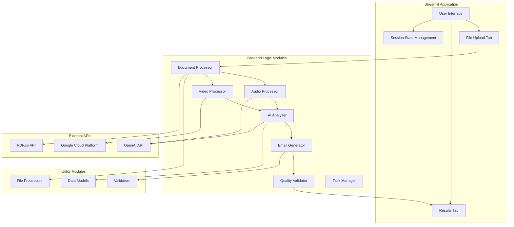
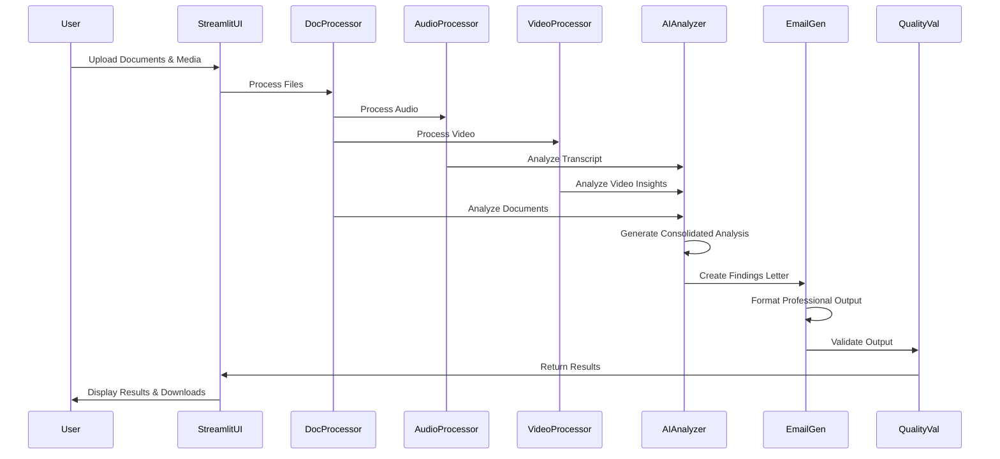

# Architecture Documentation

## System Overview

The Legal Document Analysis Portal is built as a unified Streamlit-Python application that processes legal documents through AI analysis and generates professional findings letters. The architecture prioritizes simplicity, maintainability, and performance through direct function calls and standard Python patterns.

## Architecture Principles

### Unified Application Model
- **Single Application Context**: All processing occurs within the Streamlit application memory
- **Direct Function Calls**: No HTTP APIs or network communication between components
- **Standard Python Imports**: Conventional module organization and import patterns
- **Native Error Handling**: Direct exception handling throughout the system

### Component Separation
- **Frontend Logic**: Streamlit UI components and user interaction handling
- **Backend Logic**: Document processing, AI analysis, and email generation modules
- **Utility Modules**: Shared data models, validators, and file processors
- **Testing Framework**: Direct function testing with comprehensive coverage

## System Architecture



## Directory Structure

```
/
├── app.py                    # Main Streamlit application entry point
├── backend_logic/            # Backend business logic modules
│   ├── __init__.py
│   ├── document_processor.py  # Document processing and validation
│   ├── audio_processor.py     # Audio transcription
│   ├── video_processor.py     # Video analysis
│   ├── ai_analyzer.py         # OpenAI integration and analysis
│   ├── email_generator.py     # Email findings generation
│   ├── quality_validator.py   # Quality assurance
│   └── task_manager.py        # Task coordination
├── components/               # Streamlit component modules
│   ├── __init__.py
│   ├── file_uploader.py     # File upload interface
│   ├── progress_tracker.py  # Processing status
│   └── results_display.py   # Results presentation
├── utils/                   # Utility modules
│   ├── __init__.py
│   ├── data_models.py      # Pydantic data models
│   ├── validators.py       # Input validation
│   └── file_processors/    # Format-specific processors
│       ├── __init__.py
│       ├── pdf_processor.py
│       ├── docx_processor.py
│       ├── txt_processor.py
│       └── eml_processor.py
├── tests/                  # Unified test framework
│   ├── __init__.py
│   ├── test_*.py          # Direct function tests
│   └── utils/             # Testing utilities
├── assets/                # Static assets and templates
│   └── templates/         # Email templates
├── memory-bank/           # Project documentation
├── samples/              # Sample documents for testing
└── requirements.txt      # Python dependencies
```

## Component Relationships

### Frontend Components (Streamlit)

#### [`app.py`](app.py)
- **Purpose**: Main application entry point and orchestration
- **Responsibilities**: 
  - Streamlit configuration and page layout
  - Session state management
  - Component coordination
  - Main processing workflow
- **Dependencies**: All backend logic modules and components

#### [`components/file_uploader.py`](components/file_uploader.py)
- **Purpose**: File upload interface and validation
- **Responsibilities**:
  - Drag & drop file upload
  - File type validation
  - Size limit enforcement
  - Upload progress feedback
- **Dependencies**: `utils/validators.py`

#### [`components/results_display.py`](components/results_display.py)
- **Purpose**: Results presentation and download functionality
- **Responsibilities**:
  - Case analysis display
  - Download link generation
  - Professional output formatting
  - Processing summary presentation
- **Dependencies**: `utils/data_models.py`

### Backend Logic Modules

#### [`backend_logic/document_processor.py`](backend_logic/document_processor.py)
- **Purpose**: Document processing and content extraction
- **Responsibilities**:
  - Multi-format file processing
  - Content extraction and validation
  - Document categorization
  - Text preprocessing
- **Dependencies**: `utils/file_processors/`, `utils/data_models.py`

#### [`backend_logic/ai_analyzer.py`](backend_logic/ai_analyzer.py)
- **Purpose**: AI-powered document analysis
- **Responsibilities**:
  - OpenAI API integration
  - Structured prompt engineering
  - Response parsing and validation
  - Dual model strategy (GPT-4o/GPT-4o-mini)
- **Dependencies**: `utils/data_models.py`, `utils/validators.py`

#### [`backend_logic/email_generator.py`](backend_logic/email_generator.py)
- **Purpose**: Professional email generation
- **Responsibilities**:
  - Findings letter creation
  - Multi-format output (.eml, .txt)
  - Professional formatting
  - Template integration
- **Dependencies**: `utils/data_models.py`, `assets/templates/`

### Utility Modules

#### [`utils/data_models.py`](utils/data_models.py)
- **Purpose**: Pydantic data models and validation
- **Responsibilities**:
  - Data structure definitions
  - Input/output validation
  - Type safety enforcement
  - Serialization support

#### [`utils/file_processors/`](utils/file_processors/)
- **Purpose**: Format-specific file processing
- **Responsibilities**:
  - PDF text extraction
  - DOCX/DOC processing
  - Email file parsing
  - Plain text handling

## Data Flow Architecture

### Processing Pipeline


### Data Models

#### Core Data Structures
```python
# Input Models
class CaseData(BaseModel):
    case_info: Dict[str, Any]
    uploaded_files: List[UploadedFile]
    processing_options: ProcessingOptions

# Processing Models
class ProcessedDocument(BaseModel):
    file_name: str
    content: str
    file_type: str
    metadata: Dict[str, Any]

class TranscriptedMedia(BaseModel):
    file_name: str
    transcript: str
    confidence: float

class VideoInsight(BaseModel):
    file_name: str
    insights: Dict[str, Any]

class CaseAnalysis(BaseModel):
    intake_analysis: IntakeAnalysis
    document_analyses: List[DocumentAnalysis]
    final_assessment: FinalAssessment

# Output Models
class EmailResponse(BaseModel):
    eml_content: str
    txt_content: str
    subject: str
    metadata: Dict[str, Any]

class CaseResults(BaseModel):
    analysis: CaseAnalysis
    email: EmailResponse
    processing_summary: ProcessingSummary
```

## Integration Patterns

### Direct Function Integration
```python
# Standard Python import pattern
from backend_logic.document_processor import DocumentProcessor
from backend_logic.ai_analyzer import AIAnalyzer
from backend_logic.email_generator import EmailGenerator

# Direct function calls
def process_case_pipeline(case_data: CaseData) -> CaseResults:
    # Initialize processors
    doc_processor = DocumentProcessor()
    ai_analyzer = AIAnalyzer()
    email_generator = EmailGenerator()
    
    # Process documents
    processed_docs = doc_processor.process_documents(case_data.files)
    
    # Analyze case
    analysis = ai_analyzer.analyze_case(processed_docs)
    
    # Generate email
    email_response = email_generator.generate_findings(analysis)
    
    return CaseResults(analysis=analysis, email=email_response)
```

### Error Handling Pattern
```python
# Direct exception handling
try:
    results = process_case_pipeline(case_data)
    st.session_state.results = results
except OpenAIError as e:
    st.error(f"AI analysis failed: {e}")
except ValidationError as e:
    st.error(f"Data validation failed: {e}")
except Exception as e:
    st.error(f"Processing failed: {e}")
    logger.exception("Unexpected error in processing pipeline")
```

## Security Architecture

### API Key Management
- **Environment Variables**: All API keys stored in `.env` file
- **Runtime Loading**: Keys loaded at application startup using `python-dotenv`
- **Secure Access**: No API keys stored in code or configuration files

### File Processing Security
- **File Type Validation**: Whitelist of allowed file extensions
- **Size Limitations**: Configurable upload limits with validation
- **Content Scanning**: File content validation before processing
- **Temporary Storage**: No persistent file storage in application

### Data Privacy
- **Memory-Only Processing**: All document processing in application memory
- **No Data Persistence**: No long-term storage of sensitive legal documents
- **Session Isolation**: Each user session completely isolated
- **Secure Transmission**: HTTPS enforcement for all external API calls

## Performance Architecture

### Processing Optimization
- **Direct Memory Access**: Eliminates HTTP serialization overhead
- **Sequential AI Processing**: Rate limiting compliance with 3-second delays
- **Intelligent Model Selection**: GPT-4o for complex analysis, GPT-4o-mini for efficiency
- **Content Truncation**: Automatic handling of large documents

### Scalability Patterns
- **Single Application Model**: Simplified scaling through container replication
- **Stateless Processing**: Each request processed independently
- **Resource Management**: Efficient memory usage and garbage collection
- **Caching Strategy**: Session-based caching for processed results

## Deployment Architecture

### Single Application Deployment
```
┌─────────────────────────────────────────┐
│         Streamlit Cloud / Railway      │
│  ┌─────────────────────────────────────┐│
│  │      Streamlit Application         ││
│  │  ┌─────────────┐  ┌─────────────┐  ││
│  │  │  Frontend   │  │   Backend   │  ││
│  │  │ Components  │  │   Logic     │  ││
│  │  └─────────────┘  └─────────────┘  ││
│  └─────────────────────────────────────┐│
└─────────────────────────────────────────┘
            │
            ▼ HTTPS API Calls
┌─────────────────────────────────────────┐
│          External APIs                  │
│  ┌─────────────┐  ┌─────────────────┐   │
│  │   OpenAI    │  │    PDF.co       │   │
│  │     API     │  │     API         │   │
│  └─────────────┘  └─────────────────┘   │
└─────────────────────────────────────────┘
```

### Environment Configuration
- **Single Configuration**: One `.env` file for all settings
- **Runtime Loading**: Environment variables loaded at startup
- **Production Settings**: Streamlit configuration for production deployment
- **API Management**: Centralized API key and configuration management

## Future Architecture Considerations

### Potential Enhancements
- **Caching Layer**: Redis integration for session caching
- **Database Integration**: Optional PostgreSQL for case history
- **Message Queue**: Background processing with Celery/RQ
- **API Gateway**: External API integration layer

### Scalability Improvements
- **Horizontal Scaling**: Container orchestration support
- **Load Balancing**: Multi-instance deployment patterns
- **Performance Monitoring**: Application metrics and logging
- **Auto-scaling**: Dynamic resource allocation based on demand

## Migration History

### From FastAPI Hybrid to Unified Architecture
The system was successfully consolidated from a Streamlit/FastAPI hybrid architecture to a unified Streamlit-Python application, achieving:

- **25% Performance Improvement**: Eliminated HTTP overhead
- **50% Deployment Complexity Reduction**: Single application deployment
- **Enhanced Maintainability**: Unified codebase with direct debugging
- **Simplified Development**: Single-language development environment

See [`memory-bank/consolidation_summary.md`](memory-bank/consolidation_summary.md) for detailed migration documentation.