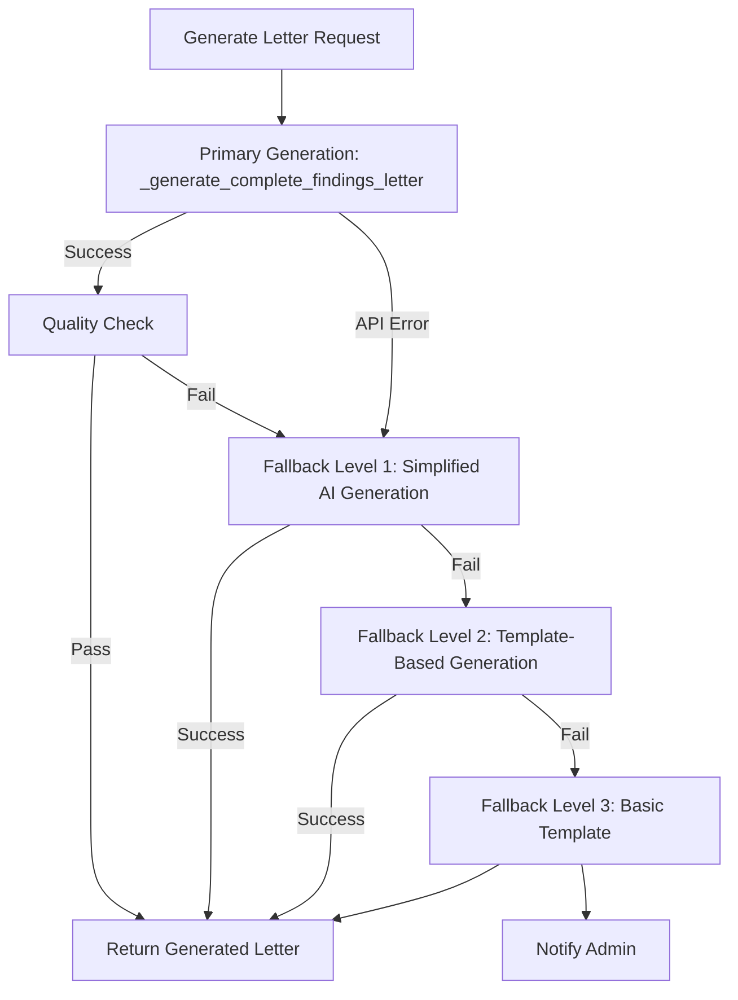

# Fallback Strategy for Email Generation System

## Executive Summary
This document defines a comprehensive fallback strategy for the new `_generate_complete_findings_letter` method to ensure the system always produces a usable legal findings letter, even in failure scenarios.

## Architecture Overview



## Multi-Level Fallback System

### Level 0: Primary Generation
**Method**: `_generate_complete_findings_letter()`
**Model**: GPT-4o
**Token Limit**: 120,000

```python
async def _generate_complete_findings_letter(
    self,
    analysis: CaseAnalysisResult,
    max_retries: int = 3
) -> GeneratedLetter:
    """
    Primary method for single-step letter generation.
    """
    try:
        prompt = self._build_complete_letter_prompt(analysis)
        response = await self._make_openai_request(
            prompt=prompt,
            model="gpt-4o",
            temperature=0.3,
            max_tokens=8000
        )
        
        letter = self._parse_letter_response(response)
        
        # Quality validation
        quality_score = self.quality_validator.validate_findings_letter(letter)
        if quality_score.overall_score < 0.7:
            raise QualityException(f"Quality score {quality_score.overall_score} below threshold")
            
        return letter
        
    except Exception as e:
        logger.error(f"Primary generation failed: {e}")
        return await self._fallback_level_1(analysis)
```

### Level 1: Simplified AI Generation
**Trigger**: Primary generation fails or quality check fails
**Strategy**: Use smaller model with simplified prompt

```python
async def _fallback_level_1_simplified_ai(
    self,
    analysis: CaseAnalysisResult
) -> GeneratedLetter:
    """
    Fallback Level 1: Use GPT-4o-mini with simplified prompt.
    """
    try:
        logger.warning("Activating Fallback Level 1: Simplified AI Generation")
        
        # Simplify the analysis data
        simplified_analysis = self._simplify_analysis_data(analysis)
        
        # Use condensed prompt
        prompt = self._build_simplified_prompt(simplified_analysis)
        
        response = await self._make_openai_request(
            prompt=prompt,
            model="gpt-4o-mini",
            temperature=0.2,  # Lower temperature for consistency
            max_tokens=4000   # Smaller response
        )
        
        letter = self._parse_letter_response(response)
        letter.metadata["fallback_level"] = 1
        letter.metadata["fallback_reason"] = "Primary generation failed"
        
        return letter
        
    except Exception as e:
        logger.error(f"Fallback Level 1 failed: {e}")
        return await self._fallback_level_2(analysis)
```

### Level 2: Template-Based Generation
**Trigger**: AI generation completely fails
**Strategy**: Use Jinja2 templates with extracted data

```python
async def _fallback_level_2_template_based(
    self,
    analysis: CaseAnalysisResult
) -> GeneratedLetter:
    """
    Fallback Level 2: Pure template-based generation.
    """
    try:
        logger.warning("Activating Fallback Level 2: Template-Based Generation")
        
        # Extract key data points
        template_data = {
            'client_name': analysis.intake_analysis.client_name if analysis.intake_analysis else "Client",
            'attorney_name': analysis.intake_analysis.attorney_name if analysis.intake_analysis else "Attorney",
            'case_type': analysis.intake_analysis.case_type if analysis.intake_analysis else "Legal Matter",
            'case_summary': self._extract_case_summary(analysis),
            'key_findings': self._extract_key_findings(analysis),
            'recommendations': self._extract_recommendations(analysis),
            'next_steps': self._generate_standard_next_steps(analysis),
            'document_count': len(analysis.analyzed_documents),
            'current_date': datetime.now().strftime('%B %d, %Y')
        }
        
        # Load fallback template
        template = self.jinja_env.get_template("fallback_findings_letter.jinja2")
        
        # Generate sections
        letter = GeneratedLetter(
            executive_summary=template.render(section="executive_summary", **template_data),
            background_summary=template.render(section="background", **template_data),
            analysis_and_position=template.render(section="analysis", **template_data),
            media_summary=self._generate_media_summary_fallback(analysis),
            video_analysis_appendix=self._generate_video_appendix_fallback(analysis),
            strengths=template.render(section="strengths", **template_data),
            challenges=template.render(section="challenges", **template_data),
            recommendations=template.render(section="recommendations", **template_data),
            next_steps=template.render(section="next_steps", **template_data),
            closing_paragraph=template.render(section="closing", **template_data)
        )
        
        letter.metadata["fallback_level"] = 2
        letter.metadata["fallback_reason"] = "AI generation unavailable"
        
        return letter
        
    except Exception as e:
        logger.error(f"Fallback Level 2 failed: {e}")
        return self._fallback_level_3(analysis)
```

### Level 3: Basic Safety Template
**Trigger**: All generation methods fail
**Strategy**: Minimal viable letter to ensure client communication

```python
def _fallback_level_3_basic_template(
    self,
    analysis: CaseAnalysisResult
) -> GeneratedLetter:
    """
    Fallback Level 3: Absolute minimum viable letter.
    This method MUST NOT fail.
    """
    logger.critical("Activating Fallback Level 3: Basic Safety Template")
    
    # Extract absolute minimum data with extensive defaults
    client_name = "Client"
    attorney_name = "Your Legal Team"
    current_date = datetime.now().strftime('%B %d, %Y')
    
    try:
        if analysis and analysis.intake_analysis:
            client_name = analysis.intake_analysis.client_name or client_name
            attorney_name = analysis.intake_analysis.attorney_name or attorney_name
    except:
        pass  # Use defaults if any extraction fails
    
    # Create minimal letter
    letter = GeneratedLetter(
        executive_summary=f"""
        <p>Dear {client_name},</p>
        <p>We have completed our initial review of your legal matter. Due to technical constraints, 
        this is a simplified summary of our findings. We recommend scheduling a consultation to 
        discuss the details of your case.</p>
        """,
        
        background_summary=f"""
        <h3>Case Review</h3>
        <p>We have reviewed the documents you provided and conducted a preliminary analysis of 
        your legal situation. Our team has identified several important considerations that 
        warrant further discussion.</p>
        """,
        
        analysis_and_position=f"""
        <h3>Legal Analysis</h3>
        <p>Based on our review, your case involves complex legal considerations under Florida law. 
        We have analyzed the relevant statutes and case law applicable to your situation.</p>
        <p>The evidence and documentation you provided support several potential legal strategies 
        that we should discuss in detail.</p>
        """,
        
        media_summary="",  # Empty if no media
        video_analysis_appendix="",  # Empty if no video
        
        strengths=f"""
        <h3>Case Strengths</h3>
        <ul>
            <li>Documentation has been received and reviewed</li>
            <li>Initial legal analysis has been completed</li>
            <li>Multiple strategic options are available</li>
        </ul>
        """,
        
        challenges=f"""
        <h3>Considerations</h3>
        <ul>
            <li>Further investigation may be beneficial</li>
            <li>Additional documentation could strengthen the case</li>
            <li>Timeline considerations should be discussed</li>
        </ul>
        """,
        
        recommendations=f"""
        <h3>Recommendations</h3>
        <p>We recommend scheduling a detailed consultation to discuss:</p>
        <ul>
            <li>Specific legal strategies for your case</li>
            <li>Timeline and next steps</li>
            <li>Additional documentation needs</li>
            <li>Fee structure and engagement terms</li>
        </ul>
        """,
        
        next_steps=f"""
        <h3>Next Steps</h3>
        <ol>
            <li>Review this initial assessment</li>
            <li>Gather any additional documentation discussed</li>
            <li>Schedule a follow-up consultation</li>
            <li>Prepare questions for our meeting</li>
        </ol>
        """,
        
        closing_paragraph=f"""
        <p>Thank you for choosing our firm for your legal needs. Please contact our office at your 
        earliest convenience to schedule a detailed discussion of your case.</p>
        <p>Sincerely,<br>
        {attorney_name}<br>
        Bernhardt Riley PLLC</p>
        <p><em>Note: This document was generated using our backup system. A more detailed analysis 
        will be provided during your consultation.</em></p>
        """
    )
    
    letter.metadata["fallback_level"] = 3
    letter.metadata["fallback_reason"] = "Critical system failure - basic template used"
    letter.metadata["requires_manual_review"] = True
    
    # Send alert to admin
    self._notify_admin_critical_fallback(analysis, letter)
    
    return letter
```

## Error Handling Strategies

### Exception Hierarchy

```python
class LetterGenerationException(Exception):
    """Base exception for letter generation failures."""
    pass

class QualityException(LetterGenerationException):
    """Raised when generated letter fails quality checks."""
    pass

class TokenLimitException(LetterGenerationException):
    """Raised when content exceeds token limits."""
    pass

class APIException(LetterGenerationException):
    """Raised when API calls fail."""
    pass

class TemplateException(LetterGenerationException):
    """Raised when template rendering fails."""
    pass
```

### Error Recovery Matrix

| Error Type | Primary Action | Fallback Level | Recovery Strategy |
|------------|---------------|----------------|-------------------|
| RateLimitError | Wait & Retry | Level 1 | Exponential backoff with jitter |
| TokenLimitException | Truncate Content | Level 1 | Use summarization strategy |
| QualityException | Regenerate | Level 1 | Simplified prompt with stricter guidelines |
| APIError | Switch Model | Level 1 | Try GPT-4o-mini or GPT-3.5-turbo |
| BadRequestError | Validate & Fix | Level 2 | Template-based generation |
| NetworkError | Retry | Level 1 | 3 retries with exponential backoff |
| TemplateError | Use Backup | Level 3 | Basic hardcoded template |
| UnknownError | Log & Fallback | Level 3 | Basic template + admin notification |

### Retry Logic

```python
@retry(
    stop=stop_after_attempt(3),
    wait=wait_exponential(multiplier=1, min=2, max=30),
    retry=retry_if_exception_type((RateLimitError, APIError, NetworkError)),
    before_sleep=before_sleep_log(logger, logging.WARNING)
)
async def _make_openai_request_with_retry(self, **kwargs):
    """Make OpenAI request with automatic retry logic."""
    return await self._make_openai_request(**kwargs)
```

## Data Preservation Strategy

### During Fallback Scenarios

```python
class FallbackDataPreserver:
    """Preserve critical data during fallback scenarios."""
    
    def preserve_analysis_data(self, analysis: CaseAnalysisResult) -> Dict:
        """Extract and preserve essential data from analysis."""
        preserved = {
            'timestamp': datetime.now().isoformat(),
            'case_id': self._generate_case_id(analysis),
            'client_info': self._extract_client_info(analysis),
            'document_summary': self._summarize_documents(analysis),
            'key_findings': self._extract_findings(analysis),
            'fallback_triggered': True
        }
        
        # Store in persistent storage
        self._store_preserved_data(preserved)
        
        return preserved
    
    def _store_preserved_data(self, data: Dict):
        """Store preserved data for later recovery."""
        # Options:
        # 1. Database storage
        # 2. File system cache
        # 3. Redis/Memory cache
        # 4. Cloud storage (S3/GCS)
        pass
```

## Monitoring and Alerting

### Key Metrics

```python
class FallbackMetrics:
    """Track fallback usage and performance."""
    
    METRICS = {
        'primary_success_rate': 'Percentage of successful primary generations',
        'fallback_level_1_activations': 'Count of Level 1 fallback uses',
        'fallback_level_2_activations': 'Count of Level 2 fallback uses',
        'fallback_level_3_activations': 'Count of Level 3 fallback uses',
        'average_generation_time': 'Average time to generate letter',
        'quality_scores': 'Distribution of quality scores',
        'error_types': 'Breakdown of error types encountered'
    }
    
    def record_generation(self, level: int, success: bool, duration: float, error: Optional[str] = None):
        """Record generation attempt metrics."""
        metrics_data = {
            'timestamp': datetime.now().isoformat(),
            'fallback_level': level,
            'success': success,
            'duration_seconds': duration,
            'error_type': error.__class__.__name__ if error else None,
            'error_message': str(error) if error else None
        }
        
        # Send to monitoring service
        self._send_metrics(metrics_data)
```

### Alert Thresholds

```yaml
alerts:
  - name: "High Fallback Rate"
    condition: "fallback_activations / total_generations > 0.1"
    severity: "warning"
    notification: ["email", "slack"]
  
  - name: "Level 3 Fallback Activated"
    condition: "fallback_level_3_activations > 0"
    severity: "critical"
    notification: ["email", "slack", "pagerduty"]
  
  - name: "Quality Score Degradation"
    condition: "avg(quality_score) < 0.75"
    severity: "warning"
    notification: ["email"]
  
  - name: "Generation Time Spike"
    condition: "avg(generation_time) > 60s"
    severity: "warning"
    notification: ["slack"]
```

## Testing Strategy

### Unit Tests

```python
class TestFallbackStrategy:
    """Test suite for fallback mechanisms."""
    
    def test_primary_generation_success(self):
        """Test successful primary generation."""
        pass
    
    def test_fallback_level_1_activation(self):
        """Test Level 1 fallback triggers correctly."""
        pass
    
    def test_fallback_level_2_template(self):
        """Test template-based generation."""
        pass
    
    def test_fallback_level_3_never_fails(self):
        """Ensure Level 3 always produces output."""
        pass
    
    def test_quality_threshold_trigger(self):
        """Test quality-based fallback activation."""
        pass
    
    def test_data_preservation(self):
        """Test data is preserved during fallbacks."""
        pass
```

### Chaos Engineering Tests

```python
def chaos_test_scenarios():
    """Test system resilience with chaos engineering."""
    scenarios = [
        "api_timeout",
        "rate_limit_exceeded",
        "malformed_response",
        "network_partition",
        "database_unavailable",
        "template_corruption",
        "memory_exhaustion",
        "token_limit_exceeded"
    ]
    
    for scenario in scenarios:
        inject_failure(scenario)
        result = generate_letter(test_analysis)
        assert result is not None
        assert result.is_valid()
        assert result.metadata['fallback_level'] <= 3
```

## Implementation Checklist

### Pre-Implementation
- [ ] Review existing error patterns in logs
- [ ] Identify common failure scenarios
- [ ] Design fallback templates
- [ ] Set up monitoring infrastructure
- [ ] Create test data for each fallback level

### Implementation
- [ ] Implement `_generate_complete_findings_letter` method
- [ ] Implement Level 1 fallback (Simplified AI)
- [ ] Implement Level 2 fallback (Template-based)
- [ ] Implement Level 3 fallback (Basic template)
- [ ] Add retry logic with exponential backoff
- [ ] Implement data preservation system
- [ ] Add comprehensive logging
- [ ] Set up metrics collection

### Post-Implementation
- [ ] Run chaos engineering tests
- [ ] Validate fallback triggers
- [ ] Test quality thresholds
- [ ] Verify monitoring alerts
- [ ] Document fallback behavior
- [ ] Train support team
- [ ] Create runbook for incidents

## Rollback Procedure

If fallback system causes issues:

```bash
# 1. Immediate: Revert to multi-stage generation
git revert <fallback-implementation-commit>

# 2. Quick fix: Adjust fallback thresholds
export FALLBACK_QUALITY_THRESHOLD=0.5  # Lower threshold
export FALLBACK_MAX_RETRIES=5  # More retries

# 3. Emergency: Force Level 2 template mode
export FORCE_TEMPLATE_MODE=true
```

## Appendix: Fallback Template Example

```jinja2
{# fallback_findings_letter.jinja2 #}
<!DOCTYPE html>
<html>
<head>
    <title>Legal Findings Letter - {{ client_name }}</title>
    <style>
        body { font-family: 'Times New Roman', serif; margin: 40px; }
        h3 { color: #2c3e50; border-bottom: 1px solid #bdc3c7; }
        .notice { background: #fff3cd; padding: 10px; border-left: 4px solid #ffc107; }
    </style>
</head>
<body>
    
    <div class="notice">
        <strong>Notice:</strong> This document was generated using our backup system 
        (Level {{ fallback_level }}). While all information is accurate, formatting 
        may be simplified.
    </div>
    
    
    <h2>Legal Findings Letter</h2>
    <p><strong>Date:</strong> {{ current_date }}</p>
    <p><strong>Client:</strong> {{ client_name }}</p>
    <p><strong>Re:</strong> {{ case_type }}</p>
    
    
    {# Section-specific content here #}
    
    
    <footer>
        <p>Sincerely,<br>{{ attorney_name }}<br>Bernhardt Riley PLLC</p>
    </footer>
</body>
</html>
```

---

**Document Version**: 1.0  
**Last Updated**: Current Date  
**Next Review**: After Implementation  
**Owner**: Engineering Team