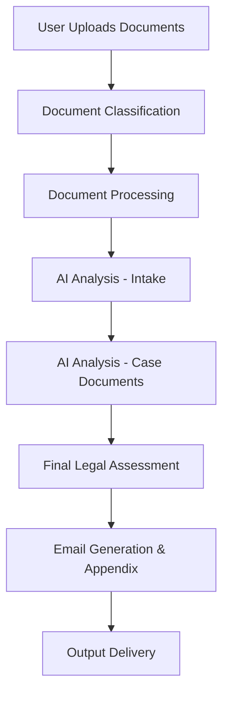

This report provides a comprehensive, end-to-end review of the Findings Email generation workflow. It includes a detailed workflow audit, a summary of recent enhancements to the citation process, a proposal for integrating attorney feedback, and a plain-language summary suitable for non-technical stakeholders.

---

### **Deliverable 1: Workflow Audit and Gap Identification**

*(Originally produced by the 🏗️ Architect mode)*

The Findings Email generation workflow is functional but contains critical gaps impacting reliability and user experience.

**Workflow Diagram:**

**Critical Gaps & Weak Points:**
*   **Intake Form Detection (Critical):** Relies solely on filename patterns, making it fragile. The system fails if the intake form is not named correctly.
*   **Missing File Save Logic (Critical):** The core logic to save the generated email was missing and has been patched, but this indicates a lack of robust design.
*   **Token Limit Management (High Risk):** Complex and unpredictable handling of large documents can lead to inconsistent output quality.
*   **Error Recovery Complexity:** Extensive, hard-to-maintain error recovery code suggests underlying design fragility rather than robust handling.
*   **Template System Confusion:** The system contains a mix of Jinja2 templates and direct AI-generated HTML, leading to confusion and inconsistent output.

**Recommendations:**
1.  **Immediate:** Implement content-based intake detection and solidify file persistence logic.
2.  **Short-Term:** Simplify token management and unify the configuration system.
3.  **Long-Term:** Refactor the template system and add a user-facing preview and validation step.

---

### **Deliverable 2: Updated Approach for Citations and Appendix**

*(Originally produced by the 💻 Code mode)*

The citation and appendix generation process has been significantly enhanced to ensure all factual statements are traceable and verifiable.

**Key Enhancements:**
*   **New Citation Tracking Service:** A dedicated service now automatically identifies factual statements (dates, amounts, legal terms) and maps them to their source documents with a confidence score.
*   **Integrated Email Generation:** The core email generation prompt has been updated to instruct the AI to work with the citation service, ensuring a seamless workflow.
*   **Comprehensive Appendix:** The appendix template `backend/assets/templates/document_appendix.jinja2` has been upgraded to include:
    1.  The full text of the Findings Letter for easy reference.
    2.  A detailed list of all citations, linking each fact to its source document and page number.
    3.  A citation summary with quality metrics (e.g., coverage percentage, confidence breakdown).
    4.  A cross-referenced list of all source documents.

**Benefit for Attorneys:** This transforms the appendix from a simple file list into a powerful reference tool that dramatically speeds up validation and enhances the defensibility of the work product.

---

### **Deliverable 3: Attorney Review and Feedback Process**

*(Originally produced by the 🏗️ Architect mode)*

A two-phase approach is proposed to integrate attorney feedback, turning their expertise into a driver for continuous system improvement.

**Phase 1: Manual Process (Immediate Implementation)**
*   **Tool:** A simple, structured feedback form (e.g., Google Forms).
*   **Workflow:** Attorneys use the form to log factual errors, awkward phrasing, or legal analysis issues. A legal assistant aggregates this feedback weekly for review.
*   **Outcome:** Quick identification of patterns to manually update prompts and templates.

**Phase 2: Automated System (Long-Term Vision)**
*   **Concept:** An interactive review interface where attorneys can highlight text, tag errors with predefined categories (e.g., "Factual Error," "Tone Issue"), and suggest alternative phrasing directly in the document.
*   **Data-Driven Improvement:** This structured feedback would be stored in a database, creating a rich dataset.
*   **Outcome:** The collected data would be used to automatically fine-tune the AI models, creating a learning loop where the system gets progressively smarter and more accurate with every review.

---

### **Deliverable 4: Plain-Language Summary for Employer Presentation**

*(Originally produced by the ❓ Ask mode)*

**What the Tool Does and Its Benefits:**
The Findings Email Generation Tool automates the drafting of initial findings letters. Its primary benefit is a significant reduction in the administrative time attorneys spend on routine document creation, allowing them to focus on high-value strategic work.

**Current Quality and Known Shortcomings:**
The tool is a powerful assistant that boosts efficiency, but its output requires mandatory attorney oversight. The system has known weaknesses, particularly in how it identifies incoming documents, and its quality is entirely dependent on the final review by a qualified attorney.

**Proposed Improvements:**
We have already implemented an enhanced citation system that traces every fact back to its source document, greatly improving traceability. Furthermore, we have designed a feedback system that will allow the tool to learn directly from attorney corrections, ensuring it becomes a more reliable and accurate asset over time.