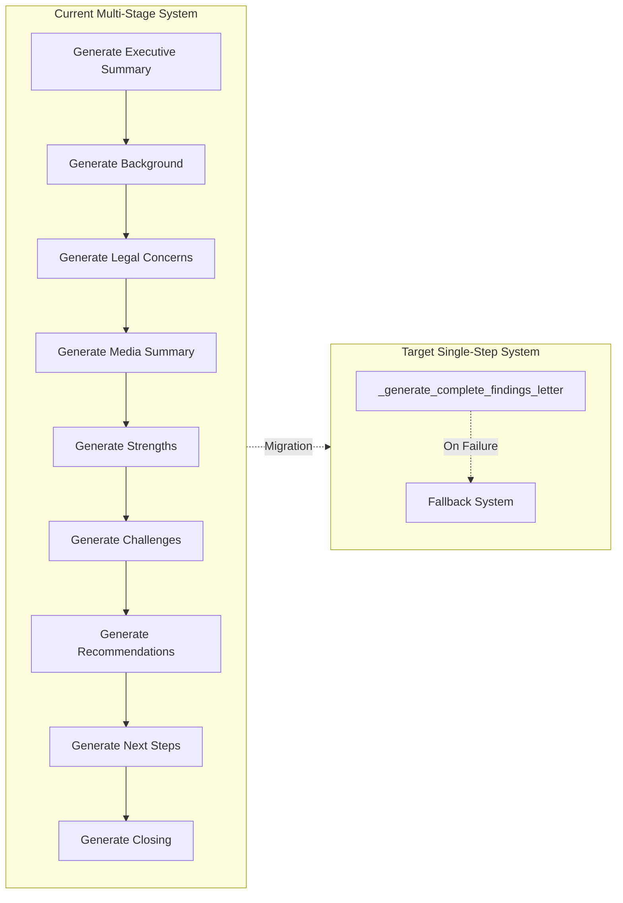
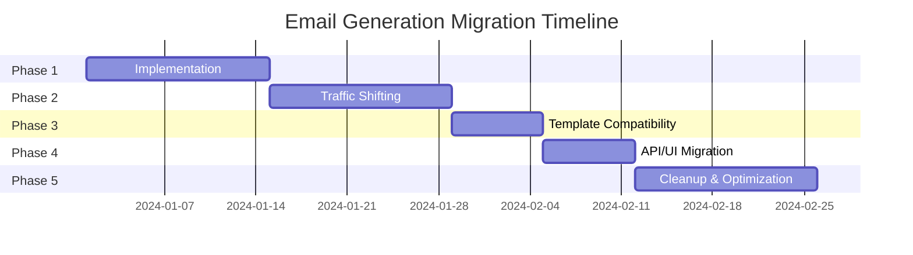

# Migration Plan for Single-Step Email Generation System

## Executive Summary
This document outlines the complete migration strategy from the current multi-stage email generation workflow to a new single-step generation approach using the AUTHENTIC attorney style framework.

## Current vs Target Architecture



## Migration Strategy Overview

### Phase-Based Approach
1. **Phase 1**: Implement new method alongside existing
2. **Phase 2**: Gradual traffic shifting
3. **Phase 3**: Template compatibility layer
4. **Phase 4**: API/UI migration
5. **Phase 5**: Cleanup and optimization

## Phase 1: Implementation (Week 1-2)

### Step 1.1: Create New Single-Step Method

```python
# backend_logic/email_generator.py

async def _generate_complete_findings_letter(
    self,
    analysis: CaseAnalysisResult,
    style: str = "AUTHENTIC"
) -> GeneratedLetter:
    """
    Generate complete findings letter in a single OpenAI call.
    Consolidates all 9 separate generation methods into one.
    """
    # Build comprehensive prompt
    prompt = self._build_unified_prompt(analysis, style)
    
    # Single API call
    response = await self._make_openai_request(
        prompt=prompt,
        model="gpt-4o",
        temperature=0.3,
        max_tokens=8000
    )
    
    # Parse structured response
    return self._parse_unified_response(response)
```

### Step 1.2: Unified Prompt Builder

```python
def _build_unified_prompt(
    self,
    analysis: CaseAnalysisResult,
    style: str = "AUTHENTIC"
) -> str:
    """
    Build comprehensive prompt for single-step generation.
    """
    
    # Select appropriate style framework
    style_framework = self._get_style_framework(style)
    
    prompt = f"""
    {style_framework}
    
    Generate a COMPLETE legal findings letter with ALL sections in a single response.
    
    REQUIRED SECTIONS (in order):
    1. Executive Summary (with greeting)
    2. Background Summary
    3. Legal Analysis & Position
    4. Media Summary (if applicable)
    5. Video Analysis Appendix (if applicable)
    6. Case Strengths
    7. Potential Challenges
    8. Strategic Recommendations
    9. Next Steps
    10. Professional Closing
    
    OUTPUT FORMAT:
    Return a JSON object with each section as a key:
    {{
        "executive_summary": "HTML content...",
        "background_summary": "HTML content...",
        "analysis_and_position": "HTML content...",
        "media_summary": "HTML content...",
        "video_analysis_appendix": "HTML content...",
        "strengths": "HTML content...",
        "challenges": "HTML content...",
        "recommendations": "HTML content...",
        "next_steps": "HTML content...",
        "closing_paragraph": "HTML content..."
    }}
    
    CASE DATA:
    {analysis.model_dump_json(indent=2)}
    
    REQUIREMENTS:
    - Use AUTHENTIC attorney style throughout
    - Reference ONLY Florida law
    - Maintain professional tone
    - Use numbered sections with ALL CAPS headers
    - Include bullet points for clarity
    - Ensure accessibility (9th-grade reading level)
    """
    
    return prompt
```

### Step 1.3: Response Parser

```python
def _parse_unified_response(self, response: Dict[str, str]) -> GeneratedLetter:
    """
    Parse the unified response into GeneratedLetter model.
    """
    
    # Validate response structure
    required_keys = [
        'executive_summary', 'background_summary', 
        'analysis_and_position', 'strengths', 
        'challenges', 'recommendations', 
        'next_steps', 'closing_paragraph'
    ]
    
    for key in required_keys:
        if key not in response:
            raise ValueError(f"Missing required section: {key}")
    
    # Clean and format each section
    letter = GeneratedLetter(
        executive_summary=self._clean_ai_response(response['executive_summary']),
        background_summary=self._clean_ai_response(response['background_summary']),
        analysis_and_position=self._clean_ai_response(response['analysis_and_position']),
        media_summary=self._clean_ai_response(response.get('media_summary', '')),
        video_analysis_appendix=self._clean_ai_response(response.get('video_analysis_appendix', '')),
        strengths=self._clean_ai_response(response['strengths']),
        challenges=self._clean_ai_response(response['challenges']),
        recommendations=self._clean_ai_response(response['recommendations']),
        next_steps=self._clean_ai_response(response['next_steps']),
        closing_paragraph=self._clean_ai_response(response['closing_paragraph'])
    )
    
    return letter
```

## Phase 2: Gradual Traffic Shifting (Week 3-4)

### Step 2.1: Feature Toggle Implementation

```python
# backend_logic/config.py
class EmailGenerationConfig:
    """Configuration for email generation migration."""
    
    # Feature toggles
    USE_SINGLE_STEP_GENERATION = False
    SINGLE_STEP_PERCENTAGE = 0  # Percentage of traffic to use new method
    
    # A/B testing
    ENABLE_AB_TESTING = False
    AB_TEST_LOG_RESULTS = True
    
    # Quality thresholds
    MIN_QUALITY_SCORE = 0.7
    FALLBACK_ON_LOW_QUALITY = True
```

### Step 2.2: Traffic Router

```python
def generate_findings(self, analysis: CaseAnalysisResult) -> GeneratedLetter:
    """
    Main entry point with traffic routing logic.
    """
    import random
    from .config import EmailGenerationConfig as config
    
    # Determine which method to use
    use_new_method = False
    
    if config.USE_SINGLE_STEP_GENERATION:
        use_new_method = True
    elif config.SINGLE_STEP_PERCENTAGE > 0:
        use_new_method = random.randint(1, 100) <= config.SINGLE_STEP_PERCENTAGE
    
    # Generate letter
    if use_new_method:
        try:
            letter = self._generate_complete_findings_letter(analysis)
            self._log_generation_method("single_step", success=True)
        except Exception as e:
            logger.error(f"Single-step generation failed: {e}")
            if config.FALLBACK_ON_LOW_QUALITY:
                letter = self._generate_multi_stage_letter(analysis)
                self._log_generation_method("multi_stage_fallback", success=True)
            else:
                raise
    else:
        letter = self._generate_multi_stage_letter(analysis)
        self._log_generation_method("multi_stage", success=True)
    
    # A/B testing comparison
    if config.ENABLE_AB_TESTING and not use_new_method:
        self._run_ab_test_comparison(analysis, letter)
    
    return letter
```

### Step 2.3: A/B Testing Framework

```python
def _run_ab_test_comparison(
    self,
    analysis: CaseAnalysisResult,
    original_letter: GeneratedLetter
) -> None:
    """
    Run both methods and compare results for A/B testing.
    """
    try:
        # Generate with new method
        new_letter = self._generate_complete_findings_letter(analysis)
        
        # Compare quality scores
        original_score = self.quality_validator.validate_findings_letter(original_letter)
        new_score = self.quality_validator.validate_findings_letter(new_letter)
        
        # Log comparison
        comparison_data = {
            'timestamp': datetime.now().isoformat(),
            'case_id': self._generate_case_id(analysis),
            'original_score': original_score.overall_score,
            'new_score': new_score.overall_score,
            'improvement': new_score.overall_score - original_score.overall_score,
            'original_time': original_letter.metadata.get('generation_time'),
            'new_time': new_letter.metadata.get('generation_time')
        }
        
        logger.info(f"A/B Test Result: {comparison_data}")
        
    except Exception as e:
        logger.error(f"A/B test comparison failed: {e}")
```

### Step 2.4: Rollout Schedule

```yaml
rollout_schedule:
  week_3:
    - day_1:
        single_step_percentage: 5
        monitor_metrics: true
        rollback_threshold: 0.01  # 1% error rate
    
    - day_3:
        single_step_percentage: 10
        quality_check: true
        min_quality_score: 0.75
    
    - day_5:
        single_step_percentage: 25
        performance_check: true
        max_generation_time: 30s
  
  week_4:
    - day_1:
        single_step_percentage: 50
        full_monitoring: true
    
    - day_3:
        single_step_percentage: 75
        prepare_full_migration: true
    
    - day_5:
        use_single_step_generation: true
        single_step_percentage: 100
        keep_fallback_ready: true
```

## Phase 3: Template Compatibility Layer (Week 3)

### Step 3.1: Template Adapter

```python
class TemplateCompatibilityAdapter:
    """
    Ensures backward compatibility with existing templates.
    """
    
    def adapt_to_legacy_format(
        self,
        letter: GeneratedLetter
    ) -> Dict[str, Any]:
        """
        Convert new format to legacy template expectations.
        """
        legacy_format = {
            'header': self._extract_header(letter),
            'sections': {
                'executive': letter.executive_summary,
                'background': letter.background_summary,
                'analysis': letter.analysis_and_position,
                'media': letter.media_summary,
                'video': letter.video_analysis_appendix,
                'strengths': letter.strengths,
                'challenges': letter.challenges,
                'recommendations': letter.recommendations,
                'next_steps': letter.next_steps,
                'closing': letter.closing_paragraph
            },
            'metadata': letter.metadata
        }
        
        # Handle old template variables
        legacy_format['client_name'] = self._extract_client_name(letter)
        legacy_format['attorney_name'] = self._extract_attorney_name(letter)
        legacy_format['case_reference'] = self._generate_case_reference(letter)
        
        return legacy_format
    
    def adapt_from_legacy_input(
        self,
        legacy_data: Dict[str, Any]
    ) -> CaseAnalysisResult:
        """
        Convert legacy input format to new analysis format.
        """
        # Map old field names to new structure
        analysis = CaseAnalysisResult()
        
        # Handle different legacy formats
        if 'intake_form' in legacy_data:
            analysis.intake_analysis = self._convert_legacy_intake(legacy_data['intake_form'])
        
        if 'documents' in legacy_data:
            analysis.analyzed_documents = self._convert_legacy_documents(legacy_data['documents'])
        
        return analysis
```

### Step 3.2: Template Migration Guide

```markdown
## Template Variable Mapping

| Old Variable | New Variable | Location |
|-------------|--------------|----------|
| `{{client_name}}` | `{{analysis.intake_analysis.client_name}}` | All sections |
| `{{attorney_name}}` | `{{analysis.intake_analysis.attorney_name}}` | All sections |
| `{{case_summary}}` | `{{generated_letter.executive_summary}}` | Executive section |
| `{{legal_analysis}}` | `{{generated_letter.analysis_and_position}}` | Analysis section |
| `{{recommendations_list}}` | `{{generated_letter.recommendations}}` | Recommendations |

## Template Update Examples

### Old Template
```jinja2
<h2>Dear {{client_name}},</h2>
<p>{{case_summary}}</p>
```

### New Template
```jinja2
<h2>{{generated_letter.executive_summary|safe}}</h2>
<!-- Executive summary now includes greeting -->
```
```

## Phase 4: API/UI Endpoint Migration (Week 4)

### Step 4.1: API Versioning

```python
# backend/api/v1/email_generation.py (Legacy)
@router.post("/v1/generate-findings", deprecated=True)
async def generate_findings_v1(request: LegacyRequest) -> LegacyResponse:
    """Legacy endpoint - maintained for backward compatibility."""
    # Convert to new format
    adapter = TemplateCompatibilityAdapter()
    analysis = adapter.adapt_from_legacy_input(request.dict())
    
    # Generate using new system
    letter = email_generator.generate_findings(analysis)
    
    # Convert back to legacy format
    legacy_response = adapter.adapt_to_legacy_format(letter)
    return LegacyResponse(**legacy_response)

# backend/api/v2/email_generation.py (New)
@router.post("/v2/generate-findings")
async def generate_findings_v2(request: AnalysisRequest) -> FindingsResponse:
    """New endpoint using single-step generation."""
    analysis = CaseAnalysisResult(**request.dict())
    letter = email_generator.generate_findings(analysis)
    return FindingsResponse(letter=letter)
```

### Step 4.2: UI Migration Strategy

```javascript
// frontend/services/emailService.js

class EmailGenerationService {
    constructor() {
        // Feature flag for API version
        this.useV2API = process.env.USE_V2_API === 'true';
        this.apiVersion = this.useV2API ? 'v2' : 'v1';
    }
    
    async generateFindings(caseData) {
        const endpoint = `/api/${this.apiVersion}/generate-findings`;
        
        if (this.useV2API) {
            // New format
            return this.generateV2(endpoint, caseData);
        } else {
            // Legacy format with adapter
            return this.generateV1(endpoint, caseData);
        }
    }
    
    async generateV2(endpoint, caseData) {
        const response = await fetch(endpoint, {
            method: 'POST',
            headers: { 'Content-Type': 'application/json' },
            body: JSON.stringify(caseData)
        });
        
        return response.json();
    }
    
    async generateV1(endpoint, caseData) {
        // Convert to legacy format
        const legacyData = this.convertToLegacyFormat(caseData);
        
        const response = await fetch(endpoint, {
            method: 'POST',
            headers: { 'Content-Type': 'application/json' },
            body: JSON.stringify(legacyData)
        });
        
        // Convert response to new format
        const legacyResponse = await response.json();
        return this.convertFromLegacyFormat(legacyResponse);
    }
}
```

### Step 4.3: Database Schema Updates

```sql
-- Migration to support new generation method
ALTER TABLE email_generation_logs ADD COLUMN generation_method VARCHAR(50);
ALTER TABLE email_generation_logs ADD COLUMN fallback_level INTEGER DEFAULT 0;
ALTER TABLE email_generation_logs ADD COLUMN quality_score DECIMAL(3,2);
ALTER TABLE email_generation_logs ADD COLUMN generation_time_ms INTEGER;

-- Create index for performance monitoring
CREATE INDEX idx_generation_method ON email_generation_logs(generation_method);
CREATE INDEX idx_quality_score ON email_generation_logs(quality_score);
```

## Phase 5: Cleanup and Optimization (Week 5-6)

### Step 5.1: Remove Deprecated Code

```python
# List of methods to remove after full migration
DEPRECATED_METHODS = [
    '_generate_executive_summary',
    '_generate_background_summary',
    '_generate_legal_concerns',
    '_generate_media_summary',
    '_generate_strengths',
    '_generate_challenges',
    '_generate_recommendations',
    '_generate_next_steps',
    '_generate_closing_paragraph',
    '_generate_video_analysis_appendix',
    'generate_email_and_analysis_docs_legacy',
    '_assemble_professional_letter_from_generated'
]

# Constants to remove
DEPRECATED_CONSTANTS = [
    'CLIENT_DIRECTED_PERSONA',
    'CONTINUING_LETTER_PERSONA',
    'SENIOR_ATTORNEY_PERSONA'
]
```

### Step 5.2: Performance Optimization

```python
class OptimizedEmailGenerator:
    """Optimized version after migration."""
    
    def __init__(self, client: OpenAI):
        self.client = client
        self.quality_validator = QualityValidator()
        
        # Cache for frequently used prompts
        self.prompt_cache = {}
        
        # Pre-compiled templates
        self.fallback_templates = self._precompile_templates()
    
    @lru_cache(maxsize=100)
    def _build_cached_prompt(self, case_type: str, style: str) -> str:
        """Cache prompts for common case types."""
        return self._build_unified_prompt_template(case_type, style)
    
    async def generate_findings(
        self,
        analysis: CaseAnalysisResult
    ) -> GeneratedLetter:
        """Optimized single-step generation."""
        
        # Use cached prompt if available
        case_type = analysis.intake_analysis.case_type if analysis.intake_analysis else "general"
        prompt = self._build_cached_prompt(case_type, "AUTHENTIC")
        
        # Inject specific case data
        prompt = prompt.format(analysis=analysis.model_dump_json(indent=2))
        
        # Generate with optimized settings
        letter = await self._generate_complete_findings_letter_optimized(
            prompt=prompt,
            analysis=analysis
        )
        
        return letter
```

## Testing Strategy

### Unit Tests
```python
class TestMigration:
    """Test suite for migration validation."""
    
    def test_single_step_generates_all_sections(self):
        """Ensure single-step method generates all required sections."""
        pass
    
    def test_backward_compatibility(self):
        """Test legacy format conversion."""
        pass
    
    def test_fallback_activation(self):
        """Test fallback triggers correctly."""
        pass
    
    def test_quality_maintained(self):
        """Ensure quality scores remain high."""
        pass
    
    def test_performance_improvement(self):
        """Verify performance gains."""
        pass
```

### Integration Tests
```python
def test_end_to_end_migration():
    """Full pipeline test with both methods."""
    
    # Generate with old method
    old_letter = generate_multi_stage(test_analysis)
    
    # Generate with new method
    new_letter = generate_single_step(test_analysis)
    
    # Compare outputs
    assert_sections_present(new_letter)
    assert_quality_maintained(old_letter, new_letter)
    assert_performance_improved(old_letter, new_letter)
```

## Rollback Plan

### Immediate Rollback
```python
# Set feature flag to disable new method
EmailGenerationConfig.USE_SINGLE_STEP_GENERATION = False

# Or use environment variable
export USE_SINGLE_STEP_GENERATION=false
```

### Emergency Procedures
```bash
# Full rollback script
#!/bin/bash

# 1. Disable new method
export USE_SINGLE_STEP_GENERATION=false

# 2. Switch UI to v1 API
export USE_V2_API=false

# 3. Clear cache
redis-cli FLUSHDB

# 4. Restart services
systemctl restart email-generation-service

# 5. Monitor logs
tail -f /var/log/email-generation/*.log
```

## Success Metrics

### Key Performance Indicators
```yaml
metrics:
  performance:
    - generation_time_p50: < 10s
    - generation_time_p95: < 30s
    - generation_time_p99: < 45s
  
  quality:
    - average_quality_score: > 0.8
    - minimum_quality_score: > 0.7
    - customer_satisfaction: > 95%
  
  reliability:
    - success_rate: > 99.9%
    - fallback_activation_rate: < 1%
    - error_rate: < 0.1%
  
  efficiency:
    - api_calls_per_letter: 1 (down from 9)
    - token_usage_reduction: > 30%
    - cost_per_letter_reduction: > 40%
```

## Timeline Summary



## Post-Migration Checklist

### Technical Validation
- [ ] All tests passing
- [ ] Performance metrics met
- [ ] Quality scores maintained
- [ ] Fallback system functional
- [ ] Monitoring in place

### Business Validation
- [ ] No customer complaints
- [ ] Cost reduction achieved
- [ ] Processing time improved
- [ ] System stability confirmed

### Documentation
- [ ] API documentation updated
- [ ] Developer guide updated
- [ ] Runbook created
- [ ] Training completed

### Cleanup
- [ ] Old methods removed
- [ ] Deprecated endpoints marked
- [ ] Legacy code archived
- [ ] Dependencies updated

---

**Document Version**: 1.0  
**Last Updated**: Current Date  
**Next Review**: Post-Implementation  
**Owner**: Engineering Team