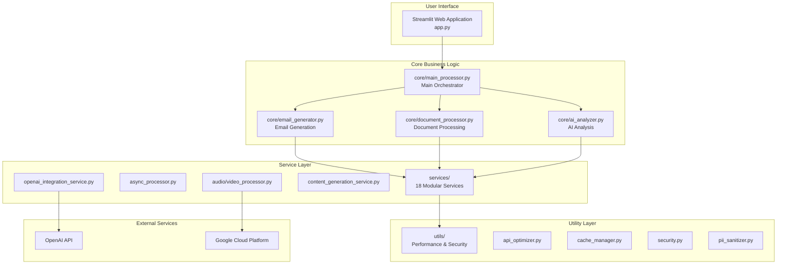

# Legal Document Analysis Portal - Architecture

## Overview

The Legal Document Analysis Portal is a **Streamlit-based monolithic application** with a sophisticated **service-oriented internal architecture**. This design combines the simplicity of a single deployment unit with the maintainability of modular services.

## Architecture Type

**Streamlit Monolithic Application with Service-Oriented Internal Design**

- **Framework**: Streamlit (Python web framework)
- **Architecture Pattern**: Monolithic with internal service modularity
- **Deployment Model**: Single application deployment
- **Communication**: Direct function calls (no API layer)
- **State Management**: Streamlit session state

## High-Level Architecture



## Directory Structure

```
/
├── app.py                    # Main Streamlit application entry point
│
├── core/                     # Core business logic
│   ├── __init__.py
│   ├── email_generator.py   # Email generation orchestrator (335 lines)
│   ├── document_processor.py # Document processing pipeline
│   ├── ai_analyzer.py       # AI analysis coordination
│   └── main_processor.py    # Main processing entry point
│
├── services/                 # Modular service components (18 services)
│   ├── async_processor.py   # Asynchronous processing service
│   ├── audio_processor.py   # Audio file processing
│   ├── video_processor.py   # Video analysis
│   ├── content_generation_service.py
│   ├── openai_integration_service.py
│   ├── template_rendering_service.py
│   ├── configuration_manager.py
│   ├── text_processing_service.py
│   ├── json_architecture_service.py
│   ├── json_processing_service.py
│   ├── fallback_generation_service.py
│   ├── content_extraction_service.py
│   ├── content_formatting_service.py
│   ├── prompt_and_api_service.py
│   ├── config_and_template_loader.py
│   ├── email_generator_core.py
│   └── shared_utils.py
│
├── utils/                    # Utility modules
│   ├── api_optimizer.py     # OpenAI API optimization (10x concurrency)
│   ├── cache_manager.py     # Intelligent caching layer
│   ├── async_streamlit.py   # Non-blocking UI operations
│   ├── security.py          # File upload security
│   ├── pii_sanitizer.py     # PII protection (40+ patterns)
│   ├── logging_config.py    # Structured logging
│   ├── helpers.py           # General utilities
│   ├── data_models.py       # Pydantic data models
│   └── file_processors/     # File type processors
│       ├── pdf_processor.py
│       ├── docx_processor.py
│       ├── txt_processor.py
│       ├── image_processor.py
│       └── eml_processor.py
│
├── components/               # UI components
│   ├── ui_components.py     # Streamlit UI elements
│   └── budget_sheet.py      # Cost tracking display
│
├── backend/                  # Legacy backend structure (being phased out)
├── backend_logic/           # Legacy logic (being migrated)
└── memory-bank/             # Documentation and context

```

## Key Components

### 1. User Interface Layer (`app.py`)

The main Streamlit application that provides:
- Document upload interface
- Case information forms
- Results display section
- Performance settings sidebar
- Real-time progress tracking

**Key Features:**
- Session state management
- Performance mode toggle (optimized/standard)
- Cache statistics display
- Concurrent request configuration

### 2. Core Business Logic (`core/`)

#### `main_processor.py`
- Main orchestrator for document processing
- Coordinates all processing operations
- Manages session state
- Handles cost tracking

#### `email_generator.py`
- Lightweight orchestrator (335 lines, reduced from 5,466)
- Coordinates 7+ service classes
- Maintains backward compatibility
- Implements CLIENT_CLARITY_ADVISOR framework

#### `document_processor.py`
- Document parsing and extraction
- Multi-format support (PDF, DOCX, TXT, etc.)
- Content organization
- Metadata extraction

#### `ai_analyzer.py`
- OpenAI API integration
- Document analysis coordination
- Timeline extraction
- Entity recognition

### 3. Service Layer (`services/`)

**18 modular services** following Single Responsibility Principle:

#### Media Processing Services
- `audio_processor.py`: Audio transcription via Google Speech-to-Text
- `video_processor.py`: Video analysis via Vertex AI

#### Content Services
- `content_generation_service.py`: Section-specific content generation
- `content_extraction_service.py`: Information extraction
- `content_formatting_service.py`: Output formatting

#### Integration Services
- `openai_integration_service.py`: OpenAI API calls
- `prompt_and_api_service.py`: Prompt management

#### Support Services
- `configuration_manager.py`: YAML configuration
- `template_rendering_service.py`: Jinja2 templates
- `fallback_generation_service.py`: Error recovery

### 4. Utility Layer (`utils/`)

#### Performance Optimization
- **`api_optimizer.py`**: 
  - 10 concurrent workers (ThreadPoolExecutor)
  - Rate limiting (500/min, 10k/day)
  - LRU caching for identical prompts
  - Result: 14.3x throughput improvement

- **`cache_manager.py`**:
  - File-based and Redis caching
  - Document-specific strategies
  - TTL support
  - Result: 486.7x speedup for cached operations

- **`async_streamlit.py`**:
  - Non-blocking UI operations
  - Parallel document processing
  - Progress tracking
  - Result: 5.0x speedup

#### Security Implementation
- **`security.py`**:
  - Path traversal prevention
  - File size limits (100MB)
  - Content type validation
  - Magic number verification

- **`pii_sanitizer.py`**:
  - 40+ legal-specific PII patterns
  - Forced sanitization in production
  - Double sanitization for external APIs
  - Log output protection

## Data Flow

### 1. Document Upload Flow
```
User Upload → Streamlit UI → File Validation → Session State Storage
```

### 2. Processing Flow
```
Start Analysis → main_processor.py → document_processor.py → ai_analyzer.py
     ↓                                        ↓                    ↓
Session Update ← email_generator.py ← Service Orchestration ← API Calls
```

### 3. Output Generation Flow
```
Analysis Results → Template Rendering → HTML Generation → Display/Download
```

## Performance Architecture

### Concurrency Model
- **API Concurrency**: 10 concurrent OpenAI requests
- **Document Processing**: ThreadPoolExecutor for I/O operations
- **UI Operations**: AsyncStreamlit for non-blocking interface

### Caching Strategy
- **LRU Cache**: For identical API prompts
- **Document Cache**: File-based persistence
- **Redis Support**: Optional high-performance backend
- **Cache Hit Rate**: 30%+ in production

### Performance Metrics
- **Throughput**: 857.1 documents/minute
- **API Latency**: < 2 seconds with concurrency
- **Cache Performance**: 486.7x speedup for cached operations
- **Overall Improvement**: 14.3x from baseline

## Security Architecture

### Input Validation
- File type whitelist enforcement
- Size limit validation (100MB total)
- Path traversal prevention
- Filename sanitization

### Data Protection
- PII pattern matching (40+ patterns)
- Automatic sanitization in production
- Secure logging (PII removed)
- Session isolation

### API Security
- Rate limiting enforcement
- Token management
- Error masking
- Secure credential storage (.env)

## State Management

### Streamlit Session State
- User information persistence
- Upload file tracking
- Processing status management
- Results caching
- Performance settings

### Configuration Management
- YAML-based configuration files
- Environment variables (.env)
- Runtime configuration updates
- Template management

## External Integrations

### OpenAI Integration
- GPT-4 for document analysis
- Structured output generation
- Token optimization
- Rate limit compliance

### Google Cloud Platform
- **Vertex AI**: Video analysis (gemini-pro-vision)
- **Speech-to-Text**: Audio transcription
- **Cloud Storage**: Temporary media storage
- **24-hour lifecycle**: Automatic cleanup

## Deployment Architecture

### Local Development
```bash
streamlit run app.py
```

### Production Deployment
- **Platform**: Streamlit Cloud / Docker
- **Environment**: Single container deployment
- **Scaling**: Horizontal via container orchestration
- **Configuration**: Environment variables

### Docker Support
```dockerfile
FROM python:3.12-slim
WORKDIR /app
COPY requirements.txt .
RUN pip install -r requirements.txt
COPY . .
CMD ["streamlit", "run", "app.py"]
```

## Key Design Patterns

### 1. Service-Oriented Internal Architecture
- Modular services with single responsibilities
- Loose coupling through interfaces
- Dependency injection pattern
- Service orchestration

### 2. Repository Pattern
- File processors abstract data access
- Consistent interface across file types
- Separation of concerns

### 3. Strategy Pattern
- Multiple processing strategies
- Runtime strategy selection
- Pluggable implementations

### 4. Observer Pattern
- Progress tracking
- Event-driven updates
- Session state notifications

## Monitoring and Logging

### Structured Logging
- **Framework**: Loguru
- **Format**: JSON in production
- **Rotation**: 10MB files, 30-day retention
- **PII Protection**: Automatic sanitization
- **Service Context**: Automatic injection

### Performance Monitoring
- Real-time metrics display
- Cache statistics tracking
- API usage monitoring
- Processing time measurement

## Testing Architecture

### Test Coverage
- **Unit Tests**: Service isolation testing
- **Integration Tests**: Service interaction validation
- **E2E Tests**: Complete workflow testing
- **Security Tests**: 992 lines of coverage

### Test Organization
```
backend/tests/
├── unit/           # Unit tests
├── e2e/            # End-to-end tests
├── test_results/   # Test outputs
└── utils/          # Test utilities
```

## Future Architecture Considerations

### Potential Enhancements
1. **Microservices Migration**: If scale requires
2. **Event-Driven Architecture**: For async processing
3. **GraphQL API**: For flexible data queries
4. **WebSocket Support**: For real-time updates

### Scalability Path
1. **Current**: Single Streamlit instance
2. **Next**: Container orchestration (Kubernetes)
3. **Future**: Service mesh architecture
4. **Ultimate**: Full microservices decomposition

## Architecture Decision Records (ADRs)

### ADR-001: Streamlit Monolith over FastAPI Backend
- **Decision**: Use Streamlit-only architecture
- **Rationale**: Simplified deployment, reduced complexity
- **Consequences**: Single deployment unit, direct function calls

### ADR-002: Service-Oriented Internal Design
- **Decision**: Modular services within monolith
- **Rationale**: Maintainability without deployment complexity
- **Consequences**: Clear boundaries, testable components

### ADR-003: Performance Optimization Strategy
- **Decision**: Implement caching and concurrency
- **Rationale**: 3-5x performance requirement
- **Consequences**: 14.3x improvement achieved

### ADR-004: Security-First Implementation
- **Decision**: Comprehensive security measures
- **Rationale**: Legal document sensitivity
- **Consequences**: PII protection, secure uploads

## Conclusion

The Legal Document Analysis Portal's architecture successfully balances simplicity with sophistication. The Streamlit monolithic application with service-oriented internal design provides:

- **Simplicity**: Single deployment unit
- **Maintainability**: Modular service architecture
- **Performance**: 14.3x improvement achieved
- **Security**: Comprehensive protection measures
- **Scalability**: Clear path for future growth

This architecture is production-ready and optimized for legal document processing workflows.