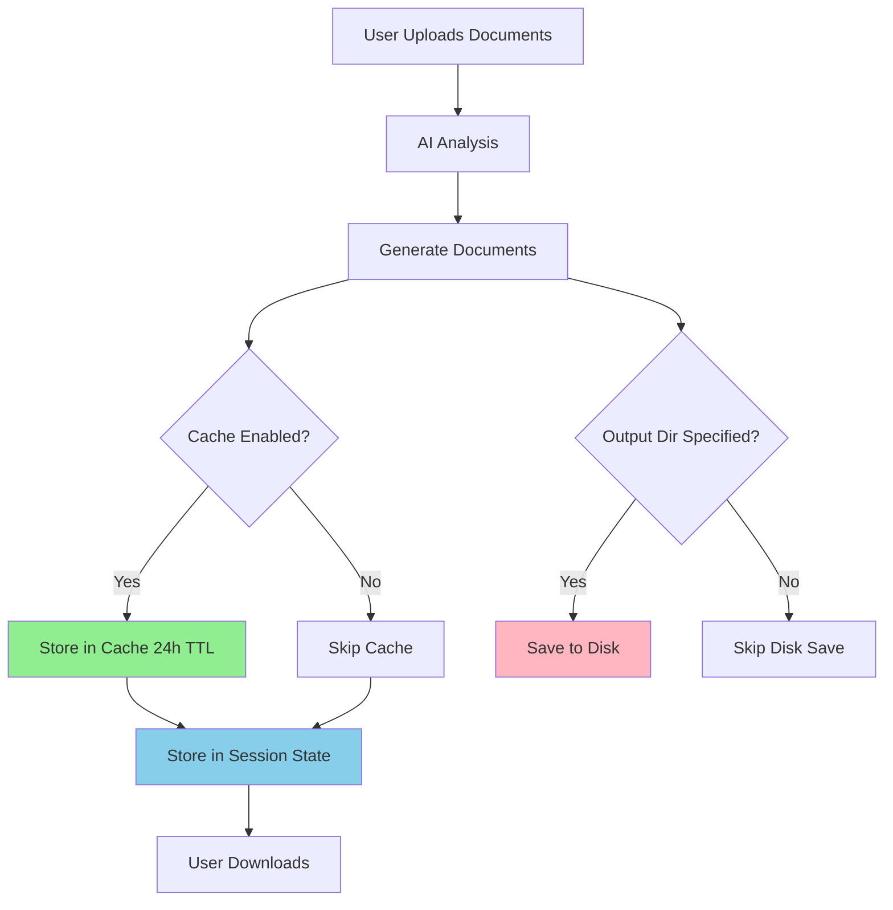
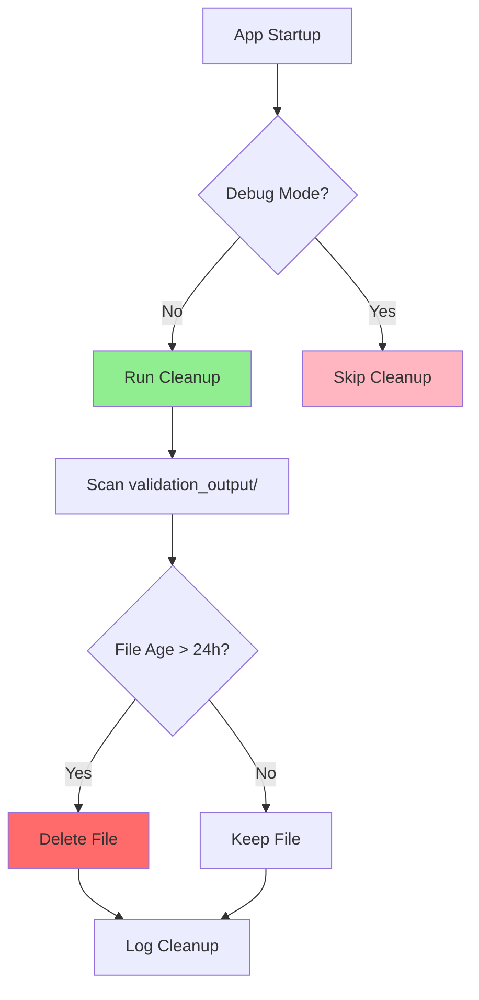

# Output File Management & Automatic Cleanup

## Overview

The Legal Portal now implements intelligent output file management with automatic 24-hour cleanup to prevent disk space accumulation while ensuring documents are available for download during active sessions.

## Architecture

### Two-Tier Storage System

1. **Session Memory** (Immediate Access)
   - Generated documents stored in `st.session_state.main_letter` and `st.session_state.appendix`
   - Available for immediate download during user session
   - Cleared when user closes browser or session expires

2. **Cache Storage** (24-Hour Retention)
   - Documents cached using `DocumentCache` with 24-hour TTL
   - Automatic cleanup of expired entries
   - File-based with optional Redis support
   - Located in `.cache/` directory (git-ignored)

3. **Diagnostic Files** (Configurable Retention)
   - Debug files in `validation_output/` directory
   - Includes: prompts, raw responses, citation maps, analysis data
   - Auto-cleanup after 24 hours (configurable)
   - Can be preserved in debug mode

## Configuration

### Environment Variables

Add to your `.env` file:

```bash
# Output and Cache Configuration
USE_CACHE_FOR_OUTPUTS=true              # Enable cache-based storage (default: true)
OUTPUT_RETENTION_HOURS=24               # Hours to retain files before cleanup (default: 24)
DEBUG_MODE=false                        # Disable cleanup, keep all diagnostic files (default: false)
VALIDATION_OUTPUT_DIR=validation_output # Directory for diagnostic files (default: validation_output)
```

### Configuration Options

| Variable | Default | Description |
|----------|---------|-------------|
| `USE_CACHE_FOR_OUTPUTS` | `true` | Store generated documents in cache with auto-cleanup |
| `OUTPUT_RETENTION_HOURS` | `24` | Number of hours before files are cleaned up |
| `DEBUG_MODE` | `false` | Keep all diagnostic files, disable auto-cleanup |
| `VALIDATION_OUTPUT_DIR` | `validation_output` | Directory for diagnostic output files |

## Behavior Modes

### Production Mode (Default)
```bash
USE_CACHE_FOR_OUTPUTS=true
DEBUG_MODE=false
OUTPUT_RETENTION_HOURS=24
```
- ✅ Documents cached with 24-hour auto-cleanup
- ✅ Diagnostic files cleaned after 24 hours
- ✅ No disk space accumulation
- ✅ Downloads available during session

### Debug Mode
```bash
USE_CACHE_FOR_OUTPUTS=true
DEBUG_MODE=true
OUTPUT_RETENTION_HOURS=168  # 7 days
```
- ✅ Documents cached for 7 days
- ✅ All diagnostic files preserved
- ✅ No automatic cleanup
- ⚠️ Manual cleanup required

### Development Mode (Files Only)
```bash
USE_CACHE_FOR_OUTPUTS=false
DEBUG_MODE=true
```
- 📁 All documents saved to disk
- 📁 All diagnostic files preserved
- ⚠️ No automatic cleanup
- ⚠️ Requires manual cleanup

## File Locations

### Cache Directory
```
.cache/
├── *.pkl                    # Cached documents (auto-cleanup after 24h)
└── [cache_key].pkl          # Individual cache entries
```

### Validation Output Directory
```
validation_output/
├── {case_name}_findings_letter.html     # Generated letters (when output_dir specified)
├── {case_name}_analysis_appendix.html   # Generated appendices
├── final_analysis_data.json             # Diagnostic: Complete analysis data
├── final_prompt.txt                     # Diagnostic: Full AI prompt
├── raw_openai_response.txt             # Diagnostic: Raw AI response
├── raw_markdown_response.md            # Diagnostic: Markdown response
├── citation_map.json                   # Diagnostic: Citation tracking
└── final_validated_html.html           # Diagnostic: Validated HTML
```

## How It Works

### Document Generation Flow



### Cleanup Flow



## API Usage

### Caching Generated Documents

```python
from legal_portal.utils.cache_manager import DocumentCache

# Initialize cache
doc_cache = DocumentCache()

# Store document in cache (24-hour TTL)
doc_cache.cache_generated_document(
    case_id="devlin_2025_001",
    doc_type="findings_letter",
    content=html_content
)

# Retrieve from cache
cached_doc = doc_cache.get_generated_document(
    case_id="devlin_2025_001",
    doc_type="findings_letter"
)
```

### Manual Cleanup

```python
from legal_portal.utils.cache_manager import cleanup_validation_output

# Clean files older than 24 hours
cleaned_count = cleanup_validation_output(
    validation_dir="validation_output",
    max_age_hours=24
)
print(f"Cleaned {cleaned_count} old files")
```

### Cache Statistics

```python
from legal_portal.utils.cache_manager import get_cache_manager

cache = get_cache_manager()
stats = cache.get_stats()

print(f"Cache directory: {stats['cache_dir']}")
print(f"File count: {stats['file_cache_count']}")
print(f"Size: {stats['file_cache_size_mb']:.2f} MB")
```

## Maintenance

### Manual Cleanup Commands

```bash
# Clean cache directory
rm -rf .cache/*.pkl

# Clean validation output (keep git structure)
find validation_output -type f -mtime +1 -delete

# Check cache size
du -sh .cache/
```

### Monitoring

```python
# Add to monitoring script
from legal_portal.utils.cache_manager import get_cache_manager

cache = get_cache_manager()
stats = cache.get_stats()

# Alert if cache size exceeds threshold
if stats['file_cache_size_mb'] > 1000:  # 1 GB
    send_alert(f"Cache size: {stats['file_cache_size_mb']:.2f} MB")
```

## Benefits

✅ **Automatic Cleanup**: Files removed after 24 hours, no manual intervention
✅ **Disk Space Management**: Prevents accumulation of old output files
✅ **Debug Flexibility**: Can disable cleanup for troubleshooting
✅ **Session Availability**: Documents available for download during active sessions
✅ **Configurable Retention**: Adjust retention period via environment variable
✅ **Production Ready**: Safe defaults for production deployment

## Migration Notes

### Existing Files

Old files in `validation_output/` will be cleaned up on next app startup (unless `DEBUG_MODE=true`).

### Backward Compatibility

- Downloads work the same way (from session state)
- Explicit file saves still work when `output_dir` is specified
- Can disable caching with `USE_CACHE_FOR_OUTPUTS=false`

## Troubleshooting

### Downloads Not Working
- ✅ Check `st.session_state.main_letter` is populated
- ✅ Verify cache is enabled: `USE_CACHE_FOR_OUTPUTS=true`
- ✅ Check cache directory exists and is writable

### Files Not Being Cleaned
- ✅ Verify `DEBUG_MODE=false`
- ✅ Check `OUTPUT_RETENTION_HOURS` setting
- ✅ Review logs for cleanup messages

### Cache Size Growing
- ✅ Check cache statistics
- ✅ Manually run cleanup: `cache.cleanup_expired()`
- ✅ Reduce `OUTPUT_RETENTION_HOURS`

## Related Documentation

- [Cache Manager Implementation](../src/legal_portal/utils/cache_manager.py)
- [Configuration Settings](../src/legal_portal/config/default.py)
- [Main Processor](../src/legal_portal/services/main_processor.py)

