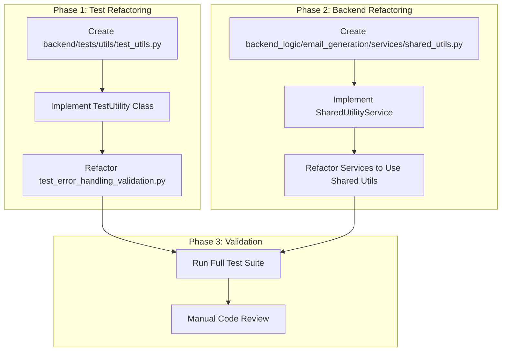

# Refactoring Plan for Redundant Logic

**Objective:** Address finding CPE-003 by refactoring redundant logic in the test suite and backend services.

## 1. Test Suite Refactoring

### Problem
The `test_error_handling_validation.py` file contains a significant amount of boilerplate code for setting up test environments, creating mock objects, and managing validation results. This makes the test suite difficult to read and maintain.

### Solution
1.  **Create a Test Utility Module:**
    *   Create a new file: `backend/tests/utils/test_utils.py`.
    *   Implement a `TestUtility` class in this file.

2.  **Consolidate Test Logic into `TestUtility`:**
    *   **`__init__`**: Initialize a `ValidationResults` instance.
    *   **`setup_test_environment`**: Handle environment variable manipulation for testing (e.g., `OPENAI_API_KEY`).
    *   **`create_mock_file`**: Generate temporary mock files for upload tests.
    *   **`run_test`**: A wrapper function to handle the `try...except` blocks, timing, and result recording for each test.
    *   **`get_summary`**: Consolidate and format the final test results.

3.  **Refactor `test_error_handling_validation.py`:**
    *   Import and instantiate the `TestUtility` class.
    *   Replace repetitive setup and validation logic with calls to the utility methods.
    *   This will significantly simplify the test functions, making them more focused and readable.

## 2. Backend Service Consolidation

### Problem
The services in `backend_logic/email_generation/services/` share common functionality for error handling, logging, and data validation, leading to code duplication.

### Solution
1.  **Create a Shared Utility Service:**
    *   Create a new file: `backend_logic/email_generation/services/shared_utils.py`.
    *   Implement a `SharedUtilityService` class.

2.  **Identify and Move Common Functions:**
    *   **`handle_openai_errors`**: A centralized function to handle common OpenAI API exceptions (e.g., `RateLimitError`, `APIError`).
    *   **`validate_required_keys`**: A utility to check for the presence of required keys in dictionaries or objects.
    *   **`log_service_activity`**: A standardized logging function for entry, exit, and error events within services.

3.  **Refactor Existing Services:**
    *   Import and inject the `SharedUtilityService` into other services that require its functionality.
    *   Replace duplicated logic with calls to the shared service methods.
    *   This will improve maintainability and ensure consistent behavior across services.

## 3. Implementation Plan

This plan will systematically eliminate redundant code, improve maintainability, and enforce consistent patterns across the application.