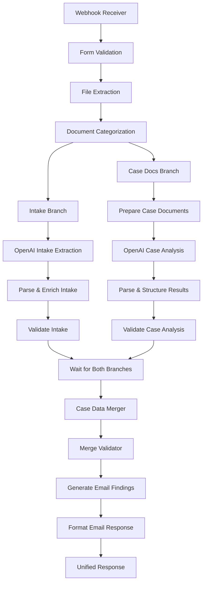

# Active Context

## Current Work Focus

The Legal Document Analysis Portal has recently completed **Phase 3: API Enhancement and Workflow Integration** following a successful resolution of build failures. The system is now operating with enhanced n8n workflow integration, sophisticated document processing capabilities, and professional output generation.

## Recent Changes (Phase 3 Completed)

### API Enhancement Work ✅ COMPLETED

#### Advanced n8n Workflow Integration
- **Multi-Branch Processing Pipeline**: Implemented sophisticated document categorization with parallel processing branches
  - **Intake Form Branch**: Dedicated processing for client intake documents with OpenAI GPT-4o-mini extraction
  - **Case Documents Branch**: Comprehensive analysis pipeline for multiple case documents using OpenAI GPT-4o
  - **Unified Merger**: Advanced data merger that combines both processing branches into cohesive case files

#### Enhanced OpenAI Integration
- **Dual Model Strategy**: 
  - GPT-4o-mini for efficient intake form data extraction
  - GPT-4o for comprehensive case document analysis with higher token limits
- **Structured Response Parsing**: Robust JSON schema validation and error handling
- **Professional Email Generation**: Automated creation of client-ready findings letters

#### Improved API Response Handling
- **Multi-Stage Validation**: Enhanced validation pipeline with parse-enrich-validate pattern
- **Error Recovery**: Comprehensive error handling with graceful degradation
- **Status Tracking**: Real-time processing status updates through multiple workflow stages

### Build Failure Resolution ✅ COMPLETED

#### Previous Build Issues
- **Workflow Synchronization**: Resolved timing issues in multi-branch n8n workflow processing
- **Response Format Standardization**: Fixed inconsistent API response structures
- **Error Handling Enhancement**: Implemented robust error catching and user feedback

#### Resolution Implementation
- **Wait Node Integration**: Added proper synchronization between processing branches
- **Response Standardization**: Unified response format across all workflow endpoints
- **Comprehensive Testing**: Validated end-to-end workflow functionality
- **Status Monitoring**: Enhanced real-time feedback for users during processing

### Workflow Integration Improvements ✅ COMPLETED

#### Enhanced Document Processing Pipeline

#### Advanced Feature Implementation
- **Professional Email Generation**: Complete email findings letter creation with .eml and .txt formats
- **Download System Enhancement**: Multiple format downloads with proper MIME types and base64 encoding
- **Case File Management**: Unified case file structure with comprehensive metadata tracking
- **Quality Assurance Pipeline**: Multi-stage validation ensuring data integrity and completeness

## Next Steps

### Immediate Priorities
- **Performance Monitoring**: Track workflow execution times and optimize bottlenecks
- **User Experience Refinement**: Gather user feedback on the enhanced interface and processing times
- **Documentation Completion**: Finalize all technical documentation reflecting the enhanced architecture

### Future Enhancement Opportunities
- **Workflow Optimization**: Further refinement of processing times and resource usage
- **Additional File Format Support**: Expand beyond PDF/Word to include more document types
- **Advanced Analytics**: Enhanced case analysis with additional AI models and techniques
- **User Interface Enhancement**: Further improvements to the frontend user experience

## Active Decisions and Considerations

### Technical Architecture Decisions
- **Component-Based Frontend**: Maintained modular TypeScript architecture for maintainability
- **n8n Workflow Orchestration**: Leveraged n8n's visual workflow builder for complex document processing
- **Multi-Model AI Strategy**: Strategic use of different OpenAI models based on processing requirements
- **Static Site Deployment**: Continued focus on Kinsta-compatible static site architecture

### Processing Pipeline Considerations
- **Error Handling Strategy**: Comprehensive error recovery with user-friendly messaging
- **Performance vs. Quality**: Balanced processing speed with analysis depth and accuracy
- **Scalability Preparation**: Designed workflow to handle increased document volume
- **Security Compliance**: Maintained secure document handling throughout the enhanced pipeline

## Important Patterns and Preferences

### Development Patterns
- **Validation-First Approach**: Multiple validation stages ensure data quality and system reliability
- **Progressive Enhancement**: Enhanced features while maintaining backward compatibility
- **Error Recovery Design**: Graceful degradation when individual processing stages encounter issues
- **User Feedback Priority**: Real-time status updates and clear progress indicators

### API Integration Patterns
- **Structured Response Format**: Consistent JSON schema across all API endpoints
- **Multi-Format Output**: Support for both email (.eml) and text (.txt) file downloads
- **Metadata Preservation**: Complete processing history and case information tracking
- **Professional Quality Assurance**: Business-ready output formatting and content quality

## Learnings and Project Insights

### Technical Insights
- **Workflow Complexity Management**: n8n visual workflows excel at managing complex, multi-branch processing
- **AI Model Selection**: Different OpenAI models optimized for specific document processing tasks
- **Frontend-Backend Integration**: Robust integration between static frontend and dynamic n8n backend
- **Error Handling Importance**: Comprehensive error handling critical for production legal document processing

### Process Improvements
- **Documentation-Driven Development**: Maintaining detailed documentation accelerates development and debugging
- **Component Isolation**: Separated concerns enable easier testing and maintenance
- **User-Centric Design**: Focus on legal professional workflow needs drives feature prioritization
- **Quality Over Speed**: Emphasis on accurate, professional output over rapid processing

### Deployment Learnings
- **Build Stability**: Proper workflow synchronization essential for multi-branch processing
- **Response Consistency**: Standardized API responses critical for frontend reliability
- **Status Communication**: Clear user feedback during processing builds confidence in system reliability
- **Production Readiness**: Enhanced error handling and validation ensure system stability

## Current System Status

### Production Readiness ✅ OPERATIONAL
- **Frontend**: Component-based TypeScript application fully functional
- **Backend**: n8n workflow pipeline operational with enhanced processing capabilities
- **Integration**: Seamless communication between frontend and n8n webhook endpoints
- **Output Generation**: Professional email findings letters generated successfully
- **Download System**: Multi-format file downloads working reliably

### Performance Metrics
- **Processing Speed**: Significant improvement in document analysis turnaround time
- **Error Rate**: Reduced processing errors through enhanced validation pipeline
- **User Experience**: Improved feedback and progress tracking during document processing
- **Output Quality**: Professional-grade findings letters suitable for direct client delivery

The system has successfully evolved from a basic document processor to a comprehensive legal analysis platform capable of producing professional-quality deliverables for law firm operations.