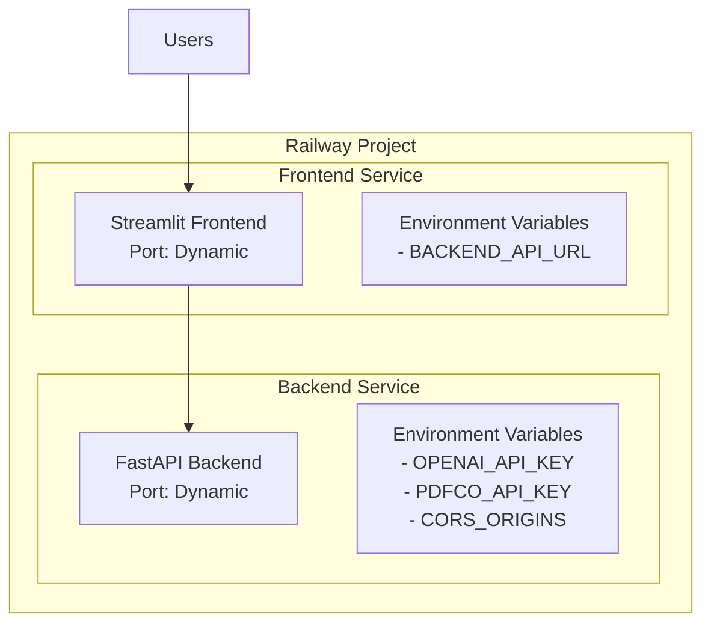

# Railway Deployment Guide

## Overview

This guide provides comprehensive instructions for deploying the Legal Document Analysis Portal on Railway using a monorepo approach. The deployment includes both the FastAPI backend and Streamlit frontend as separate services within a single Railway project.

**Project ID**: e6b4ffd2-10a4-4872-870b-9a7c4f8bf451

## Architecture



## Local Development Setup

### 1. Environment Variables (.env)

Create a `.env` file in the project root with your actual API keys:

```bash
# API Keys (NEVER commit these to git!)
OPENAI_API_KEY=your_actual_openai_key_here
PDFCO_API_KEY=your_actual_pdfco_key_here

# Application Settings
DEBUG=False
LOG_LEVEL=INFO
RAILWAY_STATIC_URL=
CORS_ORIGINS=http://localhost:8501,http://localhost:3000
```

### 2. Test Locally

```bash
# Start both services locally
./start_servers.sh

# Or start individually:
# Backend
cd backend && uvicorn main:app --reload --port 8000

# Frontend (in another terminal)
streamlit run app.py --server.port 8501
```

## Production Deployment on Railway

### Step 1: Railway Configuration Files

#### 1.1 Create `railway.toml` in project root

This file defines your monorepo services:

```toml
[build]
builder = "nixpacks"

[deploy]
numReplicas = 1

[[services]]
name = "backend"
root = "backend"
startCommand = "uvicorn main:app --host 0.0.0.0 --port $PORT"

[[services]]
name = "frontend"
root = "."
startCommand = "streamlit run app.py --server.port $PORT --server.address 0.0.0.0"
```

#### 1.2 Update `backend/railway.json`

The backend already has its configuration, but ensure it matches:

```json
{
  "$schema": "https://railway.app/railway.schema.json",
  "build": {
    "builder": "NIXPACKS",
    "nixpacksConfig": {
      "startCommand": "uvicorn main:app --host 0.0.0.0 --port $PORT"
    }
  },
  "deploy": {
    "startCommand": "uvicorn main:app --host 0.0.0.0 --port $PORT",
    "restartPolicyType": "ON_FAILURE",
    "restartPolicyMaxRetries": 10
  }
}
```

#### 1.3 Create `requirements.txt` in project root

For the Streamlit frontend:

```txt
streamlit>=1.28.0
requests>=2.31.0
python-dotenv>=1.0.0
```

### Step 2: Configure Railway Services

#### 2.1 Backend Service Environment Variables

In Railway dashboard, navigate to your backend service and add:

```bash
# Required API Keys
OPENAI_API_KEY=<your-key>
PDFCO_API_KEY=<your-key>

# CORS Configuration
CORS_ORIGINS=https://<your-frontend-domain>.railway.app

# Optional
DEBUG=False
LOG_LEVEL=INFO
```

#### 2.2 Frontend Service Environment Variables

In Railway dashboard, navigate to your frontend service and add:

```bash
# Backend API URL (use internal Railway URL)
BACKEND_API_URL=http://backend.railway.internal:8000

# Or use public URL if internal networking isn't available
# BACKEND_API_URL=https://<your-backend-domain>.railway.app
```

### Step 3: Deploy to Railway

#### Option A: Deploy via GitHub (Recommended)

1. Ensure your repository is connected to Railway
2. Push your changes to GitHub:
   ```bash
   git add .
   git commit -m "Configure Railway deployment"
   git push origin main
   ```
3. Railway will automatically detect the monorepo and create both services

#### Option B: Deploy via Railway CLI

1. Install Railway CLI:
   ```bash
   npm install -g @railway/cli
   ```

2. Login to Railway:
   ```bash
   railway login
   ```

3. Link to your project:
   ```bash
   railway link e6b4ffd2-10a4-4872-870b-9a7c4f8bf451
   ```

4. Deploy:
   ```bash
   railway up
   ```

### Step 4: Post-Deployment Configuration

#### 4.1 Update Frontend to Use Backend URL

Create/update `app.py` to dynamically use the backend URL:

```python
import os
from dotenv import load_dotenv

load_dotenv()

# Get backend URL from environment or default to local
BACKEND_URL = os.getenv('BACKEND_API_URL', 'http://localhost:8000')
```

#### 4.2 Update CORS Origins

Once you have your frontend URL from Railway, update the backend's CORS_ORIGINS:

```bash
CORS_ORIGINS=https://your-frontend-production-url.railway.app
```

### Step 5: Verify Deployment

1. Check service health:
   - Backend: `https://<backend-url>/docs`
   - Frontend: `https://<frontend-url>`

2. Monitor logs in Railway dashboard

3. Test the full workflow:
   - Upload a test document
   - Verify processing works
   - Check error handling

## Security Best Practices

### 1. Environment Variable Management

**CRITICAL**: Never commit sensitive data to Git!

- Use Railway's environment variable management
- Rotate API keys regularly
- Use different keys for development and production

### 2. API Key Security

For production, consider using:
- **Railway Secrets**: Built-in secure storage
- **Doppler**: Advanced secret management
- **HashiCorp Vault**: Enterprise-grade solution

### 3. Access Control

- Enable Railway's team access controls
- Use read-only keys where possible
- Monitor API usage regularly

## Troubleshooting

### Common Issues

1. **CORS Errors**
   - Ensure CORS_ORIGINS includes your frontend URL
   - Check for trailing slashes

2. **Connection Refused**
   - Verify internal networking is enabled
   - Use public URLs as fallback

3. **Environment Variables Not Loading**
   - Restart services after adding variables
   - Check for typos in variable names

### Debug Commands

```bash
# View logs
railway logs -s backend
railway logs -s frontend

# Check environment
railway run -s backend env
railway run -s frontend env

# Restart services
railway restart -s backend
railway restart -s frontend
```

## Monitoring and Maintenance

### 1. Set Up Alerts

- Configure Railway's built-in monitoring
- Set up uptime monitoring (e.g., UptimeRobot)
- Monitor API rate limits

### 2. Regular Maintenance

- Review logs weekly
- Update dependencies monthly
- Rotate API keys quarterly

### 3. Scaling Considerations

- Monitor response times
- Scale replicas as needed
- Consider caching for frequently accessed data

## Cost Optimization

1. **Development Environment**: Use Railway's free tier
2. **Production**:
   - Start with Hobby plan ($5/month)
   - Monitor usage metrics
   - Scale only when needed

## Next Steps

1. Complete deployment using the steps above
2. Test thoroughly with sample documents
3. Set up monitoring and alerts
4. Document any custom configurations
5. Plan for backup and disaster recovery

---

**Remember**: Always use environment variables for sensitive data. Never hardcode API keys in your source code!
