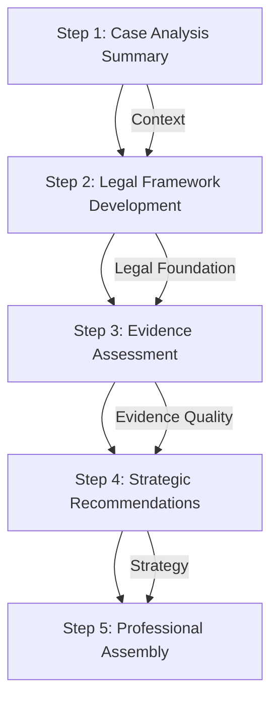

# Findings Email Enhancement Plan

## Executive Summary

This document outlines a comprehensive strategy to significantly elevate the quality, legal sophistication, and professional tone of the automated findings email generation system. The current system produces functional but generic output that lacks the polish and authority expected from a senior litigation attorney. This plan addresses critical gaps in prompt engineering, template structure, generation workflow, and tone consistency to achieve client-ready professional correspondence.

## Current System Assessment

### Technical Architecture Strengths
- **Robust Framework**: FastAPI backend with OpenAI SDK integration and Pydantic validation
- **Multi-Stage Processing**: Intake analysis → case document analysis → final assessment → email generation
- **Dual Model Strategy**: GPT-4o-mini for efficient intake processing, GPT-4o for complex analysis
- **Template System**: Jinja2-based professional formatting with structured data models

### Critical Quality Gaps

#### 1. Prompt Engineering Limitations
- **Mechanical Data Extraction**: Current prompts focus on extracting information rather than crafting sophisticated legal analysis
- **Single Large Prompt Approach**: One comprehensive prompt vs. iterative refinement for better quality
- **Generic Legal Voice**: Lacks the confident, authoritative tone demonstrated in professional samples
- **Limited Legal Reasoning**: Missing sophisticated case law integration and nuanced legal analysis

#### 2. Template and Content Structure Issues
- **Basic Professional Format**: Current template lacks the narrative sophistication of target quality
- **Missing Executive Summary**: No high-level case overview for busy clients
- **Insufficient Legal Depth**: Shallow analysis compared to sample findings letters showing case citations and detailed legal frameworks
- **Generic Recommendations**: Lack specificity and legal strategic thinking

#### 3. Output Quality Deficiencies
- **Lacks Senior Attorney Voice**: Output reads as AI-generated rather than professionally authored
- **Missing Legal Citations**: No integration of relevant case law or statutory references
- **Superficial Analysis**: Surface-level observations vs. deep legal reasoning
- **Inconsistent Tone**: Variable quality and sophistication across different case types

## Enhancement Strategy

### 1. Prompt Engineering Transformation

#### A. Senior Attorney Persona Development
**Current Approach**: Basic instruction to act as a litigation attorney
**Enhanced Approach**: Sophisticated persona with specific expertise areas

```python
SENIOR_ATTORNEY_PERSONA = """
You are a seasoned litigation attorney with 15+ years of experience at a respected law firm.
Your specialty areas include:
- Contract disputes and breach of contract claims
- Landlord-tenant law and property disputes
- Personal injury and negligence claims
- Insurance coverage disputes

Your communication style is:
- Confident and authoritative without being arrogant
- Client-focused with clear explanations of complex legal concepts
- Strategically minded, always considering long-term case implications
- Professional courtesy balanced with firm legal positions
- Precise legal language with appropriate citations when relevant

You draft findings letters that clients and opposing counsel respect for their thoroughness and legal acumen.
"""
```

#### B. Few-Shot Prompting Implementation
**Strategy**: Provide high-quality examples to guide AI output toward target sophistication level

```python
def get_few_shot_examples():
    return [
        {
            "case_type": "negligence_claim",
            "example_analysis": """
            Based on the aforementioned failed actions of Duke Energy, there may be a viable cause of action for negligence against Duke Energy. To prove a claim of negligence against Duke Energy, you would need to prove facts sufficient to show: (1) A duty, or obligation, recognized by the law, requiring the defendant to conform to a certain standard of conduct, for the protection of others against unreasonable risks; (2) A failure on the defendant's part to conform to the standard required: a breach of the duty…; (3) A reasonably close causal connection between the conduct and the resulting injury. This is what is commonly known as "legal cause," or "proximate cause," and which includes the notion of cause in fact; (4) Actual loss or damage…". Clay Elec. Coop., Inc. v. Johnson, 873 So. 2d 1182 (Fla. 2003).
            """,
            "tone_indicators": ["legally precise", "case law integration", "structured analysis"]
        }
    ]
```

#### C. Multi-Step Generation Workflow
**Current**: Single comprehensive prompt
**Enhanced**: Iterative refinement process



### 2. Template and Content Structure Enhancements

#### A. Enhanced Template Architecture
**Addition**: Executive summary section for busy clients
**Enhancement**: Improved narrative flow matching professional samples

```jinja2
<!-- New Executive Summary Section -->

<div class="section">
    <h2>Executive Summary</h2>
    <p>{{ letter.executive_summary }}</p>
</div>


<!-- Enhanced Review Section with Legal Framework -->
<div class="section">
    <h2>Review</h2>
    <h3>Factual Background</h3>
    <p>{{ letter.factual_background }}</p>

    
    <h3>Legal Framework</h3>
    <p>{{ letter.legal_framework }}</p>
    

    <h3>Analysis</h3>
    <p>{{ letter.legal_analysis }}</p>
</div>
```

#### B. Conditional Logic Implementation
**Enhancement**: Dynamic content based on case assessment

```jinja2
<!-- Conditional Demand Letter Section -->

    <h3>Demand Letter Strategy</h3>
    <p>{{ letter.demand_letter_section.reasoning }}</p>

    
        <p>Based on our analysis, a demand letter could yield the following potential outcomes:</p>
        <ul>
            
                <li>{{ outcome }}</li>
            
        </ul>
    

```

### 3. Multi-Step Generation Implementation

#### A. Enhanced Generation Pipeline
```python
class EnhancedEmailGenerator:
    async def generate_findings_letter(self, analysis: CombinedAnalysis) -> EnhancedFindingsLetter:
        # Step 1: Generate case summary with legal context
        case_summary = await self._generate_executive_summary(analysis)

        # Step 2: Develop legal framework and precedent analysis
        legal_framework = await self._generate_legal_framework(analysis)

        # Step 3: Create detailed case analysis
        detailed_analysis = await self._generate_case_analysis(analysis, legal_framework)

        # Step 4: Develop strategic recommendations
        recommendations = await self._generate_strategic_recommendations(analysis, detailed_analysis)

        # Step 5: Assemble professional letter
        return await self._assemble_professional_letter(
            case_summary, legal_framework, detailed_analysis, recommendations, analysis
        )
```

#### B. Individual Step Prompts
**Step 1 - Executive Summary Prompt**:
```python
def _build_executive_summary_prompt(self, analysis: CombinedAnalysis) -> str:
    return f"""
    {SENIOR_ATTORNEY_PERSONA}

    Draft a concise executive summary (3-4 sentences) for a findings letter that:
    - Immediately establishes the legal matter and your professional opinion
    - Highlights the strongest aspects of the case
    - Provides client confidence while maintaining professional honesty
    - Uses sophisticated legal language appropriate for the case type

    Case Context: {analysis.model_dump_json()}

    Example tone: "Our office has completed a comprehensive review of your potential claims arising from [specific incident]. Based on our analysis of the available evidence and applicable legal standards, we believe you have viable grounds for pursuing [specific legal action]. While certain challenges exist that we must address strategically, the strength of your position warrants moving forward with [recommended approach]."
    """
```

### 4. Tone and Persona Consistency

#### A. Voice Guidelines Implementation
```python
TONE_GUIDELINES = {
    "professional_confidence": "Assert legal positions with authority while acknowledging limitations honestly",
    "client_focus": "Frame all analysis in terms of client interests and practical outcomes",
    "legal_precision": "Use specific legal terminology accurately and cite relevant authorities",
    "strategic_thinking": "Always consider litigation posture and negotiation dynamics",
    "respectful_firmness": "Maintain professional courtesy while taking strong legal positions"
}
```

#### B. Quality Validation System
```python
class OutputQualityValidator:
    def validate_professional_tone(self, output: str) -> QualityScore:
        criteria = [
            "uses_confident_legal_language",
            "includes_case_law_or_statutory_references",
            "demonstrates_strategic_thinking",
            "maintains_client_focus",
            "professional_courtesy_balance"
        ]
        return self._score_against_criteria(output, criteria)
```

## Implementation Roadmap

### Phase 1: Prompt Engineering Enhancement (Week 1)
1. **Develop Senior Attorney Persona**: Create detailed personality and expertise profile
2. **Design Few-Shot Examples**: Curate high-quality sample outputs for different case types
3. **Create Multi-Step Prompts**: Break down generation into iterative refinement stages
4. **Implement Tone Guidelines**: Establish consistency mechanisms across all generation steps

### Phase 2: Template and Structure Upgrade (Week 2)
1. **Add Executive Summary Section**: Brief but sophisticated case overview
2. **Enhance Review Structure**: Separate factual background, legal framework, and analysis
3. **Implement Conditional Logic**: Dynamic content based on case assessment
4. **Improve Professional Formatting**: Match target quality visual presentation

### Phase 3: Multi-Step Generation Workflow (Week 3)
1. **Develop Pipeline Architecture**: Sequential generation with context preservation
2. **Create Individual Step Methods**: Specialized prompts for each generation phase
3. **Implement Cross-Step Validation**: Ensure consistency across generation stages
4. **Add Quality Scoring**: Automated assessment of output sophistication

### Phase 4: Testing and Refinement (Week 4)
1. **Validate Against Sample Cases**: Test using existing client scenarios
2. **Professional Review Process**: Legal team evaluation of output quality
3. **Iterative Prompt Refinement**: Adjust based on quality assessment results
4. **Performance Optimization**: Ensure enhanced quality doesn't compromise speed

## Success Criteria

### Quality Benchmarks
- **Professional Tone**: Output indistinguishable from senior attorney-authored correspondence
- **Legal Sophistication**: Appropriate use of case law, statutory references, and legal reasoning
- **Client-Ready Format**: No manual editing required before client delivery
- **Strategic Depth**: Recommendations demonstrate sophisticated legal thinking

### Technical Requirements
- **Processing Efficiency**: Enhanced quality without significant performance degradation
- **Error Handling**: Graceful fallback to current system if enhanced generation fails
- **Maintainability**: Clear documentation and modular design for future improvements
- **Scalability**: Enhanced system can handle increased document volume

## Risk Mitigation

### Technical Risks
- **Prompt Complexity**: Gradual implementation with rollback capability
- **Model Performance**: A/B testing to validate quality improvements
- **Processing Time**: Optimize for acceptable response times while maintaining quality

### Business Risks
- **Legal Accuracy**: Professional review process before full deployment
- **Client Expectations**: Clear communication about system capabilities and limitations
- **Regulatory Compliance**: Ensure output meets professional practice standards

## Maintenance and Evolution

### Ongoing Optimization
- **Prompt Library**: Centralized repository of proven high-quality prompts
- **Quality Metrics**: Continuous monitoring of output sophistication
- **Template Evolution**: Regular updates based on legal practice changes
- **Model Upgrades**: Integration of newer AI capabilities as they become available

This comprehensive enhancement plan transforms the findings email generation system from a functional tool into a sophisticated legal communication platform that matches the quality and professionalism expected from senior litigation attorneys.
