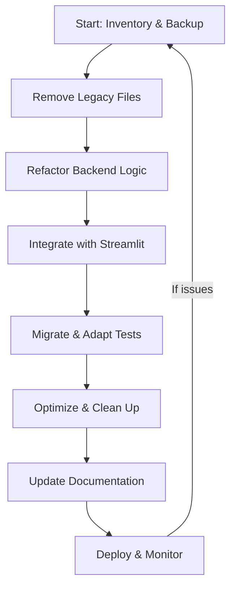

# Comprehensive Consolidation Plan: Streamlit/FastAPI to Unified Streamlit-Python Application

---

## 1. Detailed Consolidation Steps

**Phase 1: Preparation & Analysis**
- Inventory all current files and dependencies.
- Review all Memory Bank documentation for requirements, patterns, and constraints.
- Identify all FastAPI endpoints and their business logic.
- Document all Streamlit UI flows and backend interactions.
- **Risk Mitigation:** Back up the full codebase and Memory Bank. Freeze deployments during consolidation.

**Phase 2: Legacy Removal & Safe Cleanup**
- Remove legacy directories: `src/`, `services/`, `utils/`, `project/`, and any HTML GUI remnants.
- Remove FastAPI-specific dependencies from `backend/requirements.txt`.
- Validate removal by running existing tests and manual smoke tests.
- **Risk Mitigation:** Remove files in stages, verifying after each stage. Use version control for easy rollback.

**Phase 3: Backend Logic Refactor**
- Move FastAPI business logic (from `backend/services/`, `backend/utils/`, etc.) into importable Python modules.
- Refactor API endpoint logic into callable functions/classes.
- Remove FastAPI-specific request/response models, replacing with direct Python data structures.
- **Risk Mitigation:** Maintain function signatures and docstrings for clarity. Write unit tests for refactored logic.

**Phase 4: Streamlit Integration**
- Integrate backend logic directly into Streamlit (`app.py` and `components/`).
- Replace HTTP API calls with direct function calls.
- Implement real-time feedback using Streamlit's async features and session state.
- Add progress tracking and user feedback components.
- **Risk Mitigation:** Incrementally replace endpoints, validating UI after each integration.

**Phase 5: Testing & Validation**
- Migrate and adapt pytest tests to call backend logic directly.
- Update or remove tests that depend on HTTP endpoints.
- Validate with sample data and regression tests.
- **Risk Mitigation:** Run tests after each major change. Maintain a test coverage report.

**Phase 6: Final Cleanup & Optimization**
- Consolidate requirements into a single `requirements.txt`.
- Remove all FastAPI and unused dependencies.
- Reorganize files into the new unified structure.
- Optimize for performance and memory usage.
- **Risk Mitigation:** Profile the app for bottlenecks. Monitor memory usage.

**Phase 7: Documentation & Rollout**
- Update Memory Bank and in-repo documentation to reflect the new architecture.
- Document new workflows, error handling, and testing patterns.
- Prepare a rollback plan in case of critical failures.
- **Risk Mitigation:** Tag a pre-consolidation release. Communicate changes to stakeholders.

---

## 2. Legacy HTML GUI and File Removal Strategy

**Inventory of Files/Directories to Remove:**
- `src/`
- `services/`
- `utils/`
- `project/`
- Any HTML/JS/CSS files not used by Streamlit (legacy GUI)
- FastAPI-specific files: `backend/main.py`, `backend/requirements.txt` (after migration)
- Redundant test files in `backend/tests/` referencing HTTP endpoints

**Safe Removal Sequence:**
1. Remove unused directories (`src/`, `services/`, `utils/`, `project/`).
2. Remove legacy HTML/JS/CSS files.
3. Remove FastAPI-specific files after logic migration.
4. Remove or refactor tests dependent on HTTP endpoints.

**Validation Steps:**
- Run all remaining tests after each removal.
- Manually verify Streamlit app functionality.
- Confirm no import errors or missing dependencies.

---

## 3. Tight Coupling Strategy for Streamlit Integration

**Backend Integration:**
- Refactor FastAPI endpoint logic into pure Python functions/classes.
- Import these directly into Streamlit scripts/components.

**Real-Time Feedback:**
- Use Streamlit's `st.spinner`, `st.progress`, and async callbacks for real-time updates.
- Replace polling with direct state updates after function execution.

**Session State Management:**
- Use `st.session_state` to persist user data, progress, and results across interactions.
- Store intermediate results and error states for robust UX.

**Progress Tracking & UX:**
- Implement a unified progress tracker component (`components/progress_tracker.py`).
- Provide granular feedback (e.g., step-by-step, error messages, completion status).
- Use Streamlit's layout primitives for clear, responsive UI.

---

## 4. Project File Cleanup and Organization

**Proposed Unified Structure:**
```
/
├── app.py
├── components/
│   ├── __init__.py
│   ├── file_uploader.py
│   ├── progress_tracker.py
│   └── results_display.py
├── backend_logic/
│   ├── __init__.py
│   ├── document_processor.py
│   ├── email_generator.py
│   ├── pdf_compressor.py
│   ├── quality_validator.py
│   └── task_manager.py
├── utils/
│   ├── __init__.py
│   ├── data_models.py
│   ├── validators.py
│   └── file_processors/
├── assets/
│   └── templates/
├── tests/
│   ├── __init__.py
│   ├── test_document_processor.py
│   ├── test_email_generator.py
│   └── ...
├── requirements.txt
├── .env.template
├── memory-bank/
└── README.md
```

**Reorganization Plan:**
- Move all backend logic to `backend_logic/`.
- Keep Streamlit UI in `app.py` and `components/`.
- Place all tests in `tests/`, updating imports as needed.
- Consolidate requirements into a single file.

**Dependency Consolidation:**
- Remove FastAPI, Uvicorn, and related packages.
- Retain only packages required for Streamlit and backend logic.
- Use `pip freeze` and manual review to finalize `requirements.txt`.

---

## 5. Testing Framework Migration

**Adaptation Steps:**
- Refactor tests to import and call backend logic directly (no HTTP requests).
- Update fixtures and mocks to work with direct function calls.
- Preserve sample data and test cases by moving them to `tests/` or a `test_data/` subfolder.

**Preservation Strategy:**
- Copy all relevant test data and reference outputs.
- Document any changes to test logic or coverage.

**New Testing Patterns:**
- Use pytest for direct function/class testing.
- Add integration tests for Streamlit UI using tools like `streamlit-testing` or Selenium if needed.

---

## 6. Performance Optimization Considerations

**Benefits:**
- Lower latency (no HTTP overhead).
- Simpler deployment and maintenance.
- Easier debugging and profiling.

**Challenges:**
- Potential for blocking UI if long-running tasks are not async.
- Increased memory usage if large data is held in session state.

**Optimization Strategies:**
- Use async functions and Streamlit's async support for heavy tasks.
- Offload large computations to background threads/processes if needed.
- Profile memory and CPU usage; optimize data structures and caching.

---

## 7. Error Handling and Logging Improvements

**Enhanced Error Handling:**
- Use try/except blocks around all backend logic calls in Streamlit.
- Display user-friendly error messages in the UI.
- Store error states in `st.session_state` for debugging.

**Logging Strategy:**
- Use Python's `logging` module, writing logs to a file and/or console.
- Add log statements for all major actions, errors, and user events.

**User Feedback & Debugging:**
- Show clear error and success messages in the UI.
- Provide a "Download logs" option for advanced users.

---

## 8. Timeline and Milestones

**Estimated Timeline: 2-3 Weeks**

| Phase | Milestone | Validation/Checkpoint |
|-------|-----------|----------------------|
| 1     | Inventory & Analysis Complete | All files and logic mapped |
| 2     | Legacy Removal | Tests pass after each removal |
| 3     | Backend Refactor | All logic callable from Python |
| 4     | Streamlit Integration | UI functional, no HTTP calls |
| 5     | Testing Migration | All tests pass, coverage maintained |
| 6     | Final Cleanup | No unused files/deps, optimized |
| 7     | Documentation & Rollout | Memory Bank and README updated |

**Rollback Strategies:**
- Tag pre-consolidation commit.
- Use git branches for each phase.
- If critical issues arise, revert to last stable commit and re-evaluate.

---

## Mermaid Diagram: High-Level Workflow



---

This plan provides a clear, actionable roadmap for consolidating the Streamlit/FastAPI architecture into a robust, maintainable, and high-performance unified Streamlit-Python application.
