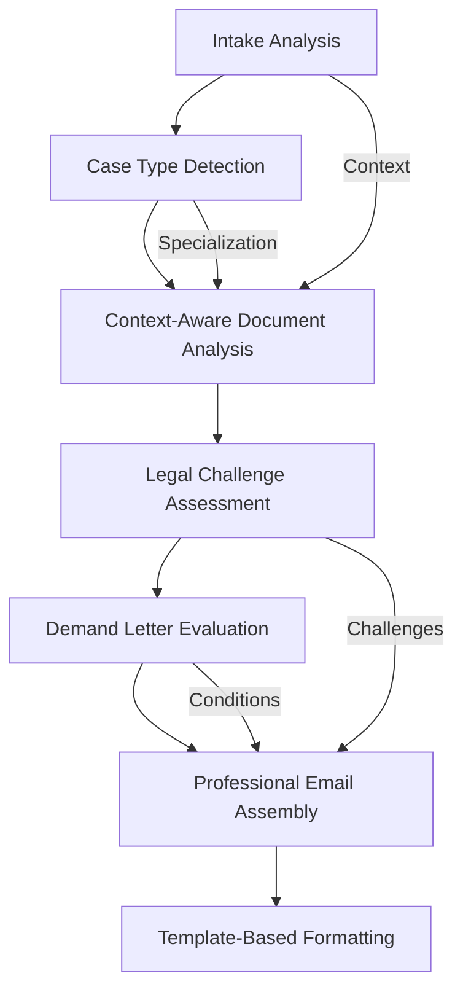

# Legal Findings Email Generation: Prompt Engineering Enhancement Plan

## Executive Summary

This document outlines a comprehensive plan to enhance the legal findings email generation system's prompt engineering and output formatting capabilities. The current system requires significant improvements to meet professional legal communication standards and match the quality demonstrated in provided templates.

## Current System Analysis

### Technical Strengths
- **Dual AI Model Strategy**: GPT-4o-mini for intake forms, GPT-4o for case documents
- **Robust Architecture**: FastAPI backend with async processing and error handling
- **Data Validation**: Pydantic models with structured validation
- **Retry Logic**: Tenacity-based retry mechanisms for API resilience

### Critical Gaps Identified

#### 1. Shallow Prompt Engineering
- **Basic Information Extraction**: Current prompts only extract surface-level information
- **No Cross-Document Analysis**: Intake priorities don't influence case document review
- **Missing Legal Depth**: No assessment of claim viability, evidence strength, or legal challenges
- **Generic Approach**: No case type specialization or context-aware analysis

#### 2. Inadequate Output Structure
- **Simple Parsing**: Basic subject/body splitting vs. professional legal letter format
- **Missing Required Sections**: No "Review," "Preliminary Assessment," or structured "Next Steps"
- **No Conditional Logic**: Missing demand letter recommendations and outcome explanations
- **Unprofessional Format**: Lacks proper legal letterhead and signature formatting

#### 3. Insufficient Data Models
- **Limited Fields**: Missing case type, urgency level, legal challenges, evidence strength
- **No Relationship Modeling**: No cross-document relationship tracking
- **Missing Business Logic**: No demand letter appropriateness detection

## Required Template Structure

Based on provided samples, findings letters must include:

### Header Section
- Date
- Client contact information
- RE: line with case summary
- Professional salutation

### Body Sections
1. **Opening Paragraph**: Context and engagement overview
2. **Review Section**: Factual case analysis and legal framework
3. **Preliminary Assessment**: Required standardized language about challenges with bullet points
4. **Next Steps**: Recommendations with conditional demand letter content

### Footer Section
- Professional signature block
- Attorney credentials and firm information

### Standard Template Language

#### Preliminary Assessment (Required)
```
As we move forward in assessing your matter, it is important to recognize that legal proceedings can often present various obstacles that may impact the strength of your case. Below, you will find a list of potential challenges that we have identified so far in our preliminary assessment of your matter. Please note that this list is not exhaustive. As the case progresses and more information becomes available, other challenges may emerge or may become more evident. Our team is committed to navigating these complexities and adapting our strategies accordingly to best represent your interests. Your understanding and awareness of these potential challenges are essential as we work together towards a successful resolution.
```

#### Demand Letter Outcomes (Conditional)
```
Remember that demand letters are not guaranteed to produce desirable results, but they are an important step in demonstrating a serious intent to resolve a dispute and can serve as a crucial piece of evidence if the dispute escalates to court proceedings. There are the following potential outcomes that you can expect from a demand letter:

• Compliance: The recipient may choose to comply with the letter's demands...
• Negotiation: The recipient may choose to engage in discussions...
• Seeking Legal Counsel: The recipient may opt to speak with an attorney...
• Ignoring the Letter: The recipient may disregard the demand letter...
• Issuing a Response: The recipient may respond to the demand letter...
```

## Enhancement Plan

### Phase 1: Enhanced Prompt Engineering

#### 1.1 Intake Analysis Enhancement
**Current State**: Basic client/attorney name and case summary extraction
**Target State**: Comprehensive intake analysis with legal depth

**Enhanced Prompts Should Extract:**
- Case type classification (landlord/tenant, contract dispute, personal injury, etc.)
- Urgency level and deadlines
- Client priorities and desired outcomes
- Parties involved with relationship mapping
- Evidence types available
- Financial impact assessment

#### 1.2 Context-Aware Case Document Analysis
**Current State**: Independent document summaries
**Target State**: Context-driven analysis referencing intake priorities

**Enhanced Analysis Should Include:**
- Document relevance to intake priorities
- Evidence strength assessment
- Timeline correlation with case facts
- Legal significance evaluation
- Relationship to other documents

#### 1.3 Legal Challenge Identification
**New Capability**: Systematic identification of potential case obstacles

**Should Analyze:**
- Statute of limitations issues
- Evidence quality concerns
- Jurisdictional challenges
- Procedural requirements
- Opposing party strengths

### Phase 2: Data Model Enhancements

#### 2.1 Enhanced IntakeAnalysis Model
```python
class EnhancedIntakeAnalysis(BaseModel):
    client_name: Optional[str]
    attorney_name: Optional[str]
    case_summary: Optional[str]
    case_type: Optional[str]  # NEW
    urgency_level: Optional[str]  # NEW
    client_priorities: List[str]  # NEW
    desired_outcomes: List[str]  # NEW
    key_facts: List[str]
    parties_involved: List[Dict[str, str]]  # NEW
    financial_impact: Optional[str]  # NEW
```

#### 2.2 Enhanced CaseAnalysis Model
```python
class EnhancedCaseAnalysis(BaseModel):
    document_title: str
    document_type: str
    key_entities: List[str]
    summary: str
    timeline_events: List[Dict[str, str]]
    evidence_strength: Optional[str]  # NEW
    legal_significance: Optional[str]  # NEW
    relevance_to_intake: Optional[str]  # NEW
    potential_challenges: List[str]  # NEW
```

#### 2.3 New LegalAssessment Model
```python
class LegalAssessment(BaseModel):
    case_type: str
    claim_viability: str
    evidence_strength: str
    potential_challenges: List[str]
    recommended_actions: List[str]
    demand_letter_appropriate: bool
    urgency_assessment: str
```

### Phase 3: Professional Email Template System

#### 3.1 Structured Template Engine
- **Template Selection**: Based on case type and assessment
- **Dynamic Content**: Conditional sections based on analysis
- **Professional Formatting**: Proper legal letterhead and signatures

#### 3.2 Required Sections Implementation
1. **Header Generation**: Date, client info, RE: line formatting
2. **Background Section**: Context from intake analysis
3. **Review Section**: Legal analysis and case facts
4. **Preliminary Assessment**: Standard language + identified challenges
5. **Next Steps**: Recommendations with conditional demand letter content

#### 3.3 Conditional Logic System
- **Demand Letter Detection**: Based on case type and circumstances
- **Outcome Explanations**: Standard language for demand letter cases
- **Action Prioritization**: Based on urgency and case strength

### Phase 4: Implementation Workflow

#### 4.1 Enhanced Processing Pipeline


#### 4.2 Cross-Document Analysis
- **Intake Context**: Use intake priorities to focus document analysis
- **Evidence Correlation**: Link documents to case timeline
- **Consistency Checking**: Identify contradictions or gaps

### Phase 5: Quality Assurance

#### 5.1 Output Validation
- **Template Compliance**: Ensure all required sections present
- **Professional Tone**: Validate legal communication standards
- **Factual Accuracy**: Cross-reference with source documents

#### 5.2 Testing Strategy
- **Sample Case Validation**: Test against existing client cases
- **Template Verification**: Ensure output matches provided samples
- **Legal Review**: Validate legal accuracy and professionalism

## Implementation Tasks

1. **Analyze current prompt engineering gaps and document baseline system capabilities**
2. **Design enhanced intake analysis prompts to extract case type, urgency, and client priorities**
3. **Develop context-aware case document analysis prompts that reference intake priorities**
4. **Create legal challenge identification prompts for preliminary assessment section**
5. **Design demand letter appropriateness detection logic and conditional content**
6. **Enhance data models to support legal analysis depth and professional output structure**
7. **Build professional email template system matching the provided sample format**
8. **Implement structured output sections: Background, Review, Preliminary Assessment, Next Steps**
9. **Create conditional logic for demand letter recommendations and standard outcomes**
10. **Develop cross-document analysis capabilities linking intake to case evidence**
11. **Test enhanced system against sample cases and validate professional output quality**
12. **Document prompt engineering best practices and maintenance guidelines**

## Success Criteria

### Functional Requirements
- Professional legal letter format matching provided templates
- All required sections present with appropriate content
- Conditional demand letter logic working correctly
- Cross-document analysis providing contextual insights

### Quality Standards
- Legal professional review approval
- Client-ready output without manual editing
- Consistent formatting and tone
- Accurate legal analysis and recommendations

## Risk Mitigation

### Technical Risks
- **Prompt Complexity**: Gradual enhancement with testing at each stage
- **Model Performance**: Fallback logic for AI failures
- **Data Quality**: Enhanced validation and error handling

### Business Risks
- **Legal Accuracy**: Professional review process for template validation
- **Client Expectations**: Clear communication about system capabilities
- **Regulatory Compliance**: Ensure adherence to legal practice standards

## Maintenance and Evolution

### Ongoing Improvements
- **Prompt Optimization**: Regular refinement based on output quality
- **Template Updates**: Adaptation to changing legal requirements
- **Model Upgrades**: Integration of newer AI capabilities

### Documentation Requirements
- **Prompt Libraries**: Centralized repository of proven prompts
- **Template Catalog**: Organized collection of legal templates
- **Best Practices**: Guidelines for future enhancements

This comprehensive plan addresses the critical gaps in the current system and provides a roadmap for achieving professional-grade legal findings letter generation.