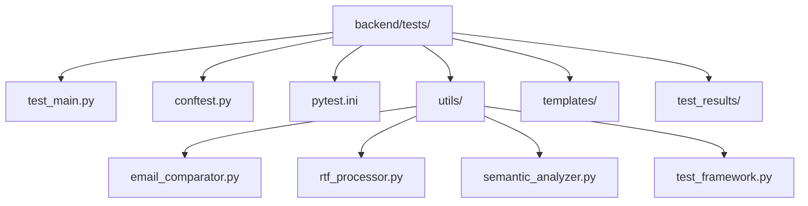

# Unit Testing Framework Design  
**Legal Document Analysis Portal**

---

## 1. Introduction

This document defines the comprehensive design for the unit testing framework of the Legal Document Analysis Portal. It establishes the standards, structure, and technical decisions required to ensure scalable, maintainable, and robust automated testing for all backend components. The framework is designed to support continuous integration, high coverage, and rapid feedback, aligning with the project's commitment to technical excellence and production readiness.

---

## 2. Directory Structure & Organization

All unit tests and related resources are organized under `backend/tests/` to ensure clear separation from production code. The structure supports modularity, reusability, and discoverability.

**Directory Tree:**
```
backend/
└── tests/
    ├── __init__.py
    ├── conftest.py
    ├── pytest.ini
    ├── run_all_tests.py
    ├── simple_test.py
    ├── test_main.py
    ├── test_framework_validation.py
    ├── test_devlin_comprehensive.py
    ├── test_badam_comprehensive.py
    ├── test_price_comprehensive.py
    ├── test_velasco_comprehensive.py
    ├── utils/
    │   ├── __init__.py
    │   ├── email_comparator.py
    │   ├── rtf_processor.py
    │   ├── semantic_analyzer.py
    │   └── test_framework.py
    ├── templates/
    │   ├── general_legal_config.yaml
    │   ├── landlord_tenant_config.yaml
    │   └── contractor_dispute_config.yaml
    ├── test_results/
    │   ├── QUALITY_IMPROVEMENT_REPORT.md
    │   └── [case-specific result folders/files]
    ├── migration_guide.md
    └── README.md
```

**Visual Structure (Mermaid):**


---

## 3. Naming Conventions

- **Test Modules:**  
  - Prefix with `test_` (e.g., `test_main.py`, `test_framework_validation.py`)
- **Test Classes:**  
  - `Test<ClassOrFeatureName>` (e.g., `TestEmailGenerator`)
- **Test Functions:**  
  - Prefix with `test_` (e.g., `test_email_generation_valid`)
- **Fixtures:**  
  - Descriptive, lowercase, underscores for multiword (e.g., `sample_email_data`, `mock_ai_response`)
- **Test Data Files:**  
  - Use clear, case- or feature-specific names (e.g., `landlord_tenant_config.yaml`)
- **Utilities:**  
  - Place all helpers in `utils/` and prefix with their domain (e.g., `email_comparator.py`)

---

## 4. Pytest Justification & Configuration

### Why Pytest?
- **Expressive Syntax:** Simple, readable test and fixture definitions.
- **Powerful Fixtures:** Supports modular, reusable, and scoped fixtures.
- **Parametrization:** Enables broad coverage with minimal code.
- **Rich Plugin Ecosystem:** Integrates with coverage, mocking, and reporting tools.
- **Auto-Discovery:** Finds all tests matching `test_*.py` and `test_*` functions.

### Configuration

- **pytest.ini:**  
  - Centralizes test configuration (markers, options, paths).
  - Example:
    ```
    [pytest]
    minversion = 6.0
    addopts = -ra --tb=short --strict-markers
    testpaths = .
    markers =
        slow: marks tests as slow (deselect with '-m "not slow"')
        integration: marks integration tests
    ```
- **conftest.py:**  
  - Shared fixtures, hooks, and plugins for the test suite.
  - Should not contain test functions.
  - Used for:
    - Global fixtures (e.g., test client, temp directories)
    - Custom hooks (e.g., test setup/teardown)
    - Plugin registration

- **Plugins:**  
  - `pytest-cov` for coverage
  - `pytest-mock` for mocking
  - Others as needed (e.g., `pytest-xdist` for parallelism)

---

## 5. Fixture Architecture

- **Scope:**  
  - Use `function` scope for most fixtures (default, ensures isolation).
  - Use `module` or `session` scope for expensive setup (e.g., database, app context).
- **Location:**  
  - Place global fixtures in `conftest.py`.
  - Place feature-specific fixtures in `utils/fixtures.py` or within test modules.
- **Autouse:**  
  - Use `autouse=True` only for essential, non-intrusive setup (e.g., temp directory cleanup).
- **Modularity:**  
  - Compose fixtures for complex setups (e.g., `sample_case_data` uses `sample_email_data`).
- **Example:**
    ```python
    # conftest.py
    @pytest.fixture
    def sample_email_data():
        return {"subject": "Test", "body": "Sample"}

    @pytest.fixture(scope="module")
    def temp_dir(tmp_path_factory):
        return tmp_path_factory.mktemp("data")
    ```

---

## 6. Parametrization Strategies

- **@pytest.mark.parametrize:**  
  - Use for broad input coverage and edge cases.
  - Example:
    ```python
    @pytest.mark.parametrize("input,expected", [
        ("valid@email.com", True),
        ("invalid-email", False),
        ("", False),
    ])
    def test_email_validator(input, expected):
        assert validate_email(input) == expected
    ```
- **Test Data Organization:**  
  - Inline for simple cases.
  - External YAML/JSON for complex or reusable datasets (store in `templates/` or `test_data/`).
- **Edge Cases:**  
  - Always include boundary values, empty inputs, and invalid types.

---

## 7. Implementation Guidelines

- **Test Isolation:**  
  - No test should depend on another; use fixtures for shared setup.
- **Mocking & Patching:**  
  - Use `pytest-mock` or `unittest.mock` for external dependencies (e.g., API calls, file I/O).
- **Coverage:**  
  - Target >90% line and branch coverage for all backend code.
  - Use `pytest-cov` and enforce in CI.
- **CI Integration:**  
  - All tests must run in CI (GitHub Actions, Railway, etc.).
  - Fail builds on test or coverage failure.
- **Documentation:**  
  - All test modules and fixtures must be documented with docstrings.
  - Update `README.md` with test running instructions and conventions.
- **Maintainability:**  
  - Refactor tests as code evolves; avoid duplication.
  - Use descriptive test names and assert messages.

---

## 8. Complete Folder Structure Snippet

```
backend/tests/
├── __init__.py
├── conftest.py
├── pytest.ini
├── run_all_tests.py
├── simple_test.py
├── test_main.py
├── test_framework_validation.py
├── test_devlin_comprehensive.py
├── test_badam_comprehensive.py
├── test_price_comprehensive.py
├── test_velasco_comprehensive.py
├── utils/
│   ├── __init__.py
│   ├── email_comparator.py
│   ├── rtf_processor.py
│   ├── semantic_analyzer.py
│   └── test_framework.py
├── templates/
│   ├── general_legal_config.yaml
│   ├── landlord_tenant_config.yaml
│   └── contractor_dispute_config.yaml
├── test_results/
│   ├── QUALITY_IMPROVEMENT_REPORT.md
│   └── [case-specific result folders/files]
├── migration_guide.md
└── README.md
```

---

## 9. Design Decisions & Rationale

- **Pytest Chosen:**  
  - Industry standard for Python, supports all required features, and integrates with CI/CD.
- **Modular Structure:**  
  - Mirrors backend code for clarity and maintainability.
- **Fixture-Driven:**  
  - Promotes DRY (Don't Repeat Yourself) and robust test setups.
- **Parametrization:**  
  - Ensures broad coverage with minimal code.
- **Strict Naming & Organization:**  
  - Guarantees auto-discovery and clarity for all contributors.
- **CI Enforcement:**  
  - Maintains code quality and prevents regressions.

---

## 10. References & Further Reading

- [Pytest Documentation](https://docs.pytest.org/en/stable/)
- [Pytest Fixtures](https://docs.pytest.org/en/stable/how-to/fixtures.html)
- [Pytest Parametrize](https://docs.pytest.org/en/stable/how-to/parametrize.html)
- [Pytest Coverage Plugin](https://pytest-cov.readthedocs.io/en/latest/)
- [Project backend/tests/README.md](../backend/tests/README.md)
- [Project backend/tests/pytest.ini](../backend/tests/pytest.ini)
- [Project backend/tests/conftest.py](../backend/tests/conftest.py)

---

**This document is the single source of truth for the Legal Document Analysis Portal's unit testing framework. All future test implementations and enhancements must adhere to these standards.**