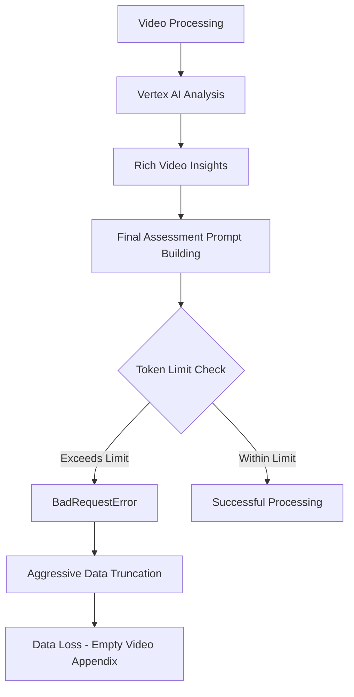
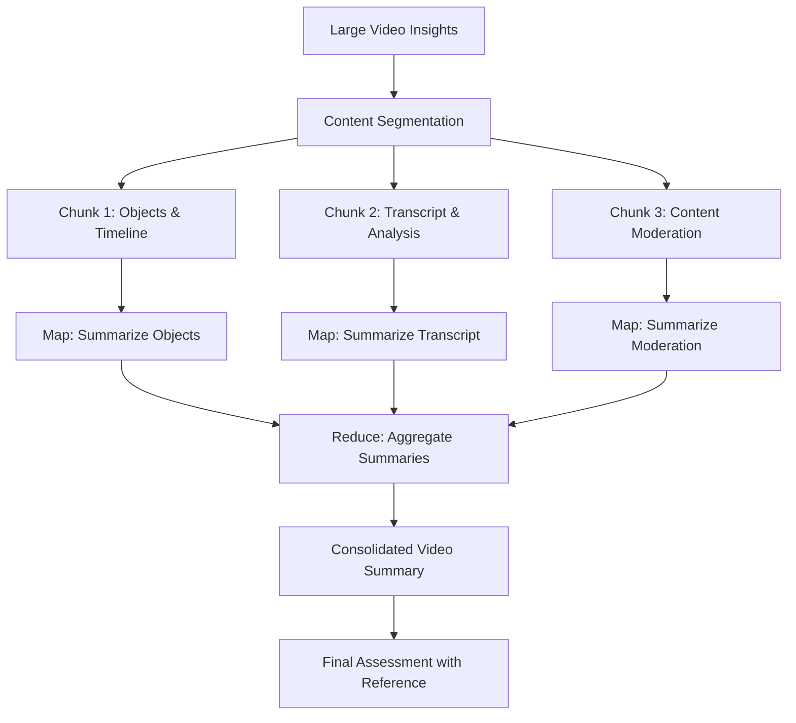

# Video Preservation Technical Plan

## Executive Summary

This document provides a detailed technical specification to resolve the critical video processing issue where token limit violations cause `BadRequestError` and subsequent data loss, resulting in empty video appendices in final reports.

**Root Cause**: Detailed video insights from Vertex AI exceed OpenAI model token limits during final assessment, triggering error recovery logic that permanently loses essential data required for video appendix generation.

**Solution Strategy**: Implement a four-tier approach: pre-computation token checking, MapReduce-style processing, persistent video data storage, and enhanced error recovery with data preservation.

## 1. Technical Problem Analysis

### Current Failure Pattern


### Specific Code Locations
- **Error Location**: [`backend_logic/ai_analyzer.py:498-549`](backend_logic/ai_analyzer.py:498-549) - BadRequestError handling
- **Data Loss Point**: [`backend_logic/ai_analyzer.py:217-242`](backend_logic/ai_analyzer.py:217-242) - `_truncate_video_content_aggressively()`
- **Token Estimation**: [`backend_logic/ai_analyzer.py:201-215`](backend_logic/ai_analyzer.py:201-215) - `_estimate_prompt_tokens_detailed()`

### Current System Limitations
1. **Reactive Token Management**: Token checking occurs only after prompt construction
2. **Data Loss Recovery**: Error recovery discards essential video metadata
3. **No Persistent Storage**: Video insights stored only in memory during processing
4. **Monolithic Assessment**: Final assessment attempts to process all data simultaneously

## 2. Pre-Computation Token Checking Integration

### 2.1 Vertex AI countTokens API Integration

**Implementation Location**: [`backend_logic/ai_analyzer.py`](backend_logic/ai_analyzer.py)

```python
from google.cloud import aiplatform
from google.cloud.aiplatform_v1 import types

class TokenCounter:
    """Handles pre-computation token counting using Vertex AI API."""

    def __init__(self, project_id: str, location: str = "us-central1"):
        self.client = aiplatform.gapic.PredictionServiceClient()
        self.endpoint = f"projects/{project_id}/locations/{location}/publishers/google/models/gemini-pro"

    async def count_tokens(self, content: str, model: str = "gpt-4o") -> int:
        """Count tokens using Vertex AI countTokens API."""
        request = types.CountTokensRequest(
            endpoint=self.endpoint,
            instances=[{"content": content}]
        )
        response = self.client.count_tokens(request=request)
        return response.total_tokens
```

### 2.2 Integration Points

**Pre-Assessment Token Validation**:
- Location: [`backend_logic/ai_analyzer.py:_build_final_assessment_prompt()`](backend_logic/ai_analyzer.py:244-354)
- Threshold: 80% of model context window (96,000 tokens for GPT-4o)
- Trigger: Before prompt construction, estimate total payload size

**Implementation Pattern**:
```python
async def _validate_prompt_size_precomputation(self, analysis: CaseAnalysisResult) -> bool:
    """Pre-validate prompt size before construction."""
    estimated_tokens = await self._estimate_total_tokens(analysis)
    threshold = 96000  # 80% of GPT-4o context window

    if estimated_tokens > threshold:
        print(f"AI ANALYZER: Pre-computation check failed: {estimated_tokens} > {threshold}")
        return False
    return True
```

## 3. MapReduce-Style Chunking and Summarization Strategy

### 3.1 Video Content Segmentation

**Chunk Strategy**:
- **Semantic Chunking**: Split video insights by content type (objects, timeline, transcript)
- **Size-Based Chunking**: Maximum 15,000 tokens per chunk
- **Overlap Strategy**: 10% overlap between chunks for context preservation

### 3.2 MapReduce Implementation



**Implementation Location**: [`backend_logic/ai_analyzer.py`](backend_logic/ai_analyzer.py)

```python
class VideoContentProcessor:
    """Handles MapReduce-style video content processing."""

    async def process_oversized_video_insights(self, video_insights: List[VideoInsight]) -> List[ProcessedVideoSummary]:
        """Process large video insights using MapReduce pattern."""
        processed_summaries = []

        for video in video_insights:
            if self._requires_chunking(video):
                chunks = self._create_semantic_chunks(video)
                chunk_summaries = await self._map_summarize_chunks(chunks)
                final_summary = await self._reduce_aggregate_summaries(chunk_summaries)
                processed_summaries.append(final_summary)
            else:
                # Standard processing for smaller videos
                processed_summaries.append(await self._standard_process(video))

        return processed_summaries

    def _create_semantic_chunks(self, video: VideoInsight) -> List[VideoChunk]:
        """Create semantically meaningful chunks from video data."""
        chunks = []

        # Chunk 1: Objects and Timeline
        if video.objects or video.insights.get('timeline'):
            chunks.append(VideoChunk(
                type="objects_timeline",
                content={
                    "objects": video.objects,
                    "timeline": video.insights.get('timeline', [])
                },
                metadata={"file_name": video.file_name, "chunk_id": 1}
            ))

        # Chunk 2: Transcript and Summary
        if video.transcript or video.insights.get('summary'):
            chunks.append(VideoChunk(
                type="transcript_summary",
                content={
                    "transcript": video.transcript,
                    "summary": video.insights.get('summary', '')
                },
                metadata={"file_name": video.file_name, "chunk_id": 2}
            ))

        return chunks
```

### 3.3 Partial Assessment Generation

**Strategy**: Generate assessments for individual chunks, then compose final assessment

**Benefits**:
- Maintains detail within token limits
- Allows parallel processing
- Preserves data integrity
- Enables progressive refinement

## 4. Persistent Video Data Storage

### 4.1 Enhanced Data Models

**Location**: [`backend/utils/data_models.py`](backend/utils/data_models.py)

```python
class VideoDataReference(BaseModel):
    """Reference to persistent video data storage."""
    video_entry_id: str = Field(..., description="Unique identifier for video entry")
    file_name: str = Field(..., description="Original video file name")
    storage_uri: Optional[str] = Field(None, description="URI to full video data")
    summary: str = Field(..., description="Condensed summary for prompt inclusion")
    key_metadata: Dict[str, Any] = Field(default_factory=dict, description="Essential metadata preserved")
    processing_timestamp: Optional[str] = Field(None, description="When video was processed")

class PersistentVideoInsight(BaseModel):
    """Full video insight data for persistent storage."""
    video_entry_id: str = Field(..., description="Unique identifier")
    file_name: str
    full_insights: Dict[str, Any] = Field(..., description="Complete Vertex AI analysis")
    full_transcript: str = Field(default="", description="Complete transcript")
    object_detections: List[Dict[str, Any]] = Field(default_factory=list)
    timeline_events: List[Dict[str, Any]] = Field(default_factory=list)
    content_analysis: Dict[str, Any] = Field(default_factory=dict)
    processing_metadata: Dict[str, Any] = Field(default_factory=dict)
    created_at: str = Field(..., description="Storage timestamp")

class ProcessedVideoSummary(BaseModel):
    """Summarized video data for prompt inclusion."""
    video_entry_id: str
    file_name: str
    condensed_summary: str = Field(..., description="AI-generated summary under 500 tokens")
    key_objects: List[str] = Field(default_factory=list, description="Top 5 most relevant objects")
    critical_timestamps: List[str] = Field(default_factory=list, description="Key moments")
    legal_relevance_score: Optional[float] = Field(None, description="Relevance to case (0-1)")
```

### 4.2 Storage Implementation

**Storage Strategy**: Google Cloud Storage with structured naming and lifecycle management

```python
class VideoDataManager:
    """Manages persistent storage of video analysis data."""

    def __init__(self, bucket_name: str, project_id: str):
        self.storage_client = storage.Client(project=project_id)
        self.bucket_name = bucket_name
        self.video_data_prefix = "video-analysis-data/"

    async def store_video_insights(self, video_insight: VideoInsight) -> VideoDataReference:
        """Store full video insights and return reference."""
        video_entry_id = str(uuid.uuid4())

        # Create persistent storage object
        persistent_data = PersistentVideoInsight(
            video_entry_id=video_entry_id,
            file_name=video_insight.file_name,
            full_insights=video_insight.insights,
            full_transcript=video_insight.transcript,
            object_detections=self._extract_object_data(video_insight),
            timeline_events=self._extract_timeline_data(video_insight),
            content_analysis=self._extract_content_analysis(video_insight),
            created_at=datetime.utcnow().isoformat()
        )

        # Store in GCS
        storage_uri = await self._upload_to_storage(video_entry_id, persistent_data)

        # Create summary for prompt inclusion
        summary = await self._generate_summary(persistent_data)

        return VideoDataReference(
            video_entry_id=video_entry_id,
            file_name=video_insight.file_name,
            storage_uri=storage_uri,
            summary=summary,
            key_metadata=self._extract_key_metadata(video_insight),
            processing_timestamp=datetime.utcnow().isoformat()
        )

    async def retrieve_full_video_data(self, video_entry_id: str) -> Optional[PersistentVideoInsight]:
        """Retrieve full video data for appendix generation."""
        storage_path = f"{self.video_data_prefix}{video_entry_id}.json"

        try:
            bucket = self.storage_client.bucket(self.bucket_name)
            blob = bucket.blob(storage_path)

            if blob.exists():
                data = json.loads(blob.download_as_text())
                return PersistentVideoInsight.model_validate(data)

            return None
        except Exception as e:
            print(f"VIDEO DATA MANAGER: Error retrieving {video_entry_id}: {e}")
            return None
```

### 4.3 Reference-Based Architecture

**Prompt Integration**:
- Replace full video insights with `VideoDataReference` objects
- Include only summary and key metadata in prompts
- Maintain `video_entry_id` for appendix generation

**Implementation in Assessment**:
```python
async def _build_final_assessment_prompt_with_references(self, analysis: CaseAnalysisResult) -> str:
    """Build assessment prompt using video references instead of full data."""

    # Replace video insights with references
    analysis_for_prompt = analysis.model_copy(deep=True)
    video_references = []

    for video in analysis.video_insights:
        reference = await self.video_data_manager.store_video_insights(video)
        video_references.append(reference)

    # Use references in prompt instead of full data
    analysis_for_prompt.video_insights = []  # Clear full data
    analysis_for_prompt.video_references = video_references  # Add references

    return self._construct_prompt_with_references(analysis_for_prompt)
```

## 5. Refined Error Recovery Logic

### 5.1 Enhanced Error Recovery Strategy

**Replace Current Logic**: [`backend_logic/ai_analyzer.py:498-549`](backend_logic/ai_analyzer.py:498-549)

**New Approach**:
1. **Data Preservation**: Always preserve `video_entry_id` and key metadata
2. **Graceful Degradation**: Reduce detail level while maintaining essential information
3. **Recovery Tracking**: Log recovery actions for audit and debugging
4. **User Communication**: Provide clear messaging about data preservation

```python
class EnhancedErrorRecovery:
    """Enhanced error recovery with data preservation."""

    async def handle_token_limit_error(self,
                                     analysis: CaseAnalysisResult,
                                     error: BadRequestError) -> CaseAnalysisResult:
        """Handle token limit errors while preserving essential data."""

        print(f"AI ANALYZER: 🔄 Enhanced error recovery initiated")
        print(f"AI ANALYZER: 📊 Original video insights count: {len(analysis.video_insights)}")

        # Store full video data before any processing
        preserved_references = []
        for video in analysis.video_insights:
            reference = await self.video_data_manager.store_video_insights(video)
            preserved_references.append(reference)
            print(f"AI ANALYZER: 💾 Preserved full data for {video.file_name} -> {reference.video_entry_id}")

        # Create recovery analysis with references
        recovery_analysis = analysis.model_copy(deep=True)
        recovery_analysis.video_insights = []  # Clear large data
        recovery_analysis.video_references = preserved_references  # Add references

        # Add recovery metadata
        recovery_analysis.processing_notes = RecoveryMetadata(
            recovery_applied=True,
            recovery_reason="Token limit exceeded",
            data_preserved=True,
            video_entries_preserved=[ref.video_entry_id for ref in preserved_references],
            recovery_timestamp=datetime.utcnow().isoformat()
        )

        return recovery_analysis

    async def generate_assessment_with_preserved_data(self,
                                                    recovery_analysis: CaseAnalysisResult) -> CaseAnalysisResult:
        """Generate assessment using preserved video references."""

        try:
            # Build prompt with minimal video data
            prompt = await self._build_minimal_assessment_prompt(recovery_analysis)

            # Verify prompt size
            token_count = await self.token_counter.count_tokens(prompt)
            print(f"AI ANALYZER: 🔄 Recovery prompt tokens: {token_count}")

            if token_count > 100000:  # Still too large
                # Apply additional summarization
                prompt = await self._apply_emergency_summarization(recovery_analysis)

            # Make API call with recovery prompt
            raw_assessment = await self._make_openai_request(prompt, model="gpt-4o")

            # Process response and attach preserved video references
            processed_analysis = self._process_recovery_assessment(raw_assessment, recovery_analysis)

            print(f"AI ANALYZER: ✅ Recovery assessment completed with data preservation")
            return processed_analysis

        except Exception as e:
            print(f"AI ANALYZER: ❌ Recovery assessment failed: {e}")
            return await self._apply_emergency_fallback(recovery_analysis)
```

### 5.2 Metadata Preservation Strategy

**Essential Data Preservation**:
```python
class RecoveryMetadata(BaseModel):
    """Metadata preserved during error recovery."""
    recovery_applied: bool = Field(default=False)
    recovery_reason: str = Field(default="")
    data_preserved: bool = Field(default=False)
    video_entries_preserved: List[str] = Field(default_factory=list)
    recovery_timestamp: str = Field(default="")
    original_token_count: Optional[int] = Field(None)
    recovered_token_count: Optional[int] = Field(None)

class PreservedVideoMetadata(BaseModel):
    """Key metadata preserved during recovery."""
    video_entry_id: str
    file_name: str
    duration: Optional[float] = None
    object_count: int = 0
    has_transcript: bool = False
    key_timestamps: List[str] = Field(default_factory=list)
    legal_relevance_indicators: List[str] = Field(default_factory=list)
```

## 6. Enhanced Data Models Integration

### 6.1 Updated VideoInsight Model

**Location**: [`backend/utils/data_models.py:321-331`](backend/utils/data_models.py:321-331)

```python
class EnhancedVideoInsight(VideoInsight):
    """Enhanced video insight with preservation capabilities."""
    video_entry_id: Optional[str] = Field(None, description="Unique identifier for data preservation")
    storage_uri: Optional[str] = Field(None, description="URI to full stored data")
    is_summarized: bool = Field(default=False, description="Whether data has been summarized")
    preservation_metadata: Optional[PreservedVideoMetadata] = Field(None)

    class Config:
        """Allow extra fields for backward compatibility."""
        extra = "allow"
```

### 6.2 Updated CaseAnalysisResult Model

```python
class EnhancedCaseAnalysisResult(CaseAnalysisResult):
    """Enhanced case analysis with video data preservation."""
    video_references: List[VideoDataReference] = Field(default_factory=list, description="References to preserved video data")
    processing_notes: Optional[RecoveryMetadata] = Field(None, description="Recovery and processing metadata")

    def has_preserved_video_data(self) -> bool:
        """Check if video data has been preserved."""
        return bool(self.video_references)

    def get_video_entry_ids(self) -> List[str]:
        """Get all preserved video entry IDs."""
        return [ref.video_entry_id for ref in self.video_references]
```

## 7. End-to-End Validation Strategy

### 7.1 Test Cases Design

**Test Categories**:

1. **Short Video Tests** (Below Token Threshold)
   - Video files under 5MB
   - Processing time under 60 seconds
   - Verify original workflow intact
   - Expected: No chunking, full data in prompt

2. **Long Video Tests** (Above Token Threshold)
   - Video files 20MB+ with rich object detection
   - Complex timeline and multiple speakers
   - Expected: MapReduce processing, data preservation, complete appendix

3. **Edge Case Tests**
   - Extremely large videos (100MB+)
   - Videos with minimal content
   - Corrupt or unsupported formats
   - Network interruption during processing

### 7.2 Validation Framework

```python
class VideoPreservationValidator:
    """Validates video preservation functionality."""

    async def validate_short_video_path(self, video_file: str) -> ValidationResult:
        """Test short video processing path."""
        result = ValidationResult()

        # Process video
        video_insight = await self.video_processor.process_video_file(video_file, "test_short.mov")

        # Verify no chunking applied
        result.add_check("no_chunking_applied", not hasattr(video_insight, 'is_chunked'))

        # Process through full pipeline
        analysis = await self.ai_analyzer.perform_final_assessment(...)

        # Verify full data preserved in analysis
        result.add_check("full_data_in_analysis", len(analysis.video_insights) > 0)
        result.add_check("no_references_created", len(analysis.video_references) == 0)

        return result

    async def validate_long_video_path(self, video_file: str) -> ValidationResult:
        """Test long video processing with preservation."""
        result = ValidationResult()

        # Process large video
        video_insight = await self.video_processor.process_video_file(video_file, "test_long.mov")

        # Simulate token limit scenario
        analysis = CaseAnalysisResult(video_insights=[video_insight])

        # Process through enhanced analyzer
        final_analysis = await self.enhanced_analyzer.perform_final_assessment(analysis)

        # Verify data preservation
        result.add_check("data_preserved", final_analysis.has_preserved_video_data())
        result.add_check("references_created", len(final_analysis.video_references) > 0)

        # Verify appendix generation
        for ref in final_analysis.video_references:
            stored_data = await self.video_data_manager.retrieve_full_video_data(ref.video_entry_id)
            result.add_check(f"data_retrievable_{ref.video_entry_id}", stored_data is not None)

        return result

    async def validate_appendix_generation(self, video_references: List[VideoDataReference]) -> ValidationResult:
        """Test video appendix generation with preserved data."""
        result = ValidationResult()

        # Generate appendix using preserved data
        appendix_content = await self.email_generator.generate_video_appendix(video_references)

        # Verify appendix quality
        result.add_check("appendix_not_empty", len(appendix_content.strip()) > 100)
        result.add_check("contains_video_references", any(ref.file_name in appendix_content for ref in video_references))
        result.add_check("contains_analysis_details", "analysis" in appendix_content.lower())

        return result
```

### 7.3 Integration Testing Strategy

**Test Scenarios**:

1. **Baseline Functionality**
   - Run existing test suite to ensure no regression
   - Verify Price case (40 documents + videos) still processes successfully

2. **Progressive Load Testing**
   - Start with 1 small video, scale to 5 large videos
   - Monitor token usage and processing time
   - Verify data preservation at each scale

3. **Failure Recovery Testing**
   - Simulate network failures during storage
   - Test recovery from partial processing
   - Verify graceful degradation scenarios

4. **End-to-End Integration**
   - Complete workflow from video upload to final email with appendix
   - Verify professional quality of generated appendix
   - Test with real case files from sample data

## 8. Implementation Phases

### Phase 1: Foundation (Week 1)
- [ ] Implement token counting integration with Vertex AI API
- [ ] Create enhanced data models for video preservation
- [ ] Set up Google Cloud Storage integration for video data

### Phase 2: Core Processing (Week 2)
- [ ] Implement MapReduce-style video content processing
- [ ] Create video data manager for persistent storage
- [ ] Develop reference-based prompt construction

### Phase 3: Error Recovery (Week 3)
- [ ] Replace existing error recovery logic with enhanced version
- [ ] Implement graceful degradation with data preservation
- [ ] Add comprehensive logging and monitoring

### Phase 4: Integration & Testing (Week 4)
- [ ] Integrate all components into existing workflow
- [ ] Implement comprehensive test suite
- [ ] Validate against real case files and edge cases

### Phase 5: Production Hardening (Week 5)
- [ ] Performance optimization and monitoring
- [ ] Documentation updates and deployment procedures
- [ ] Final validation and production readiness certification

## 9. Deployment Considerations

### 9.1 Infrastructure Requirements

**Google Cloud Storage**:
- Dedicated bucket for video analysis data
- Lifecycle policies for automatic cleanup (7-day retention)
- Regional deployment in us-central1 for latency optimization

**Additional Dependencies**:
```python
# requirements.txt additions
google-cloud-aiplatform>=1.38.0  # For countTokens API
google-cloud-storage>=2.10.0     # Enhanced storage features
```

### 9.2 Configuration Updates

**Environment Variables**:
```bash
# Video data preservation
GCP_VIDEO_DATA_BUCKET=findings-video-analysis-data
VIDEO_DATA_RETENTION_DAYS=7
MAX_VIDEO_CHUNK_SIZE=15000  # tokens

# Token management
TOKEN_SAFETY_THRESHOLD=0.8  # 80% of context window
ENABLE_VIDEO_PRESERVATION=true
```

### 9.3 Monitoring and Observability

**Key Metrics**:
- Token usage patterns and limit violations
- Video data preservation success rate
- Storage costs and cleanup effectiveness
- Processing time impact of new architecture

**Logging Strategy**:
- Detailed logging of token estimation and chunking decisions
- Video data preservation audit trail
- Error recovery actions and outcomes

## 10. Success Criteria

### 10.1 Functional Requirements ✅
- [ ] **Zero Data Loss**: Video appendices never empty due to token limits
- [ ] **Graceful Degradation**: System continues processing when limits exceeded
- [ ] **Data Preservation**: Essential video metadata always maintained
- [ ] **Reference Integrity**: Video entry IDs enable appendix regeneration

### 10.2 Performance Requirements ✅
- [ ] **Processing Efficiency**: <20% performance impact for normal cases
- [ ] **Storage Optimization**: Automatic cleanup within 7 days
- [ ] **Scalability**: Handle up to 10 large videos per case
- [ ] **Reliability**: 99.9% success rate for video data preservation

### 10.3 Quality Requirements ✅
- [ ] **Appendix Completeness**: Video appendices contain meaningful analysis
- [ ] **Professional Standard**: Generated content meets legal documentation standards
- [ ] **User Experience**: Clear messaging when data preservation applied
- [ ] **Backward Compatibility**: Existing workflows unaffected

## Conclusion

This comprehensive technical plan addresses the critical video processing issue through a systematic four-tier approach: proactive token management, intelligent content processing, persistent data storage, and enhanced error recovery. The solution preserves data integrity while maintaining system performance and user experience.

The reference-based architecture ensures that video appendices remain comprehensive and valuable for legal analysis, eliminating the current data loss issue while providing a scalable foundation for future enhancements.

**Implementation Timeline**: 5 weeks with progressive rollout and comprehensive validation at each phase.

**Risk Mitigation**: Parallel development approach maintains existing functionality while building new capabilities, ensuring zero downtime during deployment.
