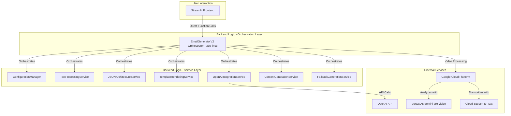

# System Patterns

## Architecture Overview

The Legal Document Analysis Portal operates on a unified Streamlit-Python architecture with a recently implemented **service-oriented backend architecture**. The major architectural enhancement focuses on modularity, maintainability, and adherence to Single Responsibility Principle.

The core architectural advancement is the **EmailGeneratorV2 Modular Refactoring** - transforming a monolithic 5,466-line class into a lightweight orchestrator with 7 focused service classes, achieving 94% code reduction while maintaining full backward compatibility.

### Current Service-Oriented Architecture

## Key Technical Patterns

### Service-Oriented Design Patterns

The current architecture emphasizes modularity and maintainability through strict service separation:

*   **Single Responsibility Principle**: Each service handles exactly one functional area (configuration, text processing, JSON operations, etc.)
*   **Dependency Injection**: The orchestrator injects dependencies between services for loose coupling
*   **Service Coordination**: EmailGeneratorV2 acts as a lightweight coordinator rather than monolithic processor
*   **Modular Package Structure**: Services organized under `backend_logic/email_generation/services/` for clear boundaries

### Simplified Processing Pipeline

The refactored architecture removes complexity while maintaining functionality:

*   **Eliminated Text Simplification**: Removed problematic Flesch score optimization that caused grammatical issues
*   **Streamlined Content Generation**: Simplified prompt-based content generation without post-processing complexity
*   **Configuration-Driven Behavior**: YAML-based configuration management through dedicated ConfigurationManager service
*   **Template-Based Rendering**: Jinja2 template operations isolated in TemplateRenderingService

### Error Recovery and Fallback Patterns

Robust error handling distributed across services:

*   **Graceful Degradation**: FallbackGenerationService provides error recovery without system failure
*   **Service-Level Error Handling**: Each service manages its own error scenarios and recovery
*   **Backward Compatibility**: All existing method interfaces preserved during refactoring
*   **Integration Testing**: Comprehensive test suite validates service integration and error paths

### CLIENT_CLARITY_ADVISOR Framework

The email generation maintains sophisticated communication framework:

*   **Core Directives**: Six core principles including collaborative tone, accessible language, and Florida law focus
*   **High-Stakes Advice Protocol**: Five-step process for counter-intuitive recommendations
*   **Service Integration**: Framework principles applied through ContentGenerationService and TemplateRenderingService

### Video Data Preservation

Advanced video processing capabilities maintained through service architecture:

*   **Proactive Token Management**: Token counting through dedicated services prevents BadRequestError scenarios
*   **Data Persistence**: GCS-based storage system with intelligent summarization
*   **Graceful Degradation**: Video processing continues with preserved data when token limits exceeded

## Architectural Benefits

### Maintainability Improvements
*   **94% Code Reduction**: Main class reduced from 5,466 to 335 lines
*   **Clear Service Boundaries**: Each service has focused, testable responsibilities
*   **Enhanced Debugging**: Issues isolated to specific services rather than monolithic class
*   **Easier Enhancement**: New features can be added as focused services

### Performance and Reliability
*   **Reduced Complexity**: Simplified processing pipeline eliminates problematic text simplification
*   **Service Isolation**: Failures in one service don't cascade to others
*   **Comprehensive Testing**: 100% integration test success rate validates reliability
*   **Backward Compatibility**: No breaking changes to existing functionality

## Security and Performance

*   **File Upload Security**: Application enforces whitelist of allowed file extensions and 100MB total upload limit
*   **Service-Level Security**: Each service handles its own security concerns and validation
*   **Performance Optimization**: Modular architecture eliminates unnecessary processing complexity
*   **Error Isolation**: Service boundaries prevent error propagation across system components