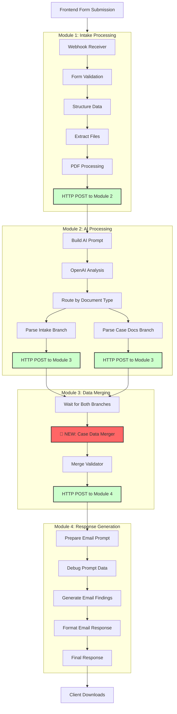
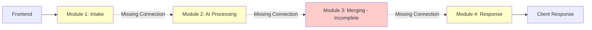

# System Patterns

## Architecture Overview

The Legal Document Analysis Portal follows a modern front-end architecture pattern with clear separation of concerns and modular organization.

### Application Architecture

```
┌─────────────────────────────────────────┐
│              Browser (Client)            │
├─────────────────────────────────────────┤
│         Static HTML + TypeScript        │
│  ┌─────────────┐  ┌─────────────────┐   │
│  │    UI       │  │   Business      │   │
│  │ Components  │  │     Logic       │   │
│  │             │  │                 │   │
│  └─────────────┘  └─────────────────┘   │
├─────────────────────────────────────────┤
│         Vite Build System               │
└─────────────────────────────────────────┘
            │
            ▼
┌─────────────────────────────────────────┐
│         n8n Webhook API                 │
│      (External Processing)              │
└─────────────────────────────────────────┘
```

## File Organization Patterns

### Source Directory Structure
```
src/
├── index.html          # Main application entry point
├── main.ts            # TypeScript application bootstrap
├── components/        # Reusable UI components (future)
│   ├── FileUpload/   # File upload component
│   ├── CaseForm/     # Case information form
│   └── StatusDisplay/ # Status and results display
└── assets/           # Static assets
    ├── images/       # Images and icons
    ├── styles/       # CSS files (future extraction)
    └── fonts/        # Custom fonts
```

### Component-Based Architecture Pattern ✅ IMPLEMENTED

The application has been successfully refactored from a monolithic structure to a modern component-based architecture:

#### Previous State (Monolithic) - COMPLETED
- **Single HTML file**: All UI structure was in `src/index.html`
- **Single TypeScript file**: All logic was in `src/main.ts`
- **Inline CSS**: Styles were embedded in HTML

#### Current State (Component-Based) - IMPLEMENTED ✅
- **UI Components**: Reusable components extracted into `/src/components/`
  - [`Header.ts`](src/components/Header.ts) - Firm logo and tagline
  - [`FormHeader.ts`](src/components/FormHeader.ts) - Form title and description
  - [`CaseForm.ts`](src/components/CaseForm.ts) - Case information form with validation
  - [`FileUpload.ts`](src/components/FileUpload.ts) - Drag & drop file upload interface
  - [`FileManager.ts`](src/components/FileManager.ts) - File list management and statistics
  - [`StatusDisplay.ts`](src/components/StatusDisplay.ts) - Status messages and submit button
- **Style Modules**: CSS extracted into [`styles.ts`](src/components/styles.ts) shared stylesheet
- **Type Safety**: Shared type definitions in [`types.ts`](src/components/types.ts)
- **Business Logic**: Application orchestration in refactored [`main.ts`](src/main.ts)
- **Minimal HTML Shell**: [`src/index.html`](src/index.html) now only contains root element

#### Component Responsibilities
- **Header**: Brand presentation and firm identity
- **FormHeader**: Application title and description
- **CaseForm**: Case information collection with form validation
- **FileUpload**: File selection, drag & drop handling, and folder structure guidance
- **FileManager**: File display, statistics tracking, and file removal controls
- **StatusDisplay**: User feedback, processing states, and download links

## Key Technical Patterns

### State Management Pattern
```typescript
// Current: Global state with Map-based file storage
let uploadedFiles = new Map<string, FileData>();

// Future: Consider state management library for complex interactions
```

### Event Handling Pattern
```typescript
// DOM Event Listeners
uploadSection.addEventListener('dragover', handleDragOver);
uploadSection.addEventListener('drop', handleDrop);

// Type-safe event handlers
function handleDragOver(e: DragEvent): void { /* ... */ }
```

### Error Handling Pattern
```typescript
// Consistent error handling with user feedback
try {
  // API operation
} catch (error) {
  const errorMessage = error instanceof Error ? error.message : 'Unknown error';
  showStatus(`❌ System Error: ${errorMessage}`, 'error');
}
```

### File Processing Pattern
```typescript
// Type-safe file processing with validation
interface FileData {
  file: File;
  name: string;
  size: number;
  type: string;
  path: string;
  folder: string;
}
```

## Integration Patterns

### Four-Part Modular n8n Workflow Architecture 🚧 IN DEVELOPMENT

The n8n workflow is being evolved from a working three-part system into a four-part modular architecture for enhanced maintainability, scalability, and component isolation.

#### Current Status: Completion Required

**✅ Working Three-Part System** ([`workflow/3_merge_and_respond.json`](workflow/3_merge_and_respond.json))
- Complete functional workflow with intake, AI processing, and response generation
- Proven working with proper caseId data flow and error handling
- **Status**: Production ready, currently operational

**🚧 Target Four-Part System** (Requires completion)
- Enhanced modular separation with distinct responsibilities
- Improved debugging and maintenance capabilities
- Independent scaling and optimization potential
- **Status**: Partially implemented, requires completion

#### Four-Part System Architecture Design

**Module 1: Intake Processing** ([`workflow/1_intake.json`](workflow/1_intake.json)) ✅ COMPLETED
- **Purpose**: Data reception, validation, and document extraction
- **Status**: Fully implemented and functional
- **Key Components**:
  - **Webhook Receiver**: Handles form data and binary file uploads with CORS configuration
  - **Form Data Validation**: Validates required fields (clientName, attorneyName) with error handling
  - **Data Structuring**: Creates standardized caseInfo format for downstream processing
  - **Binary File Extraction**: Separates intake forms from case documents for specialized processing
  - **PDF Processing Pipeline**: Uses PDF.co integration for form field extraction and text conversion
- **Output**: Structured intake data + extracted PDF content → Module 2

**Module 2: AI Processing** ([`workflow/2_ai_processing.json`](workflow/2_ai_processing.json)) ✅ COMPLETED
- **Purpose**: AI-powered document analysis with intelligent routing
- **Status**: Fully implemented, requires connection integration
- **Key Components**:
  - **Dynamic Prompt Builder**: Creates contextual AI prompts based on document type and extracted data
  - **OpenAI Integration**: Uses GPT-4o-mini for efficient document analysis with JSON response formatting
  - **Document Type Routing**: Intelligently routes between intake form and case document processing branches
  - **Response Parsing**: Separates AI results by document type for specialized handling
  - **Data Preservation**: Maintains caseId and structured data throughout processing
- **Output**: Parsed AI results (intake + case documents) → Module 3

**Module 3: Data Merging** ([`workflow/3_merging.json`](workflow/3_merging.json)) ❌ INCOMPLETE
- **Purpose**: Branch synchronization, data consolidation, and validation
- **Status**: Missing critical Case Data Merger component
- **Implemented Components**:
  - **Wait for Branches**: Synchronizes multiple processing branches ✅
  - **Merge Validator**: Validates merged case data structure ✅
- **Missing Components**:
  - **❌ Case Data Merger**: Core logic to combine intake and case document analysis
  - **❌ Input Connection**: No webhook to receive Module 2 output
  - **❌ Output Connection**: No mechanism to send data to Module 4
- **Required Output**: Validated unified case file → Module 4

**Module 4: Response Generation** ([`workflow/4_response.json`](workflow/4_response.json)) ✅ COMPLETED
- **Purpose**: Professional email generation and client response
- **Status**: Fully implemented, requires connection integration
- **Key Components**:
  - **Enhanced Email Prompt Preparation**: Multi-level fallback data access with complete case context
  - **GPT-4o Email Generation**: Creates client-ready findings letters with enhanced model capability
  - **Debug and Validation**: Comprehensive data debugging and processing verification
  - **Multi-Format Response**: Generates both .eml (email-ready) and .txt (plain text) downloads
  - **Final Response**: Returns structured JSON with download links and processing metadata
- **Output**: Complete client response with downloadable findings letters

#### Required Components for Completion

**1. Case Data Merger Node** (Module 3)
- **Purpose**: Combine AI processing results from intake and case document branches
- **Source**: Extract and adapt from working [`3_merge_and_respond.json`](workflow/3_merge_and_respond.json)
- **Features Required**:
  - Robust fallback logic for missing client/attorney names
  - caseId generation and preservation throughout pipeline
  - Processing status tracking for both branches (intake + case documents)
  - Error recovery for partial failures with graceful degradation
  - Structured data validation and integrity checks

**2. Inter-Module HTTP Connections**
- **Module 1 → Module 2**: HTTP POST after PDF processing completion
- **Module 2 → Module 3**: HTTP POST for both AI processing branches (intake + case docs)
- **Module 3 → Module 4**: HTTP POST after merge validation completion
- **Payload Requirements**: Preserve caseId, structured data, and processing metadata

**3. Enhanced Error Handling** (Module 2)
- Add comprehensive fallback mechanisms similar to Module 4
- Improve data preservation logic for failed processing scenarios
- Enhanced debugging and validation capabilities

#### Target Four-Part Data Flow Architecture



#### Current vs Target Architecture Comparison

**✅ Working Three-Part System**:


**🚧 Target Four-Part System** (Requires Completion):


#### Architectural Benefits

- **Modularity**: Each part handles distinct responsibilities with clear interfaces
- **Maintainability**: Individual workflows can be updated without affecting others
- **Error Isolation**: Failures in one part don't cascade to others
- **Scalability**: Parts can be independently optimized or scaled
- **Debugging**: Easier to trace issues through specific workflow sections
- **Reusability**: Individual parts can be reused in other workflow compositions

#### Advanced Integration Patterns

- **Multi-Branch Processing Pipeline**: Sophisticated document categorization with parallel processing
- **Synchronization Patterns**: Wait node coordination for proper branch convergence
- **Structured Data Flow**: Consistent JSON schema throughout processing pipeline with validation stages
- **Error Recovery Patterns**: Graceful degradation with partial success handling and comprehensive error messaging

### OpenAI API Integration Patterns ✅ IMPLEMENTED
- **Dual Model Strategy**: Optimized AI model selection based on processing requirements
  - **GPT-4o-mini**: Efficient intake form processing (4000 tokens, lower cost)
  - **GPT-4o**: Comprehensive case document analysis (8000 tokens, higher capability)
- **Structured Prompt Engineering**: JSON schema-enforced response formatting with validation
- **Response Validation Pipeline**: Multi-stage parsing with error recovery and fallback handling
- **Token Management**: Optimized prompt design for cost-effective processing and reliable results

### Professional Output Generation Patterns ✅ IMPLEMENTED
- **Email Template System**: Professional findings letter generation with business-appropriate formatting
- **Multi-Format Export**: Simultaneous .eml (email-ready) and .txt (plain text) file creation
- **Base64 Encoding Pattern**: Data URL generation for immediate browser download without server storage
- **Metadata Preservation**: Complete case information tracking and audit trail throughout pipeline

### Download System Architecture ✅ IMPLEMENTED
```typescript
// Download Link Generation Pattern
const downloadResponse = {
  downloadLinks: {
    findingsLetter: `data:message/rfc822;base64,${emlBase64}`,
    caseAnalysis: `data:text/plain;base64,${txtBase64}`,
    executiveSummary: `data:text/plain;base64,${summaryBase64}`
  },
  emailDetails: {
    emlFileName: `Findings_${caseReference}_${date}.eml`,
    txtFileName: `Analysis_${caseReference}_${date}.txt`
  }
};
```

### External API Integration
- **Enhanced Webhook Pattern**: Form data posted to n8n webhook endpoint with robust binary handling
- **Async Processing**: Non-blocking file upload with real-time progress feedback and status updates
- **Structured Response Handling**: Comprehensive response format with professional download links
- **CORS Configuration**: Proper cross-origin handling for Kinsta deployment with specific domain allowlisting

### Build System Integration
- **Vite Integration**: Modern build tooling with HMR and optimized production builds
- **TypeScript Compilation**: Type checking integrated into build process with strict mode
- **Asset Optimization**: Automatic bundling, minification, and static asset handling

## Security Patterns

### File Upload Security
- **File Type Validation**: Whitelist of allowed extensions (.pdf, .docx, .doc, .txt)
- **Size Limitations**: 100MB total upload limit with warnings
- **Client-side Validation**: Pre-upload validation for immediate feedback

### Data Handling
- **FormData API**: Secure multipart form submission
- **No Local Storage**: Files processed but not persisted locally
- **HTTPS Endpoints**: Secure transmission to processing endpoint

## Performance Patterns

### Lazy Loading
- **File Manager UI**: Hidden until files are uploaded
- **Progressive Enhancement**: Base functionality without JavaScript

### Memory Management
- **File Reference Management**: Using Map for efficient file tracking
- **Cleanup Functions**: Clear all files functionality
- **DOM Updates**: Efficient innerHTML updates for file lists

## Completed Architecture Achievements ✅

### Component Extraction - COMPLETED
1. ✅ **Header Component**: Firm branding and identity display
2. ✅ **FormHeader Component**: Application title and description
3. ✅ **CaseForm Component**: Client information form with validation
4. ✅ **FileUpload Component**: Drag & drop, file selection, and validation
5. ✅ **FileManager Component**: File list display, statistics, and management
6. ✅ **StatusDisplay Component**: Processing status, results, and submit controls

### Architectural Benefits Achieved
- ✅ **Separation of Concerns**: Each component has a single responsibility
- ✅ **Reusability**: Components can be easily reused or extended
- ✅ **Type Safety**: Full TypeScript implementation with strict typing
- ✅ **Maintainability**: Clear component boundaries and interfaces
- ✅ **Testability**: Components can be unit tested independently
- ✅ **Modularity**: Clean import/export structure

### Future Enhancement Opportunities
- **State Management Evolution**: Consider formal state management (Redux, Zustand) for complex state
- **Component Testing**: Add unit tests for each component
- **Build Optimization**: Code splitting for larger applications
- **Progressive Enhancement**: PWA capabilities for offline usage
- **Accessibility**: Enhanced ARIA labels and keyboard navigation
- **Performance**: Virtual scrolling for large file lists