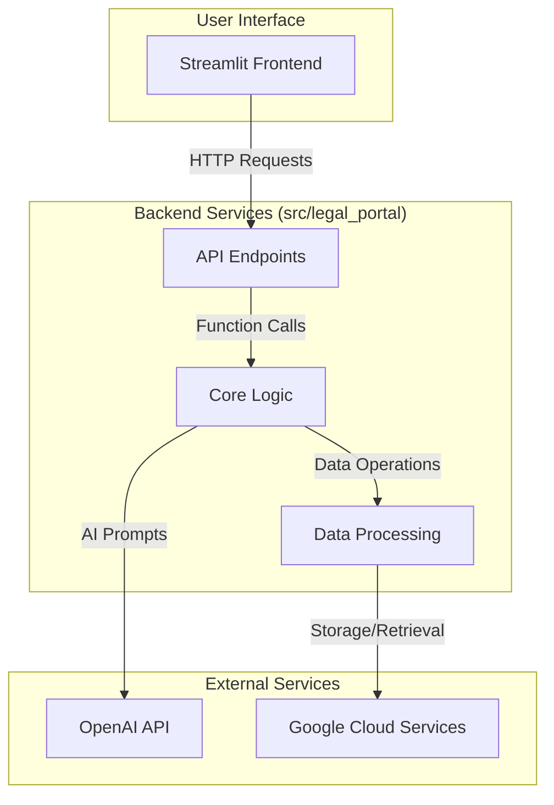

# System Patterns

## 1. High-Level Architecture

This section describes the overall architecture of the Legal Portal application, focusing on the primary components and their interactions.

## 2. Component Relationships

### 2.1 `src/legal_portal` Package

The `src/legal_portal` package represents the unified backend, organized into distinct modules:

*   **`config`**: Manages application configuration, secrets, and templates.
*   **`core`**: Contains the central business logic, including AI analysis, authentication, and data models.
*   **`services`**: Houses specialized services that perform discrete tasks like content extraction, citation tracking, and API integrations.
*   **`ui`**: Handles user interface components and interactions (if any backend-driven UI elements exist).
*   **`utils`**: Provides utility functions and helper scripts used across the application.

### 2.2 Data Flow

1.  **Ingestion**: The user uploads documents through the Streamlit frontend.
2.  **Processing**: The backend API receives the files and routes them to the appropriate `document_processor` in the `core` module.
3.  **Analysis**: The `ai_analyzer` interacts with the OpenAI API to extract insights and generate content.
4.  **Output**: The results are formatted by `content_formatting_service` and returned to the user.

## 3. Design Patterns

*   **Modular Service Architecture**: Key functionalities are encapsulated in independent services, promoting separation of concerns and maintainability.
*   **Centralized Configuration**: All configuration is managed through the `config` module, simplifying environment management.
*   **Facade Pattern**: The `main_processor` service may act as a facade, simplifying the interface to a complex subsystem of other services.

## 4. Testing Patterns

*   **Framework**: `pytest` is the standard framework for all unit and integration tests.
*   **Path Management**: A `pytest.ini` file is used to set the `pythonpath` to `src/`. This resolves absolute import issues (`from legal_portal...`) and ensures tests can locate the application source code consistently.
*   **Mocking**:
    *   The `unittest.mock.patch` decorator is used extensively to isolate components and mock external dependencies, particularly Streamlit's `session_state` and backend services.
    *   **Key Insight**: To avoid `TypeError`s when mocking complex objects like `st.session_state`, it is crucial to configure the mock with detailed specifications. This includes defining all attributes and methods that the code under test will access.