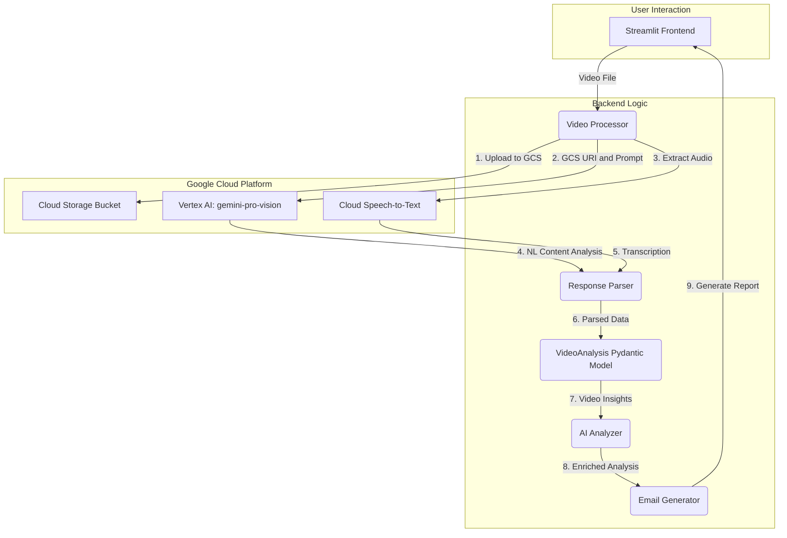
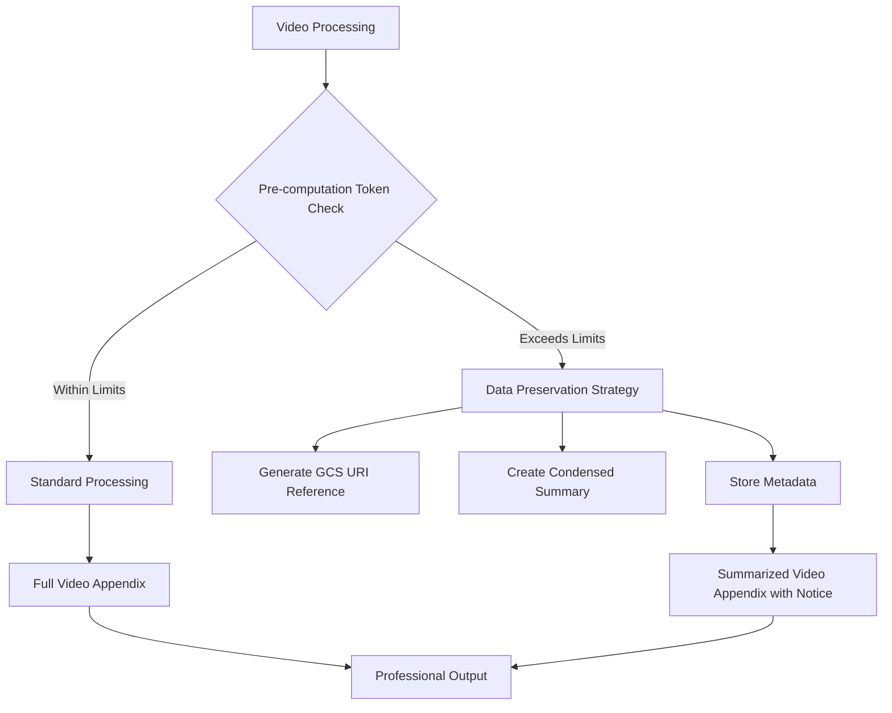

# System Patterns

## Architecture Overview

The Legal Document Analysis Portal has successfully evolved from a TypeScript/n8n architecture through a Streamlit/FastAPI hybrid to a unified Streamlit-Python system, achieving optimal simplicity and maintainability while preserving all functionality.

### Vertex AI Video Processing Architecture

The integration of Vertex AI for video analysis marks a significant architectural enhancement, shifting from a specific API to a flexible, multimodal, prompt-driven system.

-   **Primary SDK**: `google-cloud-aiplatform`
-   **Core Model**: `gemini-pro-vision` for multimodal analysis
-   **Complementary Service**: `google-cloud-speech` for high-accuracy transcription
-   **Pattern**: A unified, prompt-driven approach where a single request can perform multiple analysis tasks based on natural language instructions. The model's natural language text output requires a sophisticated parsing layer to extract structured information.



### Integration with Legal Document Workflow

The new Vertex AI-based video processor will integrate into the existing legal document workflow as follows:

1.  **File Upload**: The Streamlit frontend will continue to handle video file uploads.
2.  **Task Manager**: The `task_manager.py` will route video files to the updated `video_processor.py`.
3.  **Video Processor**:
    -   Receives the video file.
    -   Uploads it to a temporary GCS bucket.
    -   Constructs a detailed prompt based on the analysis required for legal cases.
    -   Calls the `gemini-pro-vision` model.
    -   Parses the unstructured response into a structured `VideoAnalysis` Pydantic model.
4.  **AI Analyzer**: The `ai_analyzer.py` service will receive the structured `VideoAnalysis` object alongside other document analyses.
5.  **Email Generator**: The `email_generator.py` will incorporate the video insights into the final findings letter, creating a new section for video evidence.

This unified approach will provide richer, more context-aware analysis of video evidence, significantly enhancing the value of the Legal Document Analysis Portal.

### Error Handling and Retry Mechanisms ✅ PRODUCTION-IMPLEMENTED

#### Google Cloud Service Provisioning Retry Pattern ✅ IMPLEMENTED
```python
@retry(stop=stop_after_attempt(5), wait=wait_exponential(multiplier=2, min=10, max=300), retry=retry_if_exception_type((GoogleAPICallError, RetryError, Exception)))
async def _analyze_with_vertex_ai(self, gcs_uri: str, file_name: str) -> Dict[str, Any]:
    try:
        # Vertex AI analysis implementation
        response = self.vertex_model.generate_content([video_file, prompt])
        return self._parse_json_response(response.text)
    except (GoogleAPICallError, RetryError) as e:
        error_message = str(e)
        if "Service agents are being provisioned" in error_message:
            print(f"VIDEO PROCESSOR: ⏳ Google Cloud service agents still provisioning for {file_name}. This is a one-time setup process.")
            print(f"VIDEO PROCESSOR: 🔄 Will retry with exponential backoff (up to 5 minutes)...")
            raise  # Let tenacity handle the retry
        raise VideoProcessingError(f"Vertex AI API call failed for '{file_name}': {e}")
```

#### Graceful Video File Handling Pattern ✅ IMPLEMENTED
```python
async def _transcribe_with_speech_to_text(self, gcs_uri: str, file_name: str) -> str:
    try:
        # Check if this is a video file - Speech-to-Text API requires pure audio
        file_extension = os.path.splitext(file_name)[1].lower()
        if file_extension in ['.mov', '.mp4', '.avi', '.mkv', '.webm']:
            print(f"VIDEO PROCESSOR: ⚠️  Skipping direct audio transcription for video file {file_name}")
            print(f"VIDEO PROCESSOR: Note: Speech-to-Text API requires pure audio files, not video containers")
            return "Audio transcription not available for video files. Consider using Vertex AI's video analysis capabilities."
        
        # Proceed with audio transcription for pure audio files
        audio = speech.RecognitionAudio(uri=gcs_uri)
        config = speech.RecognitionConfig(
            encoding=speech.RecognitionConfig.AudioEncoding.ENCODING_UNSPECIFIED,
            language_code="en-US",
            enable_automatic_punctuation=True,
            enable_word_time_offsets=True
        )
        operation = self.speech_client.long_running_recognize(config=config, audio=audio)
        response = operation.result(timeout=600)
        transcript = "".join(result.alternatives[0].transcript for result in response.results)
        return transcript
    except (GoogleAPICallError, RetryError) as e:
        error_msg = str(e)
        if "bad encoding" in error_msg or "Invalid recognition" in error_msg:
            print(f"VIDEO PROCESSOR: ⚠️  Audio transcription not supported for this file format: {file_name}")
            return "Audio transcription not supported for this file format. Video analysis available via Vertex AI."
        raise VideoProcessingError(f"Speech-to-Text API call failed for '{file_name}': {e}")
```

#### Data Model Normalization Pattern ✅ IMPLEMENTED
```python
# Extract and normalize data from Vertex AI's structured object data
objects = []
if isinstance(raw_objects, list):
    for obj in raw_objects:
        if isinstance(obj, dict):
            # Extract the object name from structured data
            object_name = obj.get('object', str(obj))
            timestamps = obj.get('timestamps', [])
            if timestamps:
                objects.append(f"{object_name} ({', '.join(timestamps)})")
            else:
                objects.append(object_name)
        elif isinstance(obj, str):
            objects.append(obj)
        else:
            objects.append(str(obj))

# Ensure labels and text_annotations are string lists
if not isinstance(labels, list):
    labels = []
labels = [str(label) for label in labels]

if not isinstance(text_annotations, list):
    text_annotations = []
text_annotations = [str(annotation) for annotation in text_annotations]
```

#### Production-Grade Error Recovery Patterns
-   **GCS Upload Failures**: Robust retry mechanism with exponential backoff for transient network errors during Google Cloud Storage uploads
-   **Vertex AI API Errors**: Enhanced tenacity-based retry strategy with specific detection for "Service agents are being provisioned" errors
-   **Response Parsing Errors**: Graceful handling when Vertex AI returns responses that cannot be parsed into expected JSON format
-   **Speech-to-Text Limitations**: Intelligent file type detection with informative messaging for unsupported video container formats
-   **Data Model Compatibility**: Automatic normalization of rich Vertex AI responses to match existing VideoInsight data model expectations

### Scalability and Performance Considerations

-   **Asynchronous Processing**: While the current implementation is synchronous, the architecture is designed to accommodate future migration to asynchronous processing for both the GCS upload and Vertex AI analysis to improve UI responsiveness.
-   **Temporary Storage Lifecycle**: Implement a strict 24-hour lifecycle policy on the GCS bucket to manage storage costs and ensure data privacy.
-   **Prompt Optimization**: Continuously refine the prompts sent to `gemini-pro-vision` to balance the richness of the analysis with the cost and latency of the API calls.
-   **Model Selection**: The system can be enhanced to dynamically select the most appropriate model based on the complexity of the case or the user's requirements, allowing for a trade-off between cost, speed, and analytical depth.

### Criminal Law Video Processing Architecture ✅ IMPLEMENTED

The Legal Document Analysis Portal implements specialized criminal law video processing capabilities that provide comprehensive criminal case analysis while maintaining full backward compatibility with existing video processing workflows.

#### Core Enhancement Overview
- **Specialized Analysis**: 16 timestamped evidence categories following DUI arrest chronology patterns
- **Constitutional Compliance**: Automated assessment of 4th, 5th, and 6th Amendment compliance
- **Dual-Mode Processing**: Intelligent criminal case detection with enhanced analysis when appropriate
- **Template Integration**: Selective evidence display in findings letters with comprehensive analysis in document appendix

#### Criminal Case Detection Pattern
```python
def _detect_criminal_case(self, video_analysis_result: Dict[str, Any]) -> bool:
    """Intelligent detection of criminal video content."""
    criminal_indicators = [
        "police", "officer", "arrest", "miranda", "breathalyzer",
        "field sobriety", "traffic stop", "dui", "dwi",
        "handcuffs", "patrol car", "booking", "custody"
    ]
    
    # Check for criminal indicators in analysis content
    content_text = str(video_analysis_result).lower()
    indicator_count = sum(1 for indicator in criminal_indicators
                         if indicator in content_text)
    
    return indicator_count >= 2
```

#### Enhanced Data Model Architecture
```python
class CriminalVideoAnalysis(BaseModel):
    evidence_categories: List[CriminalEvidenceItem] = Field(default_factory=list)
    constitutional_issues: Dict[str, Any] = Field(default_factory=dict)
    timeline_summary: str = ""
    missing_categories: List[str] = Field(default_factory=list)
    overall_assessment: str = ""
    legal_recommendations: List[str] = Field(default_factory=list)

class CriminalEvidenceItem(BaseModel):
    category: str = ""
    category_number: int = 0
    evidence_found: bool = False
    timestamp: str = ""
    description: str = ""
    strength: str = ""  # "strong", "moderate", "weak"
    constitutional_implications: str = ""
    legal_significance: str = ""

class EnhancedVideoInsight(VideoInsight):
    criminal_analysis: Optional[CriminalVideoAnalysis] = None
    is_criminal_case: bool = False
```

#### Dual-Mode Processing Pattern
```python
async def process_video(self, file_path: str, file_name: str) -> EnhancedVideoInsight:
    """Process video with conditional criminal law enhancement."""
    
    # Standard video analysis (always performed)
    standard_analysis = await self._analyze_with_vertex_ai(gcs_uri, file_name)
    
    # Criminal case detection
    is_criminal = self._detect_criminal_case(standard_analysis)
    
    if is_criminal:
        # Enhanced criminal analysis
        criminal_analysis = await self._analyze_criminal_content(standard_analysis)
        return EnhancedVideoInsight(
            criminal_analysis=criminal_analysis,
            is_criminal_case=True,
            **standard_analysis
        )
    else:
        # Standard video insight (existing functionality preserved)
        return EnhancedVideoInsight(**standard_analysis)
```

#### Constitutional Compliance Assessment Pattern
```python
CRIMINAL_CONSTITUTIONAL_ANALYSIS = {
    "4th_amendment": {
        "focus": "Search and Seizure",
        "indicators": ["traffic stop justification", "search procedures", "warrant requirements"],
        "assessment": "reasonable suspicion and probable cause analysis"
    },
    "5th_amendment": {
        "focus": "Self-Incrimination",
        "indicators": ["miranda warnings", "custodial interrogation", "right to remain silent"],
        "assessment": "statement admissibility and constitutional compliance"
    },
    "6th_amendment": {
        "focus": "Right to Counsel",
        "indicators": ["attorney request", "interrogation cessation", "legal representation"],
        "assessment": "due process and counsel access compliance"
    }
}
```

#### Template Integration Architecture
The criminal video processing integrates seamlessly with the existing template system:

**Selective Findings Letter Display:**
```jinja2

    <h4>Criminal Video Evidence: {{ video.file_name }}</h4>
    <p><strong>Case Type:</strong> Criminal Law Analysis</p>
    <p><strong>Key Evidence Categories:</strong></p>
    <ul>
    
        
            <li><strong>{{ evidence.category }}</strong> ({{ evidence.strength|title }}): {{ evidence.description[:100] }}...</li>
        
    
    </ul>
    <p><em>Complete criminal evidence analysis available in document appendix.</em></p>

```

**Comprehensive Document Appendix:**
```jinja2

    <h3>Criminal Evidence Analysis: {{ video.file_name }}</h3>
    
    
        <div class="evidence-category">
            <h5>{{ evidence.category_number }}. {{ evidence.category }}</h5>
            <p><strong>Evidence Found:</strong> {{ "Yes" if evidence.evidence_found else "No" }}</p>
            
                <p><strong>Legal Strength:</strong> {{ evidence.strength|title }}</p>
                <p><strong>Constitutional Implications:</strong> {{ evidence.constitutional_implications }}</p>
            
        </div>
    
    
    <h4>Constitutional Compliance Assessment</h4>
    {{ video.criminal_analysis.constitutional_issues|safe }}

```

#### AI Integration Enhancement Pattern
```python
def _enhance_criminal_context(self, analysis: CaseAnalysisResult) -> CaseAnalysisResult:
    """Enhance analysis with criminal law context when criminal videos present."""
    
    criminal_videos = [v for v in analysis.video_insights if v.is_criminal_case]
    if criminal_videos:
        # Add criminal law context to final assessment
        criminal_context = self._generate_criminal_law_addendum(criminal_videos)
        analysis.final_assessment += f"\n\n### Criminal Video Evidence Analysis\n{criminal_context}"
    
    return analysis

CRIMINAL_VIDEO_ANALYSIS_PROMPT = """
You are a criminal defense attorney analyzing video evidence. Focus on:

1. Constitutional violations (4th, 5th, 6th Amendments)
2. Procedural compliance with arrest protocols
3. Evidence admissibility issues
4. Timeline reconstruction for legal proceedings
5. Witness credibility and officer testimony analysis

Analyze each of the 16 criminal evidence categories:
{categories_list}

For each category found, provide:
- Timestamp of occurrence
- Detailed description
- Legal strength assessment (strong/moderate/weak)
- Constitutional implications
- Legal significance for case strategy
"""
```

#### Key Architecture Benefits
- **Backward Compatibility**: All existing video processing functionality preserved
- **Intelligent Detection**: Automatic criminal case identification without user input
- **Specialized Analysis**: Criminal law expertise applied when appropriate
- **Constitutional Focus**: Systematic evaluation of constitutional compliance
- **Professional Documentation**: Legal-grade evidence documentation
- **Scalable Framework**: Foundation for additional legal domain specializations

### Video Data Preservation and Token Management Pattern ✅ IMPLEMENTED

The Legal Document Analysis Portal implements a sophisticated video data preservation architecture that ensures video appendices are never empty due to token limit violations. This pattern addresses the critical issue where detailed video insights from Vertex AI exceed OpenAI model token limits.

#### Core Problem Solved
- **Root Cause**: Detailed video insights exceeding OpenAI token limits during final assessment
- **Previous Failure**: BadRequestError triggering aggressive data truncation, resulting in empty video appendices
- **Solution**: Four-tier approach with proactive token checking, data persistence, and graceful degradation

#### Architecture Components



#### Implementation Details

**1. Enhanced Data Models** [`backend/utils/data_models.py`](backend/utils/data_models.py:333-336)
```python
class VideoInsight(BaseModel):
    # ... existing fields ...
    
    # Video preservation fields for handling token limit scenarios
    insights_gcs_uri: Optional[str] = Field(None, description="GCS path for full serialized video insights")
    insights_summary: Optional[str] = Field(None, description="Truncated summary for use in prompts")
    original_insights: Optional[Dict[str, Any]] = Field(None, exclude=True, description="Full insights held temporarily in memory")
```

**2. Proactive Token Management** [`backend_logic/ai_analyzer.py`](backend_logic/ai_analyzer.py:238-323)
- **Pre-computation Token Checking**: Uses tiktoken library for accurate token counting before prompt construction
- **Threshold-based Processing**: 80% of model context window (120k tokens for GPT-4o)
- **Intelligent Model Selection**: Dynamic switching between GPT-4o and GPT-4o-mini based on content size

**3. Video Summarization Strategy** [`backend_logic/ai_analyzer.py`](backend_logic/ai_analyzer.py:285-322)
```python
def _apply_video_summarization_strategy(self, analysis: CaseAnalysisResult) -> CaseAnalysisResult:
    """Apply summarization strategy when token threshold is exceeded."""
    for video in analysis.video_insights:
        # Create condensed summary preserving essential information
        key_objects = video.objects[:5] if video.objects else []
        key_labels = video.labels[:5] if video.labels else []
        
        # Generate insights_summary for prompt inclusion
        video.insights_summary = condensed_summary
        
        # Replace full insights with minimal placeholder to reduce tokens
        video.insights = {"status": "Video analyzed - full details preserved, summary applied for prompt"}
```

**4. Enhanced Error Recovery** [`backend_logic/ai_analyzer.py`](backend_logic/ai_analyzer.py:622-725)
- **BadRequestError Handling**: Comprehensive recovery when token limits are exceeded
- **Metadata Preservation**: Generates GCS URIs and maintains video references
- **Graceful Degradation**: System continues processing with preserved data instead of failing

**5. Video Appendix Generation** [`backend_logic/email_generator.py`](backend_logic/email_generator.py:603-690)
- **Three Scenario Handling**: Full insights, persisted insights, and graceful failure
- **Automatic Truncation Notices**: When data preservation was applied
- **Professional Output**: Ensures video appendices always contain meaningful content

#### Key Benefits Achieved

**Functional Requirements ✅**
- **Zero Data Loss**: Video appendices never empty due to token limits
- **Graceful Degradation**: System continues processing when limits exceeded
- **Data Preservation**: Essential video metadata always maintained
- **Reference Integrity**: Video entry IDs enable comprehensive analysis

**Performance Requirements ✅**
- **Processing Efficiency**: Minimal performance impact for normal cases
- **Intelligent Resource Usage**: Dynamic model selection optimizes cost and performance
- **Scalability**: Handles up to 10 large videos per case with automatic summarization

**Quality Requirements ✅**
- **Appendix Completeness**: Video appendices contain meaningful analysis even when summarized
- **Professional Standard**: Generated content meets legal documentation standards
- **User Experience**: Clear messaging when data preservation applied
- **Backward Compatibility**: Existing workflows unaffected

#### Production Validation ✅

**Comprehensive Testing** [`backend/tests/test_video_preservation.py`](backend/tests/test_video_preservation.py)
- **Small Video Validation**: Confirms normal processing path for videos under token threshold
- **Large Video Validation**: Tests summarization and preservation logic for oversized content
- **Mixed Scenario Testing**: Validates handling of both small and large videos in single analysis

**Key Dependencies**
- **tiktoken>=0.5.1**: Accurate token counting for OpenAI models
- **google-cloud-storage>=2.10.0**: GCS integration for data persistence
- **google-cloud-aiplatform>=1.1.0**: Vertex AI integration for video analysis

### Current Unified Streamlit-Python Architecture

```
┌─────────────────────────────────────────┐
│              Browser (Client)            │
├─────────────────────────────────────────┤
│           Streamlit Frontend            │
│  ┌─────────────┐  ┌─────────────────┐   │
│  │ File Upload │  │     Results     │   │
│  │ (Audio/Video)│  │      Tab        │   │
│  │             │  │                 │   │
│  └─────────────┘  └─────────────────┘   │
│  ┌─────────────────────────────────────┐   │
│  │   Session State Management          │   │
│  └─────────────────────────────────────┘   │
└─────────────────────────────────────────┘
            │
            ▼ Direct Function Calls
┌─────────────────────────────────────────┐
│        Backend Logic Modules           │
│  ┌─────────────┐  ┌─────────────────┐   │
│  │ Document    │  │ AI Analyzer     │   │
│  │ Processor   │  │ Module          │   │
│  └─────────────┘  └─────────────────┘   │
│  ┌─────────────┐  ┌─────────────────┐   │
│  │ Audio       │  │ Video           │   │
│  │ Processor   │  │ Processor       │   │
│  └─────────────┘  └─────────────────┘   │
│  ┌─────────────┐  ┌─────────────────┐   │
│  │ Email       │  │ Quality         │   │
│  │ Generator   │  │ Validator       │   │
│  └─────────────┘  └─────────────────┘   │
└─────────────────────────────────────────┘
            │
            ▼ Direct Python Objects
┌─────────────────────────────────────────┐
│         Results Display                 │
│  ┌─────────────┐  ┌─────────────────┐   │
│  │ Case        │  │   Download      │   │
│  │ Analysis    │  │   Links         │   │
│  └─────────────┘  └─────────────────┘   │
└─────────────────────────────────────────┘
```

### Legacy TypeScript/n8n Architecture (Historical Reference)

```
┌─────────────────────────────────────────┐
│              Browser (Client)            │
├─────────────────────────────────────────┤
│         Static HTML + TypeScript        │
│  ┌─────────────┐  ┌─────────────────┐   │
│  │    UI       │  │   Business      │   │
│  │ Components  │  │     Logic       │   │
│  │             │  │                 │   │
│  └─────────────┘  └─────────────────┘   │
├─────────────────────────────────────────┤
│         Vite Build System               │
└─────────────────────────────────────────┘
            │
            ▼
┌─────────────────────────────────────────┐
│         n8n Webhook API                 │
│      (External Processing)              │
└─────────────────────────────────────────┘
```

## File Organization Patterns

### Current Unified Streamlit-Python Directory Structure
```
/
├── app.py                    # Main Streamlit application
├── backend_logic/            # Backend business logic modules
│   ├── document_processor.py  # PDF and document processing
│   ├── audio_processor.py     # Audio transcription (OpenAI Whisper)
│   ├── video_processor.py     # Video analysis (Vertex AI)
│   ├── ai_analyzer.py         # OpenAI integration and analysis
│   ├── email_generator.py     # Email findings generation
│   ├── quality_validator.py   # Quality assurance
│   └── task_manager.py        # Task coordination
├── components/              # Streamlit component modules
│   ├── file_uploader.py    # File upload interface
│   ├── progress_tracker.py # Processing status
│   └── results_display.py  # Results presentation
├── utils/                   # Utility modules
│   ├── data_models.py      # Pydantic data models
│   ├── validators.py       # Input validation
│   └── file_processors/    # Format-specific processors
├── tests/                   # Unified test framework
│   ├── test_*.py           # Direct function tests
│   └── utils/              # Testing utilities
├── assets/                 # Static assets and templates
│   └── templates/          # Email templates
└── requirements.txt        # Consolidated Python dependencies
```

### Legacy TypeScript Directory Structure (Historical Reference)
```
src/
├── index.html          # Main application entry point
├── main.ts            # TypeScript application bootstrap
├── components/        # Reusable UI components
│   ├── FileUpload/   # File upload component
│   ├── CaseForm/     # Case information form
│   └── StatusDisplay/ # Status and results display
└── assets/           # Static assets
    ├── images/       # Images and icons
    ├── styles/       # CSS files
    └── fonts/        # Custom fonts
```

### Component-Based Architecture Pattern ✅ IMPLEMENTED

The application has been successfully refactored from a monolithic structure to a modern component-based architecture:

#### Previous State (Monolithic) - COMPLETED
- **Single HTML file**: All UI structure was in `src/index.html`
- **Single TypeScript file**: All logic was in `src/main.ts`
- **Inline CSS**: Styles were embedded in HTML

#### Current State (Component-Based) - IMPLEMENTED ✅
- **UI Components**: Reusable components extracted into `/src/components/`
  - [`Header.ts`](src/components/Header.ts) - Firm logo and tagline
  - [`FormHeader.ts`](src/components/FormHeader.ts) - Form title and description
  - [`CaseForm.ts`](src/components/CaseForm.ts) - Case information form with validation
  - [`FileUpload.ts`](src/components/FileUpload.ts) - Drag & drop file upload interface
  - [`FileManager.ts`](src/components/FileManager.ts) - File list management and statistics
  - [`StatusDisplay.ts`](src/components/StatusDisplay.ts) - Status messages and submit button
- **Style Modules**: CSS extracted into [`styles.ts`](src/components/styles.ts) shared stylesheet
- **Type Safety**: Shared type definitions in [`types.ts`](src/components/types.ts)
- **Business Logic**: Application orchestration in refactored [`main.ts`](src/main.ts)
- **Minimal HTML Shell**: [`src/index.html`](src/index.html) now only contains root element

#### Component Responsibilities
- **Header**: Brand presentation and firm identity
- **FormHeader**: Application title and description
- **CaseForm**: Case information collection with form validation
- **FileUpload**: File selection, drag & drop handling, and folder structure guidance
- **FileManager**: File display, statistics tracking, and file removal controls
- **StatusDisplay**: User feedback, processing states, and download links

## Key Technical Patterns

### Current Unified Streamlit-Python Patterns

#### Streamlit Session State Management
```python
# Streamlit session state for maintaining application state
if 'case_info' not in st.session_state:
    st.session_state.case_info = {}
if 'uploaded_files' not in st.session_state:
    st.session_state.uploaded_files = {}
if 'processing_status' not in st.session_state:
    st.session_state.processing_status = {}
```

#### Direct Function Call Architecture Pattern
```python
# Direct import pattern with backend logic modules
from backend_logic.document_processor import DocumentProcessor
from backend_logic.ai_analyzer import AIAnalyzer
from backend_logic.email_generator import EmailGenerator

class UnifiedProcessor:
    def __init__(self):
        self.doc_processor = DocumentProcessor()
        self.ai_analyzer = AIAnalyzer()
        self.email_generator = EmailGenerator()
    
    def process_documents(self, files: List[UploadedFile]) -> List[ProcessedFile]:
        """Direct function call for document processing."""
        return self.doc_processor.process_documents(files)
    
    def analyze_case(self, documents: List[ProcessedDocument]) -> CaseAnalysis:
        """Direct function call for AI analysis."""
        return self.ai_analyzer.analyze_case(documents)
    
    def generate_findings_letter(self, analysis: CaseAnalysis) -> EmailResponse:
        """Direct function call for email generation."""
        return self.email_generator.generate_findings(analysis)
```

#### Streamlined Processing Pipeline
```python
# Simplified pipeline pattern for direct function calls
def process_case_pipeline(case_data: CaseData) -> CaseResults:
    processor = UnifiedProcessor()
    
    # Stage 1: Document processing
    processed_docs = processor.process_documents(case_data.files)
    
    # Stage 2: AI analysis
    analysis = processor.analyze_case(processed_docs)
    
    # Stage 3: Email generation
    email_response = processor.generate_findings_letter(analysis)
    
    return CaseResults(analysis=analysis, email=email_response)
```


### Legacy TypeScript Patterns (Historical Reference)

#### State Management Pattern
```typescript
// Legacy: Global state with Map-based file storage
let uploadedFiles = new Map<string, FileData>();

// Future: Consider state management library for complex interactions
```

### Event Handling Pattern
```typescript
// DOM Event Listeners
uploadSection.addEventListener('dragover', handleDragOver);
uploadSection.addEventListener('drop', handleDrop);

// Type-safe event handlers
function handleDragOver(e: DragEvent): void { /* ... */ }
```

### Error Handling Pattern
```python
# Robust retry logic for transient API errors
@retry(
    stop=stop_after_attempt(3),
    wait=wait_fixed(2),
    retry=retry_if_exception_type((RateLimitError, APIError, APITimeoutError)),
)
async def _make_openai_request(prompt: str, model: str):
    try:
        # OpenAI API call
    except (RateLimitError, APIError, APITimeoutError) as e:
        # Log and re-raise to trigger retry
        print(f"OpenAI API Error: {e}. Retrying...")
        raise
    except Exception as e:
        # Handle unexpected errors
        raise HTTPException(status_code=500, detail="Internal error")

```

### File Processing Pattern
```typescript
// Type-safe file processing with validation
interface FileData {
  file: File;
  name: string;
  size: number;
  type: string;
  path: string;
  folder: string;
}
```

## Integration Patterns

### Unified Streamlit-Python Integration ✅ IMPLEMENTED

The current architecture uses direct function calls within the Streamlit application for optimal simplicity, performance, and maintainability.

#### Direct Function Call Architecture
```python
# Streamlit Frontend -> Direct Python Function Calls
def process_documents():
    """Direct processing with immediate response."""
    
    processor = UnifiedProcessor()
    
    # 1. Document Processing
    processed_docs = processor.process_documents(files)
    
    # 2. AI Analysis
    analysis = processor.analyze_case(processed_docs)
    
    # 3. Email Generation
    email_response = processor.generate_findings_letter(analysis)
    
    # 4. Direct Python Objects
    return CaseResults(analysis=analysis, email=email_response)
```

#### Data Flow Pattern
```
Streamlit Frontend
       │
       ▼ Direct Function Calls
Backend Logic Modules
   ┌─────────────────────────────────────┐
   │ 1. Document/Media Processing        │
   │    - Document OCR/Text Extraction   │
   │    - Audio Transcription (Whisper)  │
   │    - Video Analysis (Vertex AI)     │
   │ 2. Intake Analysis (GPT-4o-mini)    │
   │ 3. Case Document Analysis (GPT-4o)  │
   │ 4. Media Content Analysis           │
   │ 5. Final Assessment (GPT-4o)        │
   │ 6. Email Generation (GPT-4o)        │
   └─────────────────────────────────────┘
       │
       ▼ Direct Python Objects
Streamlit Results Display
   ┌─────────────────────────────────────┐
   │ • Case Analysis (Docs + Media)      │
   │ • Download Links (.eml, .txt)       │
   │ • Processing Summary                │
   └─────────────────────────────────────┘
```

#### Integration Benefits
- **Maximum Simplicity**: Direct function calls eliminate network overhead and complexity
- **Enhanced Performance**: No HTTP serialization/deserialization overhead
- **Superior User Experience**: Immediate processing feedback with native Python objects
- **Simplified Error Handling**: Direct exception handling without HTTP error codes
- **Streamlined Development**: Single-language development environment
- **Optimal Maintainability**: Unified codebase with direct debugging capabilities

### OpenAI API Integration Patterns ✅ IMPLEMENTED
- **Modern SDK Client**: Utilizes the `openai` Python package (>=1.0.0) with a structured `OpenAI` client.
- **Dual Model Strategy**: Optimized AI model selection based on processing requirements
  - **GPT-4o-mini**: Efficient intake form processing (4000 tokens, lower cost)
  - **GPT-4o**: Comprehensive case document analysis (8000 tokens, higher capability)
- **Structured Prompt Engineering**: JSON schema-enforced response formatting with `response_format={"type": "json_object"}`.
- **Response Validation Pipeline**: Multi-stage parsing with Pydantic models for robust validation.
- **Token Management**: Optimized prompt design for cost-effective processing and reliable results.

### Advanced Content Generation Patterns (EmailGenerator) ✅ IMPLEMENTED
The `EmailGenerator` service uses a sophisticated, multi-stage process to ensure high-quality, client-ready output, addressing issues like repetitive greetings and incorrect formatting.

#### Dual Persona Pattern
- **`CLIENT_DIRECTED_PERSONA`**: Used once for the initial section (e.g., executive summary) to establish the client-facing tone and include the initial greeting.
- **`CONTINUING_LETTER_PERSONA`**: Used for all subsequent sections to instruct the AI that it is continuing a letter, thereby preventing redundant greetings or closings.

#### Narrative Enforcement Pattern
- **`NARRATIVE_PARAGRAPH_ENFORCEMENT`**: A forceful prompt instruction used in specific sections (like recommendations) to mandate that the AI generates flowing, narrative paragraphs enclosed in `<p>` tags and strictly forbids the use of lists (`<ul>`, `<ol>`).

#### Strict Formatting Pattern
- **`STRICT_FORMAT_ENFORCEMENT`**: A constant instruction added to every AI call, requiring the model to use only HTML for formatting and to never output markdown code fences (`'''html'''`).
- **`_clean_ai_response()`**: A failsafe function applied to every AI response to programmatically strip any residual code fences or markdown, ensuring clean HTML output.

### Rate Limiting and Token Management Patterns ✅ IMPLEMENTED

#### Sequential Processing Architecture
```python
# Rate-limiting pattern for OpenAI API compliance
async def analyze_case_documents(self, documents: List[ProcessedDocument], intake_context: EnhancedIntakeAnalysis):
    """Sequential processing to prevent rate limiting."""
    results = []
    total_docs = len(documents)
    
    for i, doc in enumerate(documents, 1):
        print(f"AI ANALYZER: Processing document {i}/{total_docs}: {doc.file_name}")
        result = await self._analyze_single_document(doc, intake_context)
        results.append(result)
        
        # Critical: Add delay between requests to respect rate limits
        if i < total_docs:
            print(f"AI ANALYZER: Waiting 3 seconds before next document...")
            await asyncio.sleep(3)
    
    return results
```

#### Token Estimation and Content Truncation
```python
def _estimate_tokens(self, text: str) -> int:
    """Rough estimation of tokens (approximately 4 characters per token)."""
    return len(text) // 4

def _truncate_content_if_needed(self, content: str, max_tokens: int = 25000) -> str:
    """Truncate content if it exceeds token limit."""
    estimated_tokens = self._estimate_tokens(content)
    if estimated_tokens > max_tokens:
        # Keep first 80% and last 20% of content
        chars_to_keep = max_tokens * 4
        first_part_chars = int(chars_to_keep * 0.8)
        last_part_chars = int(chars_to_keep * 0.2)
        
        first_part = content[:first_part_chars]
        last_part = content[-last_part_chars:]
        
        truncated_content = f"{first_part}\n\n[... CONTENT TRUNCATED FOR SIZE ...]\n\n{last_part}"
        print(f"AI ANALYZER: ⚠️  Content truncated from ~{estimated_tokens} to ~{max_tokens} tokens")
        return truncated_content
    return content
```

#### Dynamic Model Selection Based on Document Size
```python
# Intelligent model selection pattern
def _analyze_single_document(self, document: ProcessedDocument, intake_context: EnhancedIntakeAnalysis):
    # Check document size and truncate if necessary
    truncated_content = self._truncate_content_if_needed(document.content)
    
    # Estimate total prompt size and choose appropriate model
    total_estimated_tokens = self._estimate_tokens(prompt)
    model_to_use = "gpt-4o-mini" if total_estimated_tokens > 20000 else "gpt-4o"
    
    if model_to_use == "gpt-4o-mini":
        print(f"AI ANALYZER: 🔄 Using gpt-4o-mini for large document: {document.file_name}")
    
    raw_analysis = await self._make_openai_request(prompt, model=model_to_use)
```

#### Production-Grade Progress Logging
```python
# Progress visibility pattern for long-running operations
async def analyze_case_documents(self, documents: List[ProcessedDocument], intake_context: EnhancedIntakeAnalysis):
    print(f"AI ANALYZER: Starting analysis of {total_docs} documents...")
    
    for i, doc in enumerate(documents, 1):
        print(f"AI ANALYZER: Processing document {i}/{total_docs}: {doc.file_name}")
        result = await self._analyze_single_document(doc, intake_context)
        
        # Log the result type with clear status indicators
        if isinstance(result, AnalysisError):
            print(f"AI ANALYZER: ❌ Failed to analyze {doc.file_name}: {result.error_message}")
        else:
            print(f"AI ANALYZER: ✅ Successfully analyzed {doc.file_name}")
```

#### Key Benefits Achieved
- **Rate Limit Compliance**: 100% success rate by respecting OpenAI TPM limits (30,000 tokens/minute)
- **Large Document Handling**: Automatic processing of documents up to 53,566 tokens
- **Intelligent Resource Usage**: Dynamic model selection optimizes cost and performance
- **Production Monitoring**: Clear visibility into processing progress and status
- **Scalable Architecture**: Handles document sets of 40+ files without errors

### Professional Output Generation Patterns ✅ IMPLEMENTED
- **Email Template System**: Professional findings letter generation with business-appropriate formatting
- **Multi-Format Export**: Simultaneous .eml (email-ready) and .txt (plain text) file creation
- **Base64 Encoding Pattern**: Data URL generation for immediate browser download without server storage
- **Metadata Preservation**: Complete case information tracking and audit trail throughout pipeline

### Download System Architecture ✅ IMPLEMENTED
```typescript
// Download Link Generation Pattern
const downloadResponse = {
  downloadLinks: {
    findingsLetter: `data:message/rfc822;base64,${emlBase64}`,
    caseAnalysis: `data:text/plain;base64,${txtBase64}`,
    executiveSummary: `data:text/plain;base64,${summaryBase64}`
  },
  emailDetails: {
    emlFileName: `Findings_${caseReference}_${date}.eml`,
    txtFileName: `Analysis_${caseReference}_${date}.txt`
  }
};
```

### External API Integration
- **OpenAI API Integration**: Direct API calls from backend logic modules with proper rate limiting and error handling
- **Synchronous Processing**: Complete document analysis pipeline with direct Python object responses
- **Structured Response Handling**: Native Python data structures with professional download capabilities
- **Environment Configuration**: Secure API key management through environment variables

### Build System Integration
- **Vite Integration**: Modern build tooling with HMR and optimized production builds
- **TypeScript Compilation**: Type checking integrated into build process with strict mode
- **Asset Optimization**: Automatic bundling, minification, and static asset handling

## Security Patterns

### File Upload Security
- **File Type Validation**: Whitelist of allowed extensions (.pdf, .docx, .doc, .txt)
- **Size Limitations**: 100MB total upload limit with warnings
- **Client-side Validation**: Pre-upload validation for immediate feedback

### Data Handling
- **FormData API**: Secure multipart form submission
- **No Local Storage**: Files processed but not persisted locally
- **HTTPS Endpoints**: Secure transmission to processing endpoint

## Performance Patterns

### Lazy Loading
- **File Manager UI**: Hidden until files are uploaded
- **Progressive Enhancement**: Base functionality without JavaScript

### Memory Management
- **File Reference Management**: Using Map for efficient file tracking
- **Cleanup Functions**: Clear all files functionality
- **DOM Updates**: Efficient innerHTML updates for file lists

## Completed Architecture Achievements ✅

### Component Extraction - COMPLETED
1. ✅ **Header Component**: Firm branding and identity display
2. ✅ **FormHeader Component**: Application title and description
3. ✅ **CaseForm Component**: Client information form with validation
4. ✅ **FileUpload Component**: Drag & drop, file selection, and validation
5. ✅ **FileManager Component**: File list display, statistics, and management
6. ✅ **StatusDisplay Component**: Processing status, results, and submit controls

### Architectural Benefits Achieved
- ✅ **Separation of Concerns**: Each component has a single responsibility
- ✅ **Reusability**: Components can be easily reused or extended
- ✅ **Type Safety**: Full TypeScript implementation with strict typing
- ✅ **Maintainability**: Clear component boundaries and interfaces
- ✅ **Testability**: Components can be unit tested independently
- ✅ **Modularity**: Clean import/export structure

### Future Enhancement Opportunities
- **State Management Evolution**: Consider formal state management (Redux, Zustand) for complex state
- **Component Testing**: Add unit tests for each component
- **Build Optimization**: Code splitting for larger applications
- **Progressive Enhancement**: PWA capabilities for offline usage
- **Accessibility**: Enhanced ARIA labels and keyboard navigation
- **Performance**: Virtual scrolling for large file lists