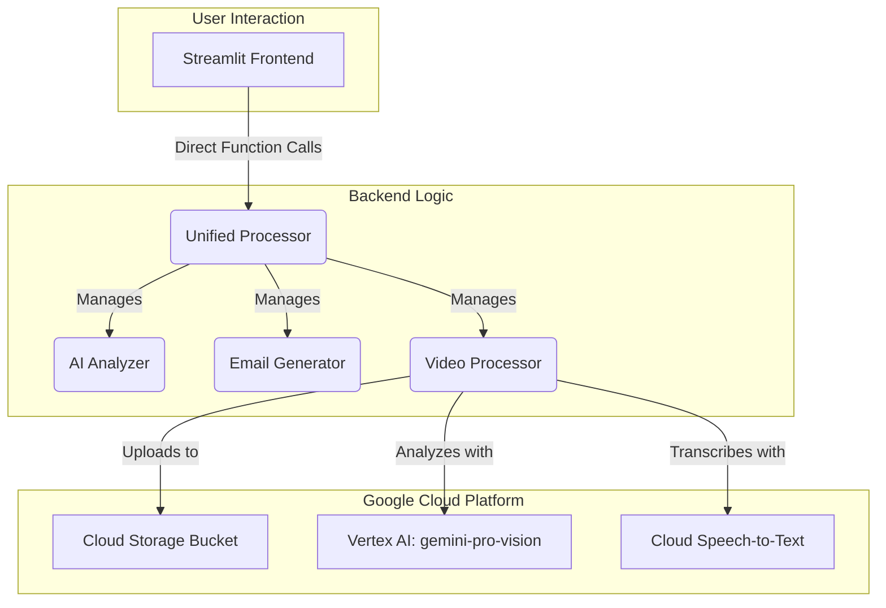

# System Patterns

## Architecture Overview

The Legal Document Analysis Portal now operates on a unified Streamlit-Python architecture, which has replaced the legacy TypeScript/n8n and FastAPI systems. This modern approach simplifies the application's structure, enhances performance, and improves maintainability while preserving all core functionality.

The integration of **Vertex AI** for video analysis and the **CLIENT_CLARITY_ADVISOR** framework for email generation represent the primary architectural enhancements.

### Current Unified Streamlit-Python Architecture

## Key Technical Patterns

### Unified Streamlit-Python Patterns

The current architecture is defined by its simplicity and directness, using a single language and framework to handle all aspects of the application.

*   **Streamlit Session State**: The application uses `st.session_state` to manage user sessions and maintain state across interactions.
*   **Direct Function Calls**: All backend logic is executed through direct Python function calls from the main `app.py`, eliminating the need for network requests or APIs.
*   **Modular Codebase**: The `backend_logic` and `utils` directories contain well-defined modules with specific responsibilities, such as document processing, AI analysis, and data modeling.

### CLIENT_CLARITY_ADVISOR Framework

The `EmailGenerator` has been enhanced with a sophisticated framework that transforms legal communications into warm, collaborative, and accessible client partnerships.

*   **Core Directives**: The framework is built on six core principles, including a collaborative tone, accessible language, and an exclusive focus on Florida law.
*   **High-Stakes Advice Protocol**: A specialized five-step process is used for delivering counter-intuitive recommendations, ensuring clarity and client confidence.
*   **Accessibility Integration**: The system automatically applies professional formatting and accessibility guidelines to all generated content.

### Video Data Preservation

The application implements a robust video data preservation architecture to prevent data loss when processing large video files that exceed token limits.

*   **Proactive Token Management**: The system uses the `tiktoken` library to check token counts before processing, preventing `BadRequestError` scenarios.
*   **Data Persistence**: A GCS-based storage system, along with intelligent summarization, ensures that all video data is preserved.
*   **Graceful Degradation**: When token limits are exceeded, the system continues to process requests with preserved data, ensuring that video appendices always contain meaningful content.

## Security and Performance

*   **File Upload Security**: The application enforces a whitelist of allowed file extensions and a 100MB total upload limit to ensure security.
*   **Performance**: The unified architecture eliminates network overhead, leading to faster processing times and a more responsive user experience.