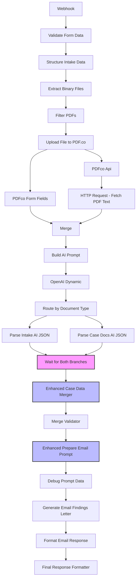

# n8n Workflow Redesign Plan: Generate Findings Email

## Executive Summary

The current n8n workflow suffers from critical data flow issues that result in incomplete email generation. The primary problems are: (1) the Respond to Webhook node only returns the first item from merged branches, (2) missing branch synchronization, (3) inadequate data hydration with fallbacks, and (4) improper data flow to email generation nodes.

This plan addresses these issues using modern n8n best practices including proper Webhook response configuration, Wait node synchronization, enhanced merge logic, and restructured data flow patterns.

## Root Cause Analysis

### 🚫 Current Problems Identified

1. **First Item Only Response Issue**
   - **Node**: `Unified Response` (Respond to Webhook)
   - **Problem**: Only returns first item when multiple branches merge
   - **Impact**: Missing `validatedUnifiedCaseFile` and other merged data

2. **Missing Branch Synchronization** 
   - **Nodes**: `Parse Intake AI JSON1` and `Parse Case Docs AI JSON1`
   - **Problem**: No Wait node ensures both branches complete before merging
   - **Impact**: Case Data Merger may proceed with incomplete data

3. **Inadequate Data Hydration**
   - **Node**: `Case Data Merger1`
   - **Problem**: Missing fallback logic for intake form data fields
   - **Impact**: `clientName`, `attorneyName`, `caseReference` not properly populated

4. **Incomplete Email Context**
   - **Node**: `Prepare Email Prompt`
   - **Problem**: Cannot access complete merged case file data
   - **Impact**: Email generation with missing or default values

## Detailed Fix Plan

### 🔧 Fix 1: Restructure Webhook Response Configuration

**Current Configuration**:
- **Node**: `Webhook` (ID: 90f33678-92ff-423c-8168-cbfec37058d5)
- **Issue**: `responseMode: "responseNode"` with `Unified Response` only returning first item

**New Configuration**:
- **Change**: Modify Webhook node's response mode
- **Setting**: `responseMode: "whenLastNodeFinishes"`
- **Rationale**: Ensures complete workflow execution before response, captures all data

**Implementation**:
```json
{
  "parameters": {
    "httpMethod": "POST",
    "path": "legal-analysis-upload",
    "responseMode": "whenLastNodeFinishes",
    "options": {
      "allowedOrigins": "https://findingemail-0w07x.kinsta.page",
      "responseHeaders": {
        "entries": [
          {
            "name": "Access-Control-Allow-Origin",
            "value": "https://findingemail-0w07x.kinsta.page"
          },
          {
            "name": "Access-Control-Allow-Methods",
            "value": "POST, OPTIONS"
          },
          {
            "name": "Access-Control-Allow-Headers",
            "value": "Content-Type"
          }
        ]
      }
    }
  }
}
```

### 🔧 Fix 2: Add Wait Node for Branch Synchronization

**Position**: Between `Route by Document Type1` and `Case Data Merger1`

**New Node Details**:
- **Type**: `n8n-nodes-base.wait`
- **Name**: `Wait for Both Branches`
- **Configuration**:
  - **Resume On**: `On Webhook Call`
  - **Response**: `When Last Node Finishes`

**Rationale**: Ensures both intake and case document processing branches complete before merging

**Implementation**:
```json
{
  "parameters": {
    "resume": "webhook",
    "options": {
      "responseMode": "whenLastNodeFinishes"
    }
  },
  "type": "n8n-nodes-base.wait",
  "typeVersion": 1.1,
  "position": [900, 768],
  "id": "wait-for-branches-node",
  "name": "Wait for Both Branches"
}
```

### 🔧 Fix 3: Enhanced Case Data Merger with Fallback Logic

**Current Issue**: Missing fallback hydration in `Case Data Merger1`

**Enhanced Code**:
```javascript
// Enhanced Case Data Merger Node with Robust Fallback Logic
const allInputs = $input.all();

const mergeResult = {
  isValid: true,
  errors: [],
  unifiedCaseFile: null,
  processingTimestamp: new Date().toISOString(),
  mergeMetadata: {
    nodeType: "case-data-merger",
    branchesReceived: allInputs.length,
    mergeStrategy: "unified-case-file",
    mergeStatus: "processing"
  }
};

if (!allInputs || allInputs.length === 0) {
  mergeResult.isValid = false;
  mergeResult.errors.push("No input data received from either branch");
  return [{ json: mergeResult }];
}

let intakeBranchData = null;
let caseDocumentsBranchData = null;

// Find branch data
for (const input of allInputs) {
  const inputJson = input.json;
  if (inputJson?.validationMetadata?.processingBranch === "intake-analysis") {
    intakeBranchData = inputJson;
  } else if (inputJson?.validationMetadata?.processingBranch === "case-documents-analysis") {
    caseDocumentsBranchData = inputJson;
  }
}

// Get structured data from upstream nodes for fallback
const structuredItems = $items('Structure Intake Data');
const promptItems = $items('Build AI Prompt');
const structuredCtx = structuredItems && structuredItems[0] ? structuredItems[0].json.structuredData : {};
const promptCtx = promptItems && promptItems[0] ? promptItems[0].json : {};

// Fallback data from structured context
const fallback = {
  clientName: structuredCtx?.caseInfo?.clientName || 'Client',
  attorneyName: structuredCtx?.caseInfo?.attorneyName || 'Attorney', 
  caseReference: structuredCtx?.caseInfo?.caseReference || promptCtx?.usedFallbackCaseRef || `CASE-${new Date().toISOString().split('T')[0]}-UNKNOWN`
};

const caseId = `CASE-${new Date().toISOString().split('T')[0]}-${Math.random().toString(36).substr(2, 6).toUpperCase()}`;
const unifiedCaseFile = {
  caseId: caseId,
  createdAt: new Date().toISOString(),
  status: "completed",
  caseInfo: {
    clientName: null,
    caseReference: null,
    attorneyName: null,
    processingDate: new Date().toISOString()
  },
  intakeFormData: {
    status: "not_processed",
    data: null,
    processingDetails: null
  },
  caseDocumentsAnalysis: {
    status: "not_processed", 
    data: null,
    processingDetails: null
  },
  processingSummary: {
    totalBranchesProcessed: 0,
    successfulBranches: 0,
    failedBranches: 0,
    branchResults: {
      intakeAnalysis: "not_processed",
      caseDocumentsAnalysis: "not_processed"
    }
  }
};

// ENHANCED: Process intake branch with robust fallback
if (intakeBranchData && intakeBranchData.isValid && intakeBranchData.validatedData) {
  const intakeData = intakeBranchData.validatedData;
  
  // Use intake data with fallbacks
  unifiedCaseFile.caseInfo.clientName = intakeData.clientInfo?.clientName || fallback.clientName;
  unifiedCaseFile.caseInfo.caseReference = intakeData.caseInfo?.caseReference || fallback.caseReference;
  unifiedCaseFile.caseInfo.attorneyName = intakeData.attorneyInfo?.attorneyName || fallback.attorneyName;
  
  unifiedCaseFile.intakeFormData = {
    status: "processed",
    data: intakeData,
    processingDetails: {
      processingTimestamp: intakeBranchData.processingTimestamp,
      validationMetadata: intakeBranchData.validationMetadata,
      originalData: intakeBranchData.originalData || {}
    }
  };
  unifiedCaseFile.processingSummary.branchResults.intakeAnalysis = "success";
  unifiedCaseFile.processingSummary.successfulBranches++;
} else {
  // ENHANCED: Use fallback data when intake processing fails
  unifiedCaseFile.caseInfo.clientName = fallback.clientName;
  unifiedCaseFile.caseInfo.attorneyName = fallback.attorneyName;  
  unifiedCaseFile.caseInfo.caseReference = fallback.caseReference;
  
  unifiedCaseFile.intakeFormData.status = "failed";
  unifiedCaseFile.intakeFormData.processingDetails = {
    error: intakeBranchData ? (intakeBranchData.errors || ["Unknown intake processing error"]) : ["No intake data received"],
    processingTimestamp: intakeBranchData ? intakeBranchData.processingTimestamp : new Date().toISOString(),
    fallbackUsed: true,
    fallbackData: fallback
  };
  unifiedCaseFile.processingSummary.branchResults.intakeAnalysis = "failed";
  unifiedCaseFile.processingSummary.failedBranches++;
}

// Process case documents branch (unchanged)
if (caseDocumentsBranchData && caseDocumentsBranchData.isValid && caseDocumentsBranchData.validatedData) {
  const caseDocsData = caseDocumentsBranchData.validatedData;
  unifiedCaseFile.caseDocumentsAnalysis = {
    status: "processed",
    data: caseDocsData,
    processingDetails: {
      processingTimestamp: caseDocumentsBranchData.processingTimestamp,
      validationMetadata: caseDocumentsBranchData.validationMetadata,
      originalData: caseDocumentsBranchData.originalData || {}
    }
  };
  unifiedCaseFile.processingSummary.branchResults.caseDocumentsAnalysis = "success";
  unifiedCaseFile.processingSummary.successfulBranches++;
} else {
  unifiedCaseFile.caseDocumentsAnalysis.status = "failed";
  unifiedCaseFile.caseDocumentsAnalysis.processingDetails = {
    error: caseDocumentsBranchData ? (caseDocumentsBranchData.errors || ["Unknown case documents processing error"]) : ["No case documents data received"],
    processingTimestamp: caseDocumentsBranchData ? caseDocumentsBranchData.processingTimestamp : new Date().toISOString()
  };
  unifiedCaseFile.processingSummary.branchResults.caseDocumentsAnalysis = "failed";
  unifiedCaseFile.processingSummary.failedBranches++;
}

unifiedCaseFile.processingSummary.totalBranchesProcessed = unifiedCaseFile.processingSummary.successfulBranches + unifiedCaseFile.processingSummary.failedBranches;

// ENHANCED: Ensure we always have valid caseInfo even with partial failures
if (unifiedCaseFile.processingSummary.successfulBranches === 0) {
  unifiedCaseFile.status = "partial_success"; // Changed from "failed" to allow email generation
} else if (unifiedCaseFile.processingSummary.failedBranches > 0) {
  unifiedCaseFile.status = "partial_success";
} else {
  unifiedCaseFile.status = "completed";
}

mergeResult.unifiedCaseFile = unifiedCaseFile;
mergeResult.mergeMetadata.mergeStatus = "completed";
mergeResult.mergeMetadata.totalDataSources = allInputs.length;
mergeResult.mergeMetadata.successfulMerges = unifiedCaseFile.processingSummary.successfulBranches;
mergeResult.message = `Case data successfully merged from ${unifiedCaseFile.processingSummary.successfulBranches} of ${unifiedCaseFile.processingSummary.totalBranchesProcessed} branches`;

return [{ json: mergeResult }];
```

### 🔧 Fix 4: Remove Unified Response Node

**Action**: Delete the `Unified Response` (Respond to Webhook) node completely

**Rationale**: With `responseMode: "whenLastNodeFinishes"` on the Webhook node, the separate Respond to Webhook node is unnecessary and causes the first-item-only issue.

### 🔧 Fix 5: Enhanced Email Preparation with Data Access

**Current Issue**: `Prepare Email Prompt` cannot access complete merged case file data

**Enhanced Code**:
```javascript
// Enhanced Prepare Email Prompt with Complete Data Access
const inputData = $input.first().json || {};
const caseFile = inputData.validatedUnifiedCaseFile || {};

// Access intake data with enhanced fallback logic
let intake = {};
let clientName = 'Client';
let attorneyName = 'Attorney';  
let caseReference = 'CASE-001';

if (caseFile && typeof caseFile === 'object') {
  // Primary: Try to get from processed intake data
  if (caseFile.intakeFormData && caseFile.intakeFormData.data) {
    intake = caseFile.intakeFormData.data;
    clientName = intake.clientInfo?.clientName || clientName;
    attorneyName = intake.attorneyInfo?.attorneyName || attorneyName;
    caseReference = intake.caseInfo?.caseReference || caseReference;
  }
  
  // Secondary: Try to get from caseInfo (fallback populated in merger)
  if (caseFile.caseInfo) {
    clientName = caseFile.caseInfo.clientName || clientName;
    attorneyName = caseFile.caseInfo.attorneyName || attorneyName;
    caseReference = caseFile.caseInfo.caseReference || caseReference;
  }
  
  // Tertiary: Check if fallback was used in processing details
  if (caseFile.intakeFormData?.processingDetails?.fallbackUsed && caseFile.intakeFormData?.processingDetails?.fallbackData) {
    const fallbackData = caseFile.intakeFormData.processingDetails.fallbackData;
    clientName = fallbackData.clientName || clientName;
    attorneyName = fallbackData.attorneyName || attorneyName;
    caseReference = fallbackData.caseReference || caseReference;
  }
}

// Build comprehensive case details with both branches
let caseDetails = `This case involves ${clientName}. Processing Results:\n`;

// Intake processing status
if (caseFile.intakeFormData) {
  caseDetails += `- Intake form: ${caseFile.intakeFormData.status}`;
  if (caseFile.intakeFormData.status === "failed" && caseFile.intakeFormData.processingDetails?.fallbackUsed) {
    caseDetails += ` (using fallback data)`;
  }
  caseDetails += `\n`;
}

// Case documents processing status  
if (caseFile.caseDocumentsAnalysis) {
  caseDetails += `- Case documents: ${caseFile.caseDocumentsAnalysis.status}\n`;
}

// Add processing summary
if (caseFile.processingSummary) {
  caseDetails += `\nProcessing Summary: ${caseFile.processingSummary.successfulBranches} of ${caseFile.processingSummary.totalBranchesProcessed} branches completed successfully.`;
}

// Enhanced prompt with better context
const emailPrompt = `Write a professional legal findings email using these EXACT values:

CLIENT NAME: ${clientName}
ATTORNEY NAME: ${attorneyName}  
CASE REFERENCE: ${caseReference}

IMPORTANT: Use the actual names above, NOT template variables.

Case Processing Information:
${caseDetails}

Write a professional legal findings email that:
1. Uses the EXACT names provided above
2. Acknowledges the current processing status  
3. Provides appropriate guidance based on available information
4. Maintains professional tone regardless of processing completeness
5. Indicates if additional documents may improve the analysis

Format:
Subject: Legal Analysis Findings - ${caseReference}

Dear ${clientName},

I have completed the initial analysis of your legal matter (Case Reference: ${caseReference}). 

[Professional content based on available data]

Please let me know if you have any questions or if additional documentation becomes available.

Sincerely,
${attorneyName}
Bernhardt Riley Attorneys at Law`;

return [{
  json: {
    emailPrompt,
    clientName,
    attorneyName,
    caseReference,
    originalData: inputData,
    processingMetadata: {
      caseStatus: caseFile.status || 'unknown',
      intakeStatus: caseFile.intakeFormData?.status || 'unknown',
      documentsStatus: caseFile.caseDocumentsAnalysis?.status || 'unknown'
    }
  }
}];
```

### 🔧 Fix 6: Connection Updates

**Required Connection Changes**:

1. **Remove**: `Final Response Formatter` → `Unified Response` connection
2. **Update**: Webhook response mode (no separate response node needed)
3. **Add**: Wait node between routing and merging:
   - `Parse Intake AI JSON1` → `Wait for Both Branches`
   - `Parse Case Docs AI JSON1` → `Wait for Both Branches`  
   - `Wait for Both Branches` → `Case Data Merger1`

## Updated Workflow Architecture



## Implementation Checklist

### Phase 1: Webhook Configuration
- [ ] Update Webhook node `responseMode` to `"whenLastNodeFinishes"`
- [ ] Remove `Unified Response` node completely
- [ ] Test basic webhook response without separate response node

### Phase 2: Branch Synchronization  
- [ ] Add `Wait for Both Branches` node after routing
- [ ] Update connections: both parse nodes → wait node → merger
- [ ] Configure wait node with webhook resume mode

### Phase 3: Enhanced Data Merger
- [ ] Replace `Case Data Merger1` code with enhanced version
- [ ] Add robust fallback logic for all critical fields
- [ ] Ensure fallback data populates `caseInfo` structure

### Phase 4: Email Generation Enhancement
- [ ] Replace `Prepare Email Prompt` code with enhanced version
- [ ] Add multi-level fallback data access
- [ ] Include processing status in email context

### Phase 5: Testing & Validation
- [ ] Test with complete intake + case documents
- [ ] Test with failed intake branch (fallback scenario)
- [ ] Test with failed case documents branch
- [ ] Test with both branches failing (full fallback)
- [ ] Verify email generation in all scenarios

## Expected Outcomes

### ✅ Immediate Fixes
1. **Complete Data Flow**: All branch data reaches email generation
2. **Robust Fallback**: Email generation works even with partial failures  
3. **Proper Synchronization**: Both branches complete before merging
4. **Professional Output**: Complete, properly formatted findings emails

### ✅ Long-term Benefits
1. **Reliability**: Workflow completes successfully in all scenarios
2. **Data Integrity**: No missing client names, case references, or attorney names
3. **User Experience**: Consistent, professional email output
4. **Maintainability**: Clear error handling and fallback patterns

## Risk Mitigation

### Data Loss Prevention
- Multiple fallback layers ensure critical data is never lost
- Structured context preservation through all processing stages  
- Enhanced logging for debugging incomplete data scenarios

### Backward Compatibility
- All existing node configurations preserved except where specifically updated
- Frontend integration remains unchanged
- Download functionality continues to work as expected

### Performance Considerations
- Wait node adds minimal latency for proper synchronization
- Enhanced code is optimized for readability and maintainability
- No additional external API calls required

This comprehensive redesign addresses all identified root causes while maintaining the workflow's existing functionality and improving its reliability and professional output quality.