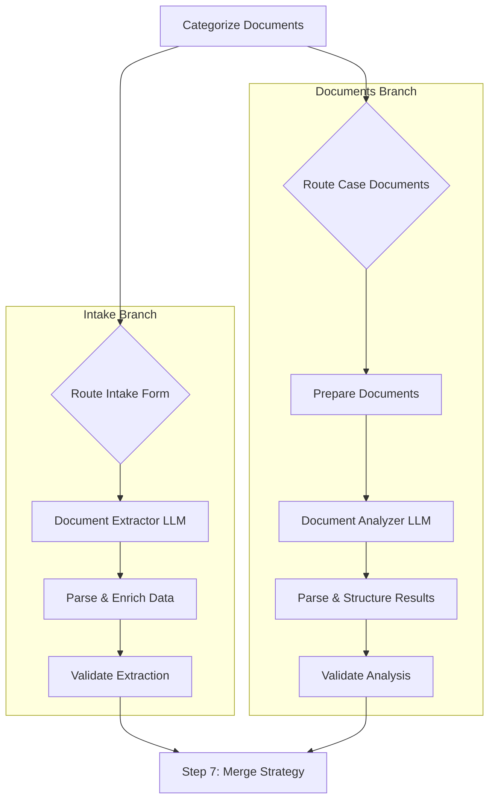

---

# Step 6: Document Information Extraction Architecture

This document outlines the complete architecture for Step 6, which focuses on extracting key information from legal documents using AI. The workflow is split into two parallel branches: `intakeForm` and `caseDocuments`.

## 1. AI Model Integration Strategy

### n8n Node Strategy
We will use the standard n8n `LLM` or `AI Agent` nodes for direct interaction with the chosen language models. This approach simplifies the workflow by handling API calls, credentials, and basic data formatting internally. Custom "Code" nodes will be used for pre-processing input and post-processing the AI's output to ensure data integrity and schema compliance.

### Intake Form Branch
*   **Recommended Model**: **Claude 3 Sonnet** or **GPT-4 Turbo**.
*   **Justification**: This branch handles a single, relatively structured document. The task is primarily data extraction and formatting into a JSON object. These models offer a great balance of cost, speed, and high accuracy for structured data tasks.

### Case Documents Branch
*   **Recommended Model**: **Claude 3 Opus**.
*   **Justification**: This branch involves analyzing a collection of potentially long and complex legal documents. Claude 3 Opus has a large context window and demonstrates strong performance in deep reasoning and analysis of nuanced information, which is critical for legal text.

## 2. Prompt Engineering Templates

### Intake Form Extraction Prompt
```text
You are an expert legal data extraction assistant. Your task is to extract information from the provided intake form document and format it as a valid JSON object.

The document content is as follows:
{{ $json.documentText }}

Please extract the following information and structure it according to the JSON schema provided below. Ensure all fields are correctly populated and that the JSON is perfectly formatted.

**JSON Schema:**
{
  "clientInfo": {
    "clientName": "string",
    "contactInfo": "string"
  },
  "caseInfo": {
    "caseReference": "string",
    "summary": "string"
  },
  "attorneyInfo": {
    "attorneyName": "string"
  }
}

Return ONLY the valid JSON object.
```

### Case Documents Analysis Prompt
```text
You are a specialized legal analysis AI. You will be given a collection of case documents. Your task is to perform a comprehensive analysis across all provided documents and extract key legal information.

The documents are provided below:
---
{{ $json.documentsText }}
---

Analyze the documents collectively and extract the following information. Structure your response as a single, valid JSON object according to the schema below.

**JSON Schema:**
{
  "keyEntities": {
    "plaintiffs": ["string"],
    "defendants": ["string"],
    "judges": ["string"],
    "other_parties": ["string"]
  },
  "keyFacts": [
    {
      "fact": "string",
      "source_document": "string"
    }
  ],
  "timelineOfEvents": [
    {
      "date": "YYYY-MM-DD",
      "event": "string",
      "source_document": "string"
    }
  ],
  "legalContext": {
    "statedClaims": ["string"],
    "defenses": ["string"]
  }
}

Return ONLY the valid JSON object.
```

## 3. JSON Output Schemas

### Intake Form Branch Schema
```json
{
  "$schema": "http://json-schema.org/draft-07/schema#",
  "title": "ExtractedIntakeForm",
  "type": "object",
  "required": ["clientInfo", "caseInfo", "attorneyInfo"],
  "properties": {
    "clientInfo": {
      "type": "object",
      "properties": {
        "clientName": { "type": "string" },
        "contactInfo": { "type": "string" }
      },
      "required": ["clientName"]
    },
    // ... complete schema
  }
}
```

### Case Documents Branch Schema
```json
{
  "$schema": "http://json-schema.org/draft-07/schema#",
  "title": "AnalyzedCaseDocuments",
  "type": "object",
  // ... complete schema
}
```

## 4. Workflow Node Design & Implementation Flow

### New Nodes Required
*   **Prepare Documents (Code Node)**: Aggregates text from all documents in the `caseDocuments` branch into a single string for the LLM.
*   **Document Extractor LLM (LLM Node)**: Executes the prompt for the `intakeForm` branch.
*   **Document Analyzer LLM (LLM Node)**: Executes the prompt for the `caseDocuments` branch.
*   **Parse & Enrich Data (Code Node)**: Parses the JSON output from the `intakeForm` LLM, validates it against the schema, and enriches it with metadata.
*   **Parse & Structure Results (Code Node)**: Parses the JSON output from the `caseDocuments` LLM and validates it.
*   **Validate Extraction (Code Node)**: Final validation and error handling for the intake branch.
*   **Validate Analysis (Code Node)**: Final validation and error handling for the documents branch.


### Workflow Diagram


---