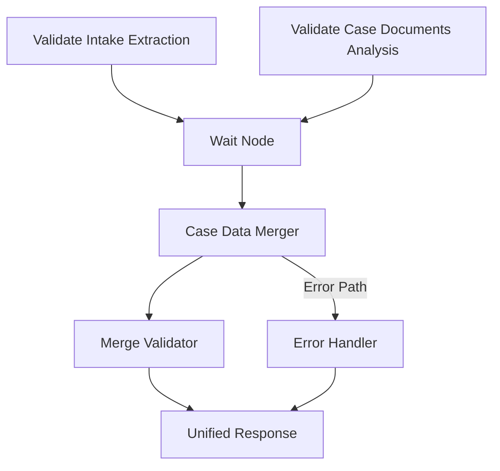

---

# Step 7: Merge Strategy Architecture

## Executive Summary

This document provides a complete architectural design for merging the outputs of two parallel processing branches in the n8n workflow: the intake form extraction branch and the case documents analysis branch. The merge strategy creates a unified, cohesive data object that represents a complete legal case file.

## 1. Merge Node Design

### Recommended n8n Architecture

The merge implementation uses a combination of native n8n nodes and custom code nodes:

1. **Wait Node** - Synchronizes both branches before merging
   - Configuration: Wait for both inputs
   - Timeout: 5 minutes (configurable)
   - Position: [1816, 208]

2. **Case Data Merger (Code Node)** - Primary merge logic
   - Combines validated data from both branches
   - Generates unique case ID
   - Creates unified data structure
   - Position: [2024, 208]

3. **Merge Validator (Code Node)** - Final validation
   - Validates merged structure
   - Adds final processing metadata
   - Position: [2232, 208]

4. **Unified Response (Respond to Webhook)** - Single response point
   - Returns complete merged data
   - Position: [2440, 208]

## 2. Final Merged JSON Schema

### UnifiedCaseFile Schema
*The full JSON schema is provided in the architect's output and should be included here.*

## 3. Error Handling Strategy

### Scenario Handling
The merge strategy gracefully handles all possible branch failure scenarios:
- **Both Branches Succeed**: Full data merge.
- **Intake Fails, Documents Succeed**: Partial merge with document analysis only.
- **Documents Fail, Intake Succeeds**: Partial merge with intake information only.
- **Both Branches Fail**: Minimal merge with metadata and error status.

## 4. Workflow Integration

### Visual Architecture

### Implementation Steps
1.  **Remove existing response nodes**.
2.  **Add new merge nodes** (Wait, Case Data Merger, Merge Validator, Unified Response).
3.  **Update connections** to route both branches into the Wait node and through the new merge pipeline.

---